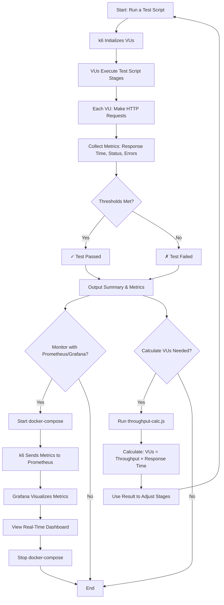

# Module 2: Performance Engineering with k6 – Complete Beginner's Guide

## Table of Contents

1. [What Is This Project?](#what-is-this-project)
2. [Key Concepts Explained](#key-concepts-explained)
3. [Step-by-Step Workflow](#step-by-step-workflow)
4. [Project Workflow Flowchart](#project-workflow-flowchart)
5. [Folder Structure & Files](#folder-structure--files)
6. [Architecture & Data Flow](#architecture--data-flow)
7. [Running Your First Test](#running-your-first-test)
8. [Troubleshooting](#troubleshooting)

---

## What Is This Project?

### The Problem It Solves

Before you deploy a website or API to production, you need to know: **Can my system handle the load?** This project teaches you how to answer that question using **k6**, a modern load-testing tool.

Imagine you built an e-commerce website. On a normal day, 50 people browse at once. But during Black Friday, 10,000 people try to shop simultaneously. Will your server crash? How do you find out _before_ Black Friday arrives?

**Answer**: You simulate that traffic using k6, which lets you:

- Send thousands of fake users to your website
- Measure response times and failure rates
- Identify bottlenecks
- Know exactly how many users your system can handle

### What You'll Learn

This project has **three test scenarios** that teach you different aspects of performance engineering:

1. **Load Test** – Simulates normal, realistic user traffic (100 concurrent users)
2. **Stress Test** – Gradually pushes the system beyond normal limits (100 VUs for extended time)
3. **DDoS Simulation** – Attacks the system with extreme traffic (200 VUs, almost no delays)

You'll also use **Prometheus** and **Grafana** (monitoring tools) to visualize the test results in real time.

---

## Key Concepts Explained

### Virtual User (VU)

A **VU is a simulated user**. Each VU follows your test script independently and concurrently.

- **Example**: If you set `vus: 100`, you have 100 fake users running the test script at the same time.
- **Reality**: These aren't 100 real computers; k6 runs all 100 VUs in your local machine or a test server, simulating their behavior.
- **Analogy**: Think of a VU like an actor in a theater. The director (k6) tells each actor (VU) to follow the script (your test code), and they all act simultaneously.

### Throughput

**Throughput = the number of requests per second your system can handle.**

- **Example**: If you have 100 VUs, each making 1 request every 2 seconds, your throughput is 50 requests per second (RPS).
- **Formula**: `Throughput = VUs * (1 / response_time_in_seconds)`
- **Why it matters**: You need to know: "My system can handle 1,000 RPS before it gets slow."

### Stages

**A stage is a time period where you gradually increase or decrease VUs.**

```javascript
stages: [
  { duration: "10s", target: 50 }, // First 10 seconds: ramp up to 50 VUs
  { duration: "20s", target: 100 }, // Next 20 seconds: ramp up to 100 VUs
  { duration: "30s", target: 100 }, // Next 30 seconds: keep 100 VUs steady
  { duration: "10s", target: 0 }, // Last 10 seconds: ramp down to 0 VUs
];
```

- **Why?** Ramping gradually mimics real users joining slowly, not everyone arriving at once.
- **Benefit**: You discover at which point the system starts getting slow.

### Thresholds

**A threshold is a pass/fail rule for your test.**

```javascript
thresholds: {
  http_req_failed: ['rate<0.01'],    // Pass if error rate < 1%
  http_req_duration: ['p(95)<500'],  // Pass if 95% of requests are < 500ms
}
```

- **Example**: If your error rate hits 2%, the threshold `rate<0.01` fails the test (because 2% > 1%).
- **Why?** You set these based on what your users expect. If 5% of requests fail, your users will be angry.

### Checks

**A check is a validation of each response.** It tests whether a single response was successful.

```javascript
check(res, {
  "status is 200": (r) => r.status === 200,
  "response time < 500ms": (r) => r.timings.duration < 500,
});
```

- **Difference from thresholds**:
  - **Check**: "Did _this one_ request return status 200?"
  - **Threshold**: "Did _all_ requests maintain an error rate < 1%?"
- **Failed checks** contribute to the overall error rate, which is then evaluated against thresholds.

### Sleep (Think Time)

**Sleep pauses a VU for a few seconds before making the next request.** This simulates a real user reading content.

```javascript
sleep(1); // VU waits 1 second before the next request
```

- **Without sleep**: VU sends requests as fast as possible (unrealistic, lots of traffic).
- **With sleep**: VU sends requests slowly, mimicking human behavior.
- **Impact**: More sleep = fewer requests per second = lower throughput, but more realistic test.

---

## Step-by-Step Workflow

### Phase 1: Setup (One-Time)

1. **Install k6**
   - Download and install from https://k6.io/docs/get-started/installation/
   - Verify: `k6 version` (should print a version number)

2. **Install Node.js dependencies** (only for the calculator utility)

   ```bash
   cd module2_performance
   npm install
   ```

3. **Understand the scripts**
   - Read the test scripts (`load-test.js`, `stress-test.js`, `ddos-simulation.js`)
   - Each script defines how VUs behave and what requests they make

### Phase 2: Run a Load Test

1. **Start the test**

   ```bash
   cd module2_performance
   make load-test
   ```

   Or directly:

   ```bash
   k6 run scripts/load-test.js
   ```

2. **Watch the output**
   - k6 prints metrics every few seconds: VUs, requests, errors, response times
   - At the end, it shows a summary (✓ thresholds passed or ✗ thresholds failed)

3. **Interpret results**
   - Green ✓ = test passed, your system handled the load
   - Red ✗ = test failed, your system couldn't meet the requirements (error rate too high, response time too slow, etc.)

### Phase 3: Monitor with Prometheus & Grafana (Optional but Recommended)

1. **Start the monitoring stack**

   ```bash
   make monitoring-up
   ```

   This launches three Docker containers: Prometheus, Grafana, and OpenTelemetry Collector

2. **Open Grafana dashboard**
   - Go to http://localhost:3000 in your browser
   - Username: `admin`, Password: `admin`
   - Import the k6 dashboard (ID: 19198) to visualize test results

3. **Run a test while monitoring**

   ```bash
   make load-test
   ```

   - Watch the Grafana dashboard update in real time
   - See VUs, requests per second, error rate, response times

4. **Stop the monitoring stack**
   ```bash
   make monitoring-down
   ```

### Phase 4: Analyze & Calculate

1. **Use the throughput calculator** to determine how many VUs you need

   ```bash
   npm run throughput -- --throughput 1000 --responseTime 100
   ```

   This calculates: "To achieve 1000 RPS with 100ms average response time, I need X VUs"

2. **Adjust your test scripts**
   - If your system can't handle the target throughput, optimize the code or infrastructure
   - Re-run tests with higher VU counts to find the breaking point

3. **Document findings**
   - "My system can handle up to 500 RPS with < 1% error rate"
   - "After 500 RPS, response times exceed 1 second"

---

## Project Workflow Flowchart



---

## Folder Structure & Files

### Root-Level Files

#### `Makefile`

- **Purpose**: Simplifies commands by providing shortcuts
- **What it does**: `make load-test` → runs `k6 run scripts/load-test.js`
- **Why it exists**: Typing long commands is tedious; Makefile saves you time
- **Example usage**:
  ```bash
  make load-test          # Run load test
  make stress-test        # Run stress test
  make ddos-test          # Run DDoS test
  make monitoring-up      # Start monitoring stack
  make monitoring-down    # Stop monitoring stack
  ```

#### `package.json`

- **Purpose**: Lists Node.js dependencies
- **Dependencies**: Only `commander` (for the CLI utility)
- **Script**: `npm run throughput` points to the calculator
- **Why it exists**: Node.js packages are managed via `package.json`

#### `.gitignore`

- **Purpose**: Tells Git which files NOT to commit
- **Ignores**: `node_modules/`, `reports/`, Docker volumes
- **Why**: These are temporary; no need to store in version control

#### `README.md`

- **Purpose**: Documentation (already in your project)
- **Contains**: Setup instructions, command examples, troubleshooting

#### `config/thresholds.json` (Optional)

- **Purpose**: Centralized threshold configuration (currently not used in scripts, but useful for future refactoring)
- **Content**: Shared threshold values (error rate, response time)
- **Why it exists**: Allows multiple test scripts to use the same thresholds

---

### `scripts/` Folder – The Test Scripts

#### `load-test.js`

**Purpose**: Simulates realistic user load on your system

**How it works**:

1. Stages: ramp up from 50 → 100 VUs, hold at 100, ramp down to 0
2. Each VU: Makes GET request to public API (`https://test-api.k6.io/public/crocodiles/`)
3. Checks: Verifies response is 200 and response time < 500ms
4. Thresholds:
   - Error rate < 1%
   - 95th percentile response time < 500ms

**Real-world equivalent**: "Let's simulate a normal day with 100 concurrent users browsing our website"

**Expected outcome**: ✓ Pass (if system is healthy)

---

#### `stress-test.js`

**Purpose**: Pushes the system to its limits

**How it works**:

1. Stages: warm-up 50 VUs → peak 100 VUs → sustain 100 VUs for 2 minutes → ramp down
2. Each VU: Makes POST request to API (`https://jsonplaceholder.typicode.com/posts`)
3. Longer duration: Runs for 4.5 minutes total (vs. 70 seconds for load test)
4. Thresholds:
   - Error rate < 2% (allows more failures than load test)
   - 95th percentile response time < 1000ms

**Real-world equivalent**: "What if 100 users keep actively using our system for 5 minutes?"

**Expected outcome**: ✓ Pass (if system is robust)

---

#### `ddos-simulation.js`

**Purpose**: Tests extreme attack scenario (educational, not malicious)

**How it works**:

1. Configuration: 200 VUs, 30 seconds duration
2. Each VU: Makes GET request, then sleeps only 0.1 seconds (very little think time)
3. Result: Massive request rate (~200 requests per second)
4. Thresholds:
   - Error rate < 10% (expects significant failures)
   - 95th percentile response time < 2000ms

**Real-world equivalent**: "What happens if someone launches a DDoS attack on our API?"

**Expected outcome**: ✗ Fail or barely pass (showing system under extreme stress)

**Note**: This is educational; you're learning what extreme load looks like, not actually attacking anyone.

---

### `utils/` Folder – The Calculator

#### `throughput-calc.js`

**Purpose**: Calculates how many VUs you need to achieve a target throughput

**Formula**:

```
Required VUs = Target Throughput (RPS) × Average Response Time (seconds)
```

**Example**:

```bash
npm run throughput -- --throughput 1000 --responseTime 100
# Output: You need 100 VUs to achieve 1000 RPS with 100ms avg response time
# Reasoning: Each VU can handle (1 / 0.1s) = 10 requests per second
#            So 1000 RPS ÷ 10 RPS per VU = 100 VUs
```

**When to use**:

- Planning a test: "I need 500 RPS. How many VUs?"
- Capacity planning: "My average response time is 200ms. How many users can I support?"

**Why it exists**: Manual calculation is error-prone; this automates it

---

### `monitoring/` Folder – The Observability Stack

#### `docker-compose.yml`

**Purpose**: Defines three Docker services that run in containers

**Services**:

1. **Prometheus** (port 9090)
   - Time-series database that stores metrics
   - Scrapes k6 metrics every 15 seconds
   - Port 9090: You can visit http://localhost:9090 to query metrics manually

2. **Grafana** (port 3000)
   - Dashboard tool that visualizes Prometheus data
   - Pre-configured to show k6 metrics
   - Port 3000: Visit http://localhost:3000 to see dashboards
   - Default credentials: admin / admin

3. **OpenTelemetry Collector** (port 4318)
   - Receives telemetry data from applications
   - Optional; included for future enhancements

**Volumes** (persistent storage):

- `prometheus-data`: Stores metrics so they survive container restarts
- `grafana-data`: Stores Grafana settings

**How to use**:

```bash
make monitoring-up    # Start all three containers
# Now visit http://localhost:3000 to see dashboards
make monitoring-down  # Stop and remove containers
```

---

#### `prometheus.yml`

**Purpose**: Tells Prometheus where to find k6 metrics

**Key line**:

```yaml
targets: ["host.docker.internal:6565"]
```

- **host.docker.internal**: Special hostname that Docker containers use to reach your local machine
- **:6565**: Port where k6 publishes Prometheus metrics

**How it works**:

1. When you run `k6 run scripts/load-test.js`, k6 publishes metrics on localhost:6565
2. Prometheus (in a Docker container) reads `prometheus.yml`
3. Prometheus connects to `host.docker.internal:6565` and collects metrics
4. Grafana queries Prometheus and displays charts

---

#### `grafana-dashboards/` (Optional)

**Purpose**: Pre-configured dashboard JSON files

**Currently**: Empty or contains optional dashboard definitions

**Why it's useful**: Instead of manually creating charts in Grafana, you can import a pre-built k6 dashboard

**To use**:

1. Start monitoring: `make monitoring-up`
2. Open http://localhost:3000
3. Go to Dashboards → Import
4. Enter dashboard ID: `19198` (the official k6 dashboard)
5. Select Prometheus as data source
6. Done! You now see k6 metrics visualized

---

#### `otel-collector.yml/` (Advanced, Optional)

**Purpose**: Configures OpenTelemetry Collector for advanced observability

**Why it's here**: Future-proofing; you can use OpenTelemetry to send traces and metrics to platforms like Datadog, New Relic, etc.

**For now**: You don't need to touch this; it's optional advanced usage.

---

## Architecture & Data Flow

### High-Level Architecture

```
┌─────────────────────────────────────────────────────────────┐
│                   Your Local Machine                        │
│                                                             │
│  ┌─────────────────┐                                        │
│  │   k6 Script     │                                        │
│  │  (load-test.js) │                                        │
│  └────────┬────────┘                                        │
│           │                                                 │
│           ├─→ Makes HTTP requests to public APIs            │
│           │   (https://test-api.k6.io/...)                  │
│           │                                                 │
│           └─→ Publishes metrics to Prometheus               │
│               (localhost:6565)                              │
│               │                                             │
│               └─→ Metrics include:                          │
│                   - VUs count                               │
│                   - Requests per second                     │
│                   - Response times                          │
│                   - Error rates                             │
│                   - Threshold results                       │
│                                                             │
│  ┌─────────────────────────────────────────────────────────┐│
│  │         Docker Containers (monitoring-up)               ││
│  │                                                         ││
│  │  ┌─────────────┐       ┌──────────────┐                 ││
│  │  │ Prometheus  │◄──────│ k6 Metrics   │                 ││
│  │  │  (9090)     │       │ (localhost:  │                 ││
│  │  └────────┬────┘       │  6565)       │                 ││
│  │           │            └──────────────┘                 ││
│  │           │                                             ││
│  │  ┌────────▼──────┐                                      ││
│  │  │   Grafana     │                                      ││
│  │  │   (3000)      │                                      ││
│  │  │   Queries     │                                      ││
│  │  │  Prometheus   │                                      ││
│  │  └───────────────┘                                      ││
│  │                                                         ││
│  └─────────────────────────────────────────────────────────┘│
│                                                             │
│  ┌─────────────────────────────────────────────────────────┐│
│  │  Browser (http://localhost:3000)                        ││
│  │  ┌─────────────────────────────────────────────────────┐││
│  │  │       Grafana Dashboard                             │││
│  │  │  - Line charts (response times)                     │││
│  │  │  - Gauge (current VUs)                              │││
│  │  │  - Pie chart (error distribution)                   │││
│  │  │  - Real-time updates every 5 seconds                │││
│  │  └─────────────────────────────────────────────────────┘││
│  └─────────────────────────────────────────────────────────┘│
│                                                             │
└─────────────────────────────────────────────────────────────┘
```

### Data Flow Step-by-Step

1. **Test Starts**

   ```bash
   make load-test  →  k6 run scripts/load-test.js
   ```

2. **VUs Spawn**
   - k6 creates 50 VUs (according to first stage)
   - Each VU independently executes the test script

3. **HTTP Requests**
   - Each VU makes GET request to `https://test-api.k6.io/public/crocodiles/`
   - Server responds with status 200, response body, response time

4. **Checks Run**
   - k6 checks: "Is status 200?" ✓
   - k6 checks: "Is response time < 500ms?" ✓
   - Failed checks increment error counter

5. **Metrics Collected**
   - k6 collects: VU count, request duration, error count, etc.
   - Every second, k6 publishes aggregated metrics

6. **Prometheus Scrapes** (every 15 seconds)
   - Prometheus reads from `localhost:6565`
   - Prometheus stores metrics in time-series database
   - Timestamp: "At 14:23:45, error_rate was 0.5%"

7. **Grafana Queries** (every 5 seconds)
   - Grafana asks Prometheus: "What's the error rate for the last 5 minutes?"
   - Prometheus returns: `[{timestamp, value}, ...]`
   - Grafana plots the values on a line chart

8. **You View Dashboard** (http://localhost:3000)
   - Grafana displays real-time charts
   - You watch VUs increase, requests spike, errors decrease

9. **Test Ends**
   - Last stage: ramp down to 0 VUs
   - k6 produces summary report (passed/failed thresholds)
   - Metrics continue flowing to Prometheus (historical data)

10. **Analysis**
    - Review Prometheus data: http://localhost:9090
    - Review Grafana charts: http://localhost:3000
    - Decide: Pass? Fail? Optimize? Rerun?

---

## Running Your First Test

### Quick Start (5 Minutes)

#### Step 1: Install k6

```bash
# macOS
brew install k6

# Linux
sudo apt-get install k6

# Windows
choco install k6
```

Verify: `k6 version`

#### Step 2: Navigate to the project

```bash
cd module2_performance
npm install  # Install Commander for calculator (optional)
```

#### Step 3: Run the load test

```bash
make load-test
```

**Expected output** (first few lines):

```
     execution: local
        script: scripts/load-test.js
        output: -

scenarios executed: 1 (1 local scenario)
     data received: 45 kB
     data sent:    3.5 kB
     http requests: 123
      http errors:  0
   ramp-up stage:   PASS
     main stage:    PASS
   ramp-down stage: PASS

thresholds:
  ✓ http_req_failed rate<0.01 ........ 0.00% < 1%
  ✓ http_req_duration p(95)<500 ...... 245ms < 500ms
  ✓ errors rate<0.01 ................ 0.00% < 1%
```

**Interpretation**: ✓ All thresholds passed! Your system handled the load.

---

### Intermediate (15 Minutes) – With Monitoring

#### Step 1: Start monitoring stack

```bash
make monitoring-up
```

Wait 10 seconds for containers to start.

#### Step 2: Open Grafana

- Visit http://localhost:3000
- Login: admin / admin
- Click "Dashboards" → "Browse" → (if no k6 dashboard yet, continue to Step 3)

#### Step 3: Import k6 Dashboard

- Click "+" → "Import"
- Enter ID: `19198`
- Click "Load"
- Select "Prometheus" as data source
- Click "Import"

#### Step 4: Run the test while monitoring

```bash
make load-test
```

#### Step 5: Watch Grafana in real time

- Return to http://localhost:3000
- See charts update as the test runs
- Watch VU count increase, error rate stay low, response times climb

#### Step 6: Stop monitoring

```bash
make monitoring-down
```

---

### Advanced (30 Minutes) – Using the Calculator & Custom VU Count

#### Step 1: Determine your throughput target

Example: "I want to support 100 requests per second with 200ms average response time"

#### Step 2: Calculate required VUs

```bash
npm run throughput -- --throughput 100 --responseTime 200
```

**Output**:

```
Throughput target: 100 req/s
Average response time: 200 ms
Calculated Virtual Users needed: 20

Explanation:
Each VU can process 5.00 requests per second.
To achieve 100 req/s, you need 100 / 5.00 ≈ 20 VUs.
```

#### Step 3: Modify a test script

Edit `scripts/load-test.js`, change stages:

```javascript
export const options = {
  stages: [
    { duration: "10s", target: 20 }, // ramp up to 20 VUs (our calculated value)
    { duration: "30s", target: 20 }, // sustain for 30s
    { duration: "5s", target: 0 }, // ramp down
  ],
  // ... rest stays same
};
```

#### Step 4: Run the custom test

```bash
k6 run scripts/load-test.js
```

#### Step 5: Analyze results

- Did it achieve 100 RPS? Check output: "http requests: XXX"
- Did it maintain thresholds? Check: "✓ or ✗" for each threshold

---

## Troubleshooting

### Problem: "k6: command not found"

**Solution**: k6 is not installed. Install from https://k6.io/docs/get-started/installation/

---

### Problem: "Cannot connect to http://localhost:3000"

**Solution**:

1. Ensure `make monitoring-up` ran successfully
2. Check Docker is running: `docker ps` (should show 3 containers)
3. If containers crashed, check logs: `docker-compose -f monitoring/docker-compose.yml logs`

---

### Problem: Test passes but Grafana shows no data

**Solution**:

1. k6 metrics may not be flowing to Prometheus
2. Run k6 with explicit Prometheus output:
   ```bash
   k6 run --out prometheus=http://localhost:9090 scripts/load-test.js
   ```
3. Wait 15 seconds for Prometheus to scrape
4. Refresh Grafana

---

### Problem: All requests fail (0% pass rate)

**Solution**:

1. Check if the target API is reachable: `curl https://test-api.k6.io/public/crocodiles/`
2. If unreachable, modify the URL to an API you have access to
3. If reachable, check thresholds; you may have set them too strict

---

### Problem: Docker containers won't start

**Solution**:

1. Port 9090 or 3000 already in use: `lsof -i :9090` or `lsof -i :3000`
2. Kill the process: `kill -9 <PID>`
3. Or map to different ports in `docker-compose.yml`

---

## Next Steps

1. **Run all three test types**: Load, stress, DDoS
2. **Compare results**: Which test failed? Why?
3. **Modify test scripts**: Change URLs, VU counts, stages
4. **Set realistic thresholds**: Based on your SLAs (service level agreements)
5. **Integrate into CI/CD**: Run tests automatically on every deployment
6. **Track over time**: Keep historical results to spot performance regressions

---

## Key Takeaways

- **k6** simulates users and measures system performance
- **VUs** are virtual users; more VUs = higher load
- **Stages** let you ramp up gradually (realistic)
- **Thresholds** define pass/fail criteria
- **Prometheus** stores metrics; **Grafana** visualizes them
- **Three test types**: Load (realistic), Stress (beyond limits), DDoS (extreme)
- **Calculator** helps you plan: "How many VUs do I need?"

You now understand the complete flow: write test → run k6 → collect metrics → visualize → analyze → optimize.

---

**Happy Load Testing! 🚀**
