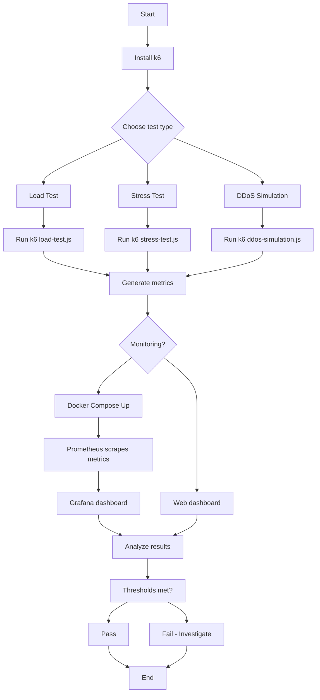

# Module 2: Performance Engineering with k6

This module provides a complete performance engineering environment using **k6**, covering load testing, stress testing, DDoS simulation, Virtual User (VU) / throughput calculations, and real‑time monitoring with Prometheus and Grafana.

---

## Table of Contents
1. [Overview](#overview)
2. [Prerequisites](#prerequisites)
3. [Quick Start](#quick-start)
4. [Chronological Commands & Explanations](#chronological-commands--explanations)
5. [Project Workflow (Mermaid Flowchart)](#project-workflow-mermaid-flowchart)
6. [Folder Structure & File Descriptions](#folder-structure--file-descriptions)
7. [Troubleshooting](#troubleshooting)
8. [License](#license)

---

## Overview

This module is designed to teach performance engineering concepts using **k6**, a modern load‑testing tool.  
You will learn:

- k6 scripting architecture (stages, VUs, checks, thresholds)
- Virtual User (VU) vs. Throughput calculations
- Stress‑testing and DDoS simulation
- Defect prediction and threshold alerts
- Metrics visualisation with Grafana + Prometheus

The project is **self‑contained** and independent of any other modules in this repository.

---

## Prerequisites

- [k6](https://k6.io/docs/get-started/installation/) installed on your system.
- **Optional**: [Docker](https://www.docker.com/get-started) and Docker Compose for the monitoring stack.
- **Optional**: Node.js (v16+) for the throughput calculator utility.

---

## Quick Start

1. **Install k6** – follow the [official guide](https://k6.io/docs/get-started/installation/) for your OS.
2. **Clone or navigate** to this module folder.
3. **Install Node dependencies** (for the calculator):
   ```bash
   npm install
   ```
4. **Run a test**:
   ```bash
   make load-test
   ```
   or directly:
   ```bash
   k6 run scripts/load-test.js
   ```

---

## Chronological Commands & Explanations

Below is the typical sequence of commands you would run in this project, with explanations.

### 1. Install dependencies (Node.js utility)
```bash
npm install
```
Installs `commander` (for the throughput calculator). Only needed if you use the calculator.

### 2. Run the load test
```bash
make load-test
```
Equivalent to: `k6 run scripts/load-test.js`  
**What it does**: Simulates a 100‑user load on a public API (`https://test-api.k6.io/public/crocodiles/`) with a ramp‑up and ramp‑down pattern. It checks for HTTP status 200, response time < 500ms, and enforces a 1% error rate threshold.

### 3. Run the stress test
```bash
make stress-test
```
Equivalent to: `k6 run scripts/stress-test.js`  
**What it does**: Sends a high volume of requests (~10k) to a dummy login endpoint (`https://httpbin.org/post`) with 100 concurrent VUs over several minutes. It allows 2% failures and a 95th‑percentile response time < 1s.

### 4. Run the DDoS simulation
```bash
make ddos-test
```
Equivalent to: `k6 run scripts/ddos-simulation.js`  
**What it does**: Launches 200 VUs with almost no think‑time, generating a very high request rate against the public API. It allows 10% failures and a 95th‑percentile response time < 2s.

### 5. Start the monitoring stack (Docker)
```bash
make monitoring-up
```
Equivalent to: `cd monitoring && docker-compose up -d`  
**What it does**: Spins up Prometheus, Grafana, and OpenTelemetry Collector in Docker containers.

### 6. Check Docker status
```bash
docker ps
```
Lists running containers – confirms the monitoring stack is up.

### 7. Run a test with Prometheus output (if extension installed)
```bash
k6 run --out prometheus scripts/load-test.js
```
**What it does**: Sends test metrics to the Prometheus remote‑write endpoint (port 6565). Requires a k6 binary with the Prometheus extension.

### 8. Run a test with the web dashboard
```bash
k6 run --out web-dashboard scripts/load-test.js
```
Opens a live HTML dashboard (port 5665) with real‑time charts – no external dependencies.

### 9. Stop the monitoring stack
```bash
make monitoring-down
```
Stops and removes the containers but preserves volumes.

### 10. Calculate required VUs (utility)
```bash
node utils/throughput-calc.js --throughput 100 --responseTime 200
```
**What it does**: Calculates the number of Virtual Users needed to achieve a target throughput (requests/second) given an average response time (ms).

---

## Project Workflow (Mermaid Flowchart)

The following flowchart illustrates the typical workflow when using this module – from setup to test execution, monitoring, and reporting.



---

## Folder Structure & File Descriptions

```
module2_performance/
├── README.md                         # This file – documentation and usage guide
├── .gitignore                        # Excludes node_modules, reports, and Docker volumes
├── Makefile                          # Shortcuts: load-test, stress-test, ddos-test, monitoring-up/down
├── package.json                      # Node dependencies (commander) for the throughput calculator
│
├── scripts/                          # All k6 test scripts
│   ├── load-test.js                  # 100-user ramp-up load test with checks & thresholds
│   ├── stress-test.js                # High-volume stress test (10k requests) on a login endpoint
│   └── ddos-simulation.js            # High-RPS DDoS-like attack with minimal think-time
│
├── utils/                            # Helper utilities
│   └── throughput-calc.js            # Node.js CLI to compute required VUs based on throughput & response time
│
├── config/                           # Shared configuration
│   └── thresholds.json               (optional) JSON with global threshold values
│
└── monitoring/                       # Docker-based observability stack
    ├── docker-compose.yml            # Defines Prometheus, Grafana, and OpenTelemetry Collector services
    ├── prometheus.yml                # Prometheus scrape config (targets k6 on port 6565)
    └── grafana-dashboards/           # Pre-configured dashboards (optional)
        └── k6-dashboard.json         (instructions to import official dashboard ID 19198)
```

### File-by-file breakdown

| File | What it does |
|------|--------------|
| `README.md` | This file – contains all documentation, commands, workflow, and folder structure. |
| `.gitignore` | Prevents `node_modules/`, `reports/`, generated JSON/HTML, and Docker volumes from being committed. |
| `Makefile` | Provides simple aliases: `make load-test`, `make stress-test`, `make ddos-test`, `make monitoring-up`, `make monitoring-down`. |
| `package.json` | Lists `commander` as a dependency. Defines a script `throughput` to run the VU calculator. |
| `scripts/load-test.js` | Implements a gradual load test with stages. Uses checks to verify status and response time, and thresholds to enforce an error rate <1% and p95 <500ms. |
| `scripts/stress-test.js` | Sends a large number of requests to a POST endpoint to test system limits. Uses stages and allows 2% errors and p95 <1s. |
| `scripts/ddos-simulation.js` | Simulates a high‑rate attack with 200 VUs and almost no sleep. Allows 10% errors and p95 <2s to detect failure patterns. |
| `utils/throughput-calc.js` | A Node script that accepts `--throughput` and `--responseTime` and prints the required VUs using the formula `VUs = throughput × response_time`. |
| `config/thresholds.json` (optional) | Centralises threshold values; can be imported into scripts. |
| `monitoring/docker-compose.yml` | Orchestrates three containers: Prometheus (scrapes k6 metrics), Grafana (dashboard UI), and OTel Collector (receives OTLP data). |
| `monitoring/prometheus.yml` | Configures Prometheus to scrape metrics from `host.docker.internal:6565` – the default port of k6's Prometheus remote writer. |
| `monitoring/grafana-dashboards/` | Optional folder; you can import the official k6 dashboard (ID: 19198) manually in Grafana. |

---

## Troubleshooting

### Error: `invalid output type 'prometheus'`
**Cause**: Your k6 binary does not include the Prometheus remote‑write output.  
**Fix**: Use `--out web-dashboard` instead, or install a k6 build with the Prometheus extension from the [official releases](https://github.com/grafana/k6/releases).

### Error: `Cannot connect to the Docker daemon`
**Cause**: Docker is not running.  
**Fix**: Start Docker Desktop (macOS) or `sudo systemctl start docker` (Linux). Run `docker info` to verify.

### Error: `using 'duration' and 'stages' options simultaneously is not allowed`
**Cause**: The script had both `duration` and `stages` in options.  
**Fix**: Use only `stages` (as provided in the fixed `stress-test.js`).

### Error: `thresholds on metrics '...' have been crossed`
**Cause**: The test violated the performance threshold (e.g., error rate too high, response time too slow).  
**Fix**: Investigate the system under test, increase threshold values (if appropriate), or fix performance bottlenecks.

---

## License

This project is for educational purposes and is provided as-is. Feel free to use and modify for your own learning.