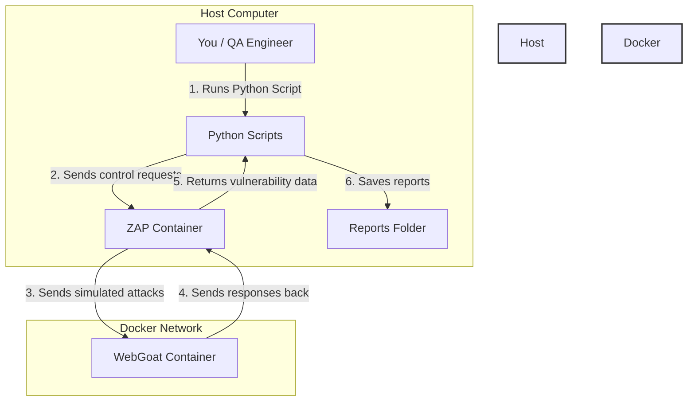
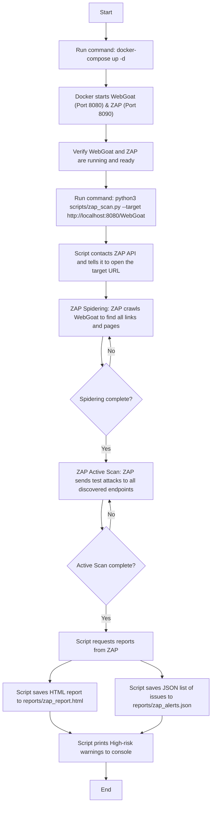

# Module 3: Security Testing with OWASP Framework – Beginner's Guide

Welcome to the comprehensive, beginner-friendly guide for the `module3_security` project! If you are new to security testing, Docker, Python scripting, APIs, or HTTP requests, do not worry. This guide is built just for you, explaining everything from the absolute basics up to how the entire project runs.

---

## 1. Project Overview (What is this project for?)

### Why does this project exist?

Imagine you build a beautiful house with heavy lockable doors, but you leave a window wide open on the side. A burglar won't struggle with the doors; they will simply climb through the window.

In the digital world, websites and web APIs (services that let programs talk to each other) often have hidden "open windows" called **vulnerabilities** (security flaws or weaknesses). Attackers can use these flaws to steal user passwords, access private databases, or hijack user accounts.

This project exists to teach yoI have a project named `module3_security` that implements security testing using OWASP tools, ZAP (Zed Attack Proxy), and OWASP WebGoat. I built this project with the help of another AI assistant, but I do not have a deep understanding of how it all works. I need you to create a **single `explanation.md` file** that explains the entire project to me from the ground up.

**Assume I know nothing about:**

- Security testing
- OWASP
- ZAP (Zed Attack Proxy)
- Docker and Docker Compose
- Python scripting
- APIs (I only have basic web knowledge)
- JSON, HTTP requests, etc.

Please explain everything in **very simple, beginner‑friendly language**. Use analogies and real‑world comparisons if helpful.

---

## What I Need in `explanation.md`

Your output should be a markdown file (`explanation.md`) with the following sections. You can add more if needed.

### 1. Project Overview (What is this project for?)

- In simple terms, why does this project exist?
- What problems does it solve?
- Who would use this and when?

### 2. Architecture and Components

- What are the main pieces of the project (WebGoat, ZAP, scripts, reports)?
- How do they fit together?
- Draw a simple diagram (use Mermaid syntax) showing how these components interact.

### 3. Workflow – What Happens When I Run the Script?

- Provide a **Mermaid flowchart** that shows the step‑by‑step process from starting Docker to generating the final report.
- Include user actions (like running `python3 scripts/zap_scan.py`) and what happens inside the system.

### 4. Folder and File Breakdown

- Walk me through every file and folder in the project:
  - `README.md`
  - `.gitignore`
  - `requirements.txt`
  - `docker-compose.yml`
  - `config/zap-config.json`
  - `scripts/zap_scan.py`
  - `scripts/jwt_tester.py`
  - `scripts/scan_workflow.py`
  - `scripts/integration_example.js`
  - `docs/OWASP_Top10_Cheatsheet.md`
  - `docs/JWT_Vulnerabilities.md`
- For each file, explain:
  - What it does.
  - Why it exists.
  - How it contributes to the overall project.
  - Any important details (like how the Python script connects to ZAP).

### 5. Key Concepts Explained

Explain these terms in simple language:

- **OWASP Top 10** – what are they, and why are they important?
- **ZAP (Zed Attack Proxy)** – what is it, and how does it find vulnerabilities?
- **WebGoat** – why is it a “vulnerable” app?
- **Active scan** vs. **passive scan** – what’s the difference?
- **Spidering** – what does the spider do in ZAP?
- **JWT** – what is a JSON Web Token, and what are common vulnerabilities?
- **SQL Injection** and **XSS** – what are they in simple terms?
- **API vs UI security testing** – how do they differ?

### 6. Running the Project – Step by Step

- Walk me through the **entire process** from cloning the repo to seeing the final report.
- Include all commands and explain what each command does (e.g., `docker-compose up -d`, `python3 scripts/zap_scan.py --target ...`).
- Explain what I should see at each stage (e.g., “You’ll see spider progress numbers... then active scan... finally a report appears”).

### 7. Understanding the Results

- How do I read the HTML report? (What do “High”, “Medium”, “Low” mean?)
- What does the JSON output contain?
- How do I know if my application is secure or not?

### 8. Troubleshooting

- Mention common errors (like `ConnectionRefusedError`, `Empty reply from server`) and how to fix them.
- Keep it simple – “If you see this error, do that.”

### 9. How to Extend or Customize

- Briefly explain how I could change the target URL, scan policies, or add new checks.
- Give an example of changing the scan intensity.

---

## Additional Instructions for Your Output

- Write the entire explanation in **one markdown file** (no separate files).
- Use **headings, subheadings, bullet points, and code blocks** where appropriate.
- Include a **Mermaid flowchart** (use ```mermaid syntax) for the workflow and a **Mermaid architecture diagram**.
- Make sure the language is welcoming and encouraging – I am learning.
- **Do not assume any prior knowledge** – define every technical term the first time you use it.

---

## Summary of Project (for your reference)

This project is named `module3_security`. It contains:

- **WebGoat**: a deliberately vulnerable training application.
- **ZAP**: a security scanner that runs in a Docker container.
- **Python scripts** that talk to ZAP’s API to run spidering, active scanning, and generate reports.
- **JWT tester**: a script that checks a JWT for common flaws.
- **Workflow script**: scans multiple URLs and consolidates findings.
- **Integration example**: shows how to call ZAP from Playwright.
- **Documentation**: cheat sheets for OWASP Top 10 and JWT vulnerabilities.

The folder structure is:
module3_security/
├── README.md
├── .gitignore
├── requirements.txt
├── docker-compose.yml
├── config/
│ └── zap-config.json
├── scripts/
│ ├── zap_scan.py
│ ├── jwt_tester.py
│ ├── scan_workflow.py
│ └── integration_example.js
├── reports/ (generated files)
└── docs/
├── OWASP_Top10_Cheatsheet.md
└── JWT_Vulnerabilities.md

text

Please use this summary and the file contents (you can find them in my project or I can provide them if needed) to write the explanation.

---

Thank you! I will copy your output into a file called `explanation.md` and use it to understand my project.u how to **automatically find these security flaws** before the bad guys do. It sets up a safe, local laboratory environment where you can practice scanning a real web application for vulnerabilities.

### What problems does it solve?

- **Automates the Search**: Instead of manually checking every single webpage and input box for bugs, this project uses an automated scanner to do it in minutes.
- **Provides a Safe Learning Sandbox**: You should **never** scan or hack real websites without permission—that is illegal. This project runs a training website locally on your own computer, so you can learn safely without harming anyone.
- **Integrates Security into Testing**: It shows how software QA (Quality Assurance) engineers can run security tests automatically whenever new code is written, ensuring security is built-in from day one.

### Who would use this and when?

- **QA Engineers & Developers**: Run these tools during the development process (before releasing the application) to ensure no new bugs are introduced.
- **Security Engineers**: To scan apps, locate issues, and recommend fixes to the developers.

---

## 2. Architecture and Components

To understand this project, you need to understand the four primary parts that work together:

1. **OWASP WebGoat (The Target)**: This is a deliberately broken, insecure web application. Think of it as a virtual punching bag. It has security flaws built-in on purpose so you have something to find.
2. **OWASP ZAP (The Scanner / Inspector)**: ZAP (Zed Attack Proxy) is like a security guard that tests doors. It will inspect every part of the WebGoat application, send test attacks at it, and see if WebGoat fails.
3. **Python Scripts (The Orchestrator / Remote Control)**: ZAP can be controlled via a graphical user interface (GUI), but this project uses Python scripts to send commands to ZAP behind the scenes. This is called using an **API** (Application Programming Interface), which is just a set of rules allowing our Python script to control ZAP.
4. **Reports (The Evidence)**: Once ZAP is finished testing, it generates HTML pages and JSON files detailing what it found.

### Architecture Interaction Diagram

Here is a visual map showing how all these components interact:



---

## 3. Workflow – What Happens When I Run the Script?

Here is the exact step-by-step process of what happens when you start the project and execute a scan:



---

## 4. Folder and File Breakdown

Here is a breakdown of every single file in the project, explaining what it does, why it exists, and how it contributes to the overall goal.

### Root Files

#### 1. `README.md`

- **What it does**: It is a text file written in "Markdown" format that contains introduction documentation, quick-start commands, exercises, and troubleshooting steps.
- **Why it exists**: It serves as the homepage of the project directory so that other developers know how to run the project.

#### 2. `.gitignore`

- **What it does**: Tells Git (the version control system) which files and folders it should **ignore** and never upload to GitHub/Gitlab.
- **Why it exists**: It prevents uploading temporary computer cache folders, locally generated reports (`reports/`), or heavy virtual environment directories (`venv/`).

#### 3. `requirements.txt`

- **What it does**: Lists the exact Python library dependencies needed for the scripts:
  - `requests`: To send HTTP requests (messages) from Python to ZAP's API.
  - `pyjwt`: To decode and manipulate JSON Web Tokens.
  - `python-json-logger`: To format script outputs.
- **Why it exists**: Lets you install all required Python tools with a single command (`pip install -r requirements.txt`).

#### 4. `docker-compose.yml`

- **What it does**: A configuration file that tells Docker how to pull down and launch two main virtual computers (containers):
  - **WebGoat**: Runs the target app on port `8080`.
  - **ZAP**: Runs the scanner on port `8090` in daemon mode (meaning it has no visible screen, it just runs silently waiting for instructions).
- **Why it exists**: It saves you from installing WebGoat and ZAP manually on your computer, which would take hours. Docker downloads and configures them in a single click.

---

### `config/` Folder

#### 5. `config/zap-config.json`

- **What it does**: A small settings file written in JSON format (a format that stores keys and values). It defines the default scanning rules and where to output generated files.
- **Why it exists**: It allows you to customize the scan parameters (like enabling or disabling specific scan IDs) without having to edit the Python code.

---

### `scripts/` Folder

#### 6. `scripts/zap_scan.py`

- **What it does**: The main Python automation controller. It instructs ZAP to:
  1. Ping ZAP until it is awake.
  2. Visit the target URL (`http://localhost:8080/WebGoat`).
  3. Start **Spidering** (crawling the site).
  4. Perform an **Active Scan** (sending attacks like SQL injection).
  5. Fetch the results, write an HTML report to `reports/zap_report.html`, write a JSON summary to `reports/zap_alerts.json`, and print out severe alerts.
- **Connection Details**: Instead of using ZAP's Python library, it uses the standard `requests` library to send raw HTTP `GET` requests to ZAP's API endpoints (e.g., `http://localhost:8090/JSON/spider/action/scan`). This makes the script highly customizable and independent.

#### 7. `scripts/jwt_tester.py`

- **What it does**: Tests security credentials called JSON Web Tokens (JWT). It checks if a given token is secure or not.
- **Why it exists**: It checks for three common JWT mistakes:
  - Does the token accept the "none" algorithm (allowing someone to bypass verification)?
  - Is the token missing an expiration date (`exp` claim)?
  - Can we guess the token's secret key using a list of weak words (like `secret` or `password`)?

#### 8. `scripts/scan_workflow.py`

- **What it does**: A workflow wrapper script that takes a list of multiple target URLs, scans each one in turn, and combines all security findings into a single consolidated file (`reports/workflow_summary.json`).
- **Why it exists**: In the real world, you might have 10 different APIs to test. Running 10 scripts is slow; this script automates scanning them in one go.

#### 9. `scripts/integration_example.js`

- **What it does**: A Javascript file showing how to trigger the ZAP Python script from inside a web testing framework called Playwright.
- **Why it exists**: Demonstrates how an engineering team can run a ZAP scan automatically as part of their regular tests and force the tests to **fail** if any high-risk security flaws are detected.

---

### `docs/` Folder

#### 10. `docs/OWASP_Top10_Cheatsheet.md`

- **What it does**: A cheat sheet summarizing the 10 most common and dangerous security mistakes developers make.
- **Why it exists**: Provides quick reference definitions for learning the vulnerabilities.

#### 11. `docs/JWT_Vulnerabilities.md`

- **What it does**: A detailed guide explaining how JSON Web Tokens work, what mistakes developers make when writing them, and how to fix them.
- **Why it exists**: Serves as the study material for JWT security concepts.

---

## 5. Key Concepts Explained

Let’s translate the complex security terms into plain language:

### OWASP Top 10

- **What it is**: The Open Web Application Security Project (OWASP) is a non-profit group of security experts. Every few years, they publish the "Top 10" list.
- **Analogy**: Think of it as the "10 Most Common Ways Burglars Break Into Houses." It highlights the mistakes developers make most frequently (like leaving keys under the doormat or having weak window latches).

### ZAP (Zed Attack Proxy)

- **What it is**: A tool that acts as a "middleman" (Proxy) between a web browser and a website. It intercepts and modifies web traffic to see if the website breaks under malicious input.
- **Analogy**: It is like a digital building inspector who walks around your house, pushing hard on the doors, checking the locks, and shaking the windows to see if anything is loose.

### WebGoat

- **What it is**: A "Goat" in security terms often represents a scapegoat or a victim. WebGoat is a deliberately vulnerable Java web application created by OWASP.
- **Analogy**: It is a "training dummy." If you practice boxing, you use a punching bag, not a real person. WebGoat is a digital punching bag for hacking tools.

### Active Scan vs. Passive Scan

- **Passive Scan**: ZAP only _looks_ at the traffic flowing naturally between you and the website. It does not send any attacks. It just checks if headers are missing or if credentials are sent in plain text. (Like a building inspector looking at a house from the sidewalk).
- **Active Scan**: ZAP actively constructs and sends fake attacks (like malicious script payloads or SQL code) to the input fields on the website to see if it can break or exploit it. (Like a building inspector throwing rocks at the windows to see if they break).

### Spidering

- **What it is**: Before ZAP can attack a website, it needs to know what pages exist. The "Spider" starts at the homepage, finds every link, clicks them, finds more links, and maps out a tree of the entire site.
- **Analogy**: It is like drawing a map of all the rooms in a building before inspecting them.

### JWT (JSON Web Token)

- **What it is**: A secure way of passing information between two systems. When you login, the server sends you a JWT (a long encrypted-looking string). Your browser sends this token back on every subsequent request to prove who you are.
- **Analogy**: It is like a wristband you get at a concert. Instead of showing your ticket at every bar inside, you show your wristband. If the wristband is made of weak paper or has no expiration date, someone can easily copy it or reuse it next week.

### SQL Injection (SQLi) & Cross-Site Scripting (XSS)

- **SQL Injection (SQLi)**: Databases use a language called SQL to look up data. If an input box (like a search bar) allows an attacker to type database commands that the server runs, the attacker can bypass logins or delete the entire database.
  - _Example_: Typing `' OR '1'='1` into a password field, causing the database to evaluate the query as "always true," logging the attacker in without a password.
- **Cross-Site Scripting (XSS)**: Occurs when an attacker injects malicious code (usually JavaScript) into a website, which then runs inside another user's browser.
  - _Example_: Typing `<script>stealPasswords()</script>` into a comment box. Anyone who visits the comment page will have their browser run that script, sending their login details to the attacker.

### API vs. UI Security Testing

- **UI Security Testing**: Focuses on the web pages a human clicks on. It checks if forms, login buttons, or search bars can be broken.
- **API Security Testing**: Focuses on the invisible data channels behind the scenes. Websites often use APIs to fetch raw data. API security checks if an attacker can bypass the visual web pages entirely and request private data records directly from the database servers.

---

## 6. Running the Project – Step by Step

Let's walk through a complete testing session on your machine:

### Step 1: Open the Terminal and Navigate

Open your command line/terminal application and go to the security directory:

```bash
cd "/Users/techverito/Action Plan 01_ QA Engineer Specialization/action-plan-qa/module3_security"
```

### Step 2: Launch WebGoat and ZAP (Docker)

Start the two services in the background:

```bash
docker-compose up -d
```

- **What this does**: Docker downloads the WebGoat and ZAP configurations, opens ports `8080` (WebGoat) and `8090` (ZAP), and launches them as background processes.
- **What you should see**: You will see downloads completing and a message saying `Creating webgoat ... done` and `Creating zap ... done`.
- **Verification**: Open `http://localhost:8080/WebGoat` in your browser. You should see a login page.

### Step 3: Install the Python Libraries

Install the script requirements:

```bash
pip install -r requirements.txt
```

- **What this does**: Downloads the helper libraries (`requests`, `pyjwt`, `python-json-logger`) so Python can execute the scripts.

### Step 4: Run the Security Scan

Execute the automated scan script targeting WebGoat:

```bash
python scripts/zap_scan.py --target http://localhost:8080/WebGoat
```

- **What this does**: The Python script starts. It pings ZAP until ZAP's server is awake, then commands ZAP to crawl WebGoat, run tests, and generate files.
- **What you will see in the terminal**:
  ```text
  ZAP is ready.
  Accessing target http://localhost:8080/WebGoat
  Spidering...
  Spider progress: 0%
  Spider progress: 54%
  Spider progress: 100%
  Spider complete. Starting active scan...
  Active scan progress: 0%
  Active scan progress: 28%
  Active scan progress: 100%
  Scan complete.
  Generating HTML report...
  HTML report saved to reports/zap_report.html
  Alerts JSON saved to reports/zap_alerts.json
  ⚠️ Found 3 high-risk vulnerabilities!
    - SQL Injection at http://localhost:8080/WebGoat/login
  ```

### Step 5: Test a JWT Token

To check if a web token is secure, run the JWT testing script with a test token string:

```bash
python scripts/jwt_tester.py --token "eyJhbGciOiJIUzI1NiIsInR5cCI6IkpXVCJ9.eyJzdWIiOiJhZG1pbiIsImV4cCI6MTUxNjIzOTAyMn0.signature"
```

- **What this does**: Inspects the token data and tries to break it using common weak keys. It prints security warnings directly to your screen.

### Step 6: Shut down Docker

When you are done testing, turn off the Docker containers to save battery and RAM:

```bash
docker-compose down
```

---

## 7. Understanding the Results

Once the scan finishes, look inside the `reports/` folder.

### Reading the HTML Report (`reports/zap_report.html`)

Double-click `zap_report.html` to open it in any web browser. It displays a summary dashboard:

- **Red (High Risk)**: Severe flaws that must be fixed immediately. (e.g., SQL Injection, allowing databases to be stolen).
- **Orange (Medium Risk)**: Less severe, but still bad. (e.g., Cross-Site Scripting, allowing session hijacking).
- **Yellow (Low Risk)**: Minor configuration issues or information leaks.
- **Blue (Informational)**: Informational notes (e.g., certain headers are missing).

Each entry contains a description of **how the vulnerability works** and a **solution** section advising developers on how to secure their code.

### Reading the JSON file (`reports/zap_alerts.json`)

This is a computer-friendly file. It contains the exact parameters, URLs, and evidence ZAP used to prove a vulnerability existed. You don't need to read this manually—it is used by other scripts (like our Playwright integration script) to automatically parse results.

### How do I know if my application is secure?

If you see **zero High or Medium alerts**, your application is in a good baseline state. However, security is an ongoing process. Automated tools cannot find 100% of flaws, but they are excellent at catching common mistakes.

---

## 8. Troubleshooting

Here are the most common errors beginners encounter and how to solve them:

#### Error 1: `ConnectionRefusedError` or `Could not connect to ZAP`

- **Why it happens**: ZAP is not running, or is still waking up inside Docker.
- **How to fix it**:
  1. Make sure Docker is running on your computer.
  2. Run `docker-compose up -d` in your terminal.
  3. Wait 15-30 seconds for ZAP to finish booting before running the Python script.

#### Error 2: `ModuleNotFoundError: No module named 'requests'` (or similar)

- **Why it happens**: Python is trying to run the scripts but doesn't have the necessary libraries installed.
- **How to fix it**: Run `pip install -r requirements.txt` in your terminal. If you are using a virtual environment, make sure it is activated first.

#### Error 3: WebGoat page displays blank or doesn't open in the browser

- **Why it happens**: Another application on your computer is already using port `8080` (a very common port for developer apps).
- **How to fix it**: Open `docker-compose.yml` and change the line `- "8080:8080"` to `- "8085:8080"`. Now, you can access WebGoat at `http://localhost:8085/WebGoat`.

---

## 9. How to Extend or Customize

### How to change the Target URL

By default, the script scans WebGoat. If you want to scan a different application running locally (e.g., an API you built at port `5000`), simply pass it as a parameter:

```bash
python scripts/zap_scan.py --target http://localhost:5000/api
```

### How to adjust Scan Rules or Intensity

In ZAP, scans can take a long time if they test every rule. You can control this in two ways:

1. **Modify the configuration file (`config/zap-config.json`)**:
   Open the file and modify the threshold rules:

   ```json
   { "id": 90001, "enabled": true, "threshold": "HIGH" }
   ```

   - Changing a threshold to **"HIGH"** makes ZAP less sensitive (it will report fewer issues, reducing false alarms).
   - Changing a threshold to **"LOW"** makes ZAP more sensitive (it will scan more thoroughly, but might report minor false alarms).
   - Setting `"enabled": false` will turn off that specific scan rule completely to speed up the run.

2. **Add a Delay (Think Time) in Python**:
   If you want to slow ZAP down so it doesn't crash a weak server during active scans, you can edit `scripts/zap_scan.py` and modify the sleep timers:
   ```python
   # Inside scripts/zap_scan.py active scan loop
   time.sleep(20)  # Increase time between polling ZAP status
   ```

---

_Congratulations! You now have a complete, solid foundation in security testing concepts and execution using OWASP tools. Have fun testing, and stay safe!_ 🚀
