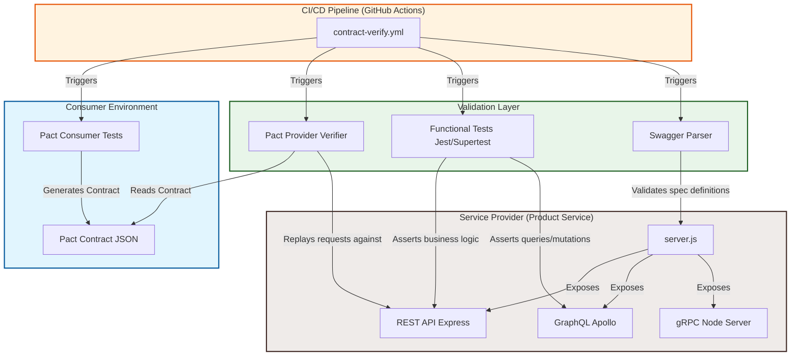
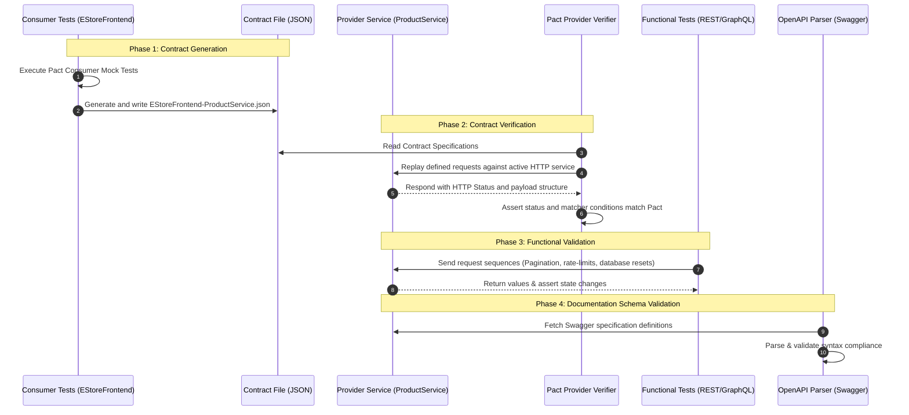

# Advanced Service & Contract Testing with Pact, Express, GraphQL, and gRPC

Welcome to the comprehensive technical guide for **Module 5: Advanced Service & Contract Testing**. This project serves as an architectural blueprint demonstrating how to build, test, and document multi-protocol APIs (REST, GraphQL, and gRPC) using a multi-layered testing strategy (Contract Testing, Functional Testing, and Schema Validation).

---

## 1. Project Overview

In a modern microservice architecture, services constantly communicate with one another. If one service changes its API schema (like renaming a field from `productId` to `id`), dependent services will break in production. 

This project demonstrates a production-grade testing stack designed to solve this exact problem by combining three distinct validation methods:

```
┌────────────────────────────────────────────────────────────────────────┐
│                        API Validation Strategy                         │
├──────────────────────────┬─────────────────────────────────────────────┤
│ 1. Contract Testing      │ Verifies that consumers and providers       │
│    (Pact)                │ agree on request/response shapes.           │
├──────────────────────────┼─────────────────────────────────────────────┤
│ 2. Functional Testing    │ Validates internal business logic, state    │
│    (Jest + Supertest)    │ changes, rate-limiting, and mutations.      │
├──────────────────────────┼─────────────────────────────────────────────┤
│ 3. Schema Validation     │ Ensures OpenAPI documentation is valid and  │
│    (Swagger Parser)      │ complies with standards.                    │
└──────────────────────────┴─────────────────────────────────────────────┘
```

By layering these three approaches, you build a "Quality Gate" that catches protocol changes, documentation drift, and business logic errors before they reach production.

---

## 2. Technologies Used

Here are the core libraries and tools used in this project:
* **Node.js (v22+)**: The runtime environment.
* **Express**: Fast, minimalist web framework used to expose the REST endpoints.
* **Apollo Server & GraphQL**: Used to implement flexible query-based APIs.
* **gRPC (`@grpc/grpc-js` & `@grpc/proto-loader`)**: A high-performance, low-latency Remote Procedure Call framework utilizing Protocol Buffers (protobuf) for unary and streaming services.
* **Pact (`@pact-foundation/pact` v12)**: The consumer-driven contract testing framework used to generate and verify API contracts.
* **Jest**: The testing framework and test runner.
* **Supertest**: Library used to programmatically make HTTP requests to Express/Apollo routes without manually starting the server listener.
* **Swagger JSDoc & Swagger Parser**: Tools used to generate and validate OpenAPI 3.0 specification documents.

---

## 3. Architecture Diagram

The diagram below shows how the consumer (client), provider (service), and testing components interact:



---

## 4. Workflow Explanation

The project operates under a structured verification pipeline:



---

## 5. File-by-File Breakdown

### `backend/product-service/src/server.js`
* **Purpose**: The main server entry point.
* **Step-by-Step Functionality**:
  1. Initializes the Express application.
  2. Mounts the REST endpoints under `/api`.
  3. Configures `swagger-jsdoc` to generate OpenAPI documentation from JSDoc declarations and serves Swagger UI on `/api-docs`.
  4. Starts Apollo Server and mounts GraphQL middleware under `/graphql`.
  5. If executed directly, starts a gRPC server on port `50051` serving the unary `GetProduct` and streaming `ListProducts` endpoints, and starts the Express web server on port `3000`.
* **Architectural Role**: Serves as the central server engine. It also exports `initializeApp()` to allow testing frameworks (like Supertest) to instantiate the routes independently of the socket listener.

### `backend/product-service/src/routes/rest.js`
* **Purpose**: Implements the REST API endpoints and state.
* **Step-by-Step Functionality**:
  1. Defines an in-memory database of products.
  2. Implements a rate-limiting middleware that blocks clients with a `429 Too Many Requests` status code if they exceed 10 requests.
  3. Implements pagination, sorting, and slicing filters for `GET /api/products`.
  4. Implements GET, POST, PUT, and DELETE methods.
  5. Exports a `resetCounter()` helper allowing testing modules to reset the rate limit state between test files.
* **Architectural Role**: Contains all REST interface implementation and business logic rules.

### `backend/product-service/src/routes/graphql.js`
* **Purpose**: Implements the GraphQL schema and resolvers.
* **Step-by-Step Functionality**:
  1. Configures type definitions (`typeDefs`) specifying queries (`products`, `product`) and mutations (`addProduct`, `updateProduct`, `deleteProduct`).
  2. Implements resolver functions to interact with the shared, in-memory product data.
* **Architectural Role**: Serves as the query and mutation engine for clients requesting customized payload shapes.

### `backend/product-service/src/proto/product.proto`
* **Purpose**: Declares the gRPC protocol buffers contract.
* **Step-by-Step Functionality**:
  1. Defines `ProductService` interface.
  2. Declares `rpc GetProduct` which takes a `ProductRequest` message and returns a single `Product`.
  3. Declares `rpc ListProducts` which takes an `Empty` request and returns a continuous stream of `Product` messages.
* **Architectural Role**: Serves as the microservice-to-microservice communication interface standard.

### `pact-tests/consumer/product-consumer.spec.js`
* **Purpose**: Generates the Pact contract specification file from the client's perspective.
* **Step-by-Step Functionality**:
  1. Configures a new `PactV3` instance specifying `EStoreFrontend` as the consumer and `ProductService` as the provider.
  2. Defines the expected mock interaction: when request is `GET /api/products/prod_0001` under the provider state `product exists with ID prod_0001`, ZAP must respond with status `200` and a specific JSON structure using type matchers (`MatchersV3.like`).
  3. Executes the test against the Pact mock service and verifies assertions.
* **Architectural Role**: Generates the formal contract definition stored in `pact-tests/pacts/`.

### `pact-tests/provider/verify-pact.js`
* **Purpose**: Verifies that the actual Product Service conforms to the contract.
* **Step-by-Step Functionality**:
  1. Creates a Pact `Verifier` instance.
  2. Configures the location of the local JSON contract files and the provider's base url (`http://localhost:3000`).
  3. Replays all interactions from the contract files against the provider and registers verification results.
* **Architectural Role**: Ensures the provider hasn't broken API schemas expected by the frontend.

### `functional-tests/rest-api.test.js`
* **Purpose**: Verifies the REST API endpoints and state.
* **Step-by-Step Functionality**:
  1. Starts the Express server routes using `supertest(app)`.
  2. Asserts pagination offsets (`toHaveLength(5)`).
  3. Validates PUT and DELETE idempotency rules.
  4. Resets counters and triggers rate limits to assert that `429` statuses are returned successfully.
* **Architectural Role**: Validates business logic correctness.

### `functional-tests/graphql-api.test.js`
* **Purpose**: Verifies GraphQL Apollo resolver behaviors.
* **Step-by-Step Functionality**:
  1. Initiates query and mutation request payloads targeting the `/graphql` route.
  2. Asserts correct data is returned inside the `data` envelope.
* **Architectural Role**: Ensures GraphQL handlers resolve correctly.

### `schema-validation/validate-openapi.js`
* **Purpose**: Validates the generated OpenAPI specification schema.
* **Step-by-Step Functionality**:
  1. Generates an OpenAPI JSON object using `swagger-jsdoc`.
  2. Runs `@apidevtools/swagger-parser` to validate the structure.
* **Architectural Role**: Prevents documentation errors and invalid schemas.

### `package.json`
* **Purpose**: Configures script commands and dependencies.
* **Architectural Role**: Contains all pipeline execution targets (e.g. `npm run test:pact`).

### `github-actions/contract-verify.yml`
* **Purpose**: Continuous Integration pipeline configuration.
* **Architectural Role**: Ensures every code contribution compiles and passes all checks.

---

## 6. Comparison Tables

### Protocol Comparison (REST vs. GraphQL vs. gRPC)

| Criteria | REST API | GraphQL API | gRPC API |
| :--- | :--- | :--- | :--- |
| **Testing Approach** | Request/response payloads, status codes. | Query validation, nested resolver outputs. | Binary payload stream validation, protobuf conformance. |
| **Common Tools** | Jest, Supertest, Postman. | Apollo Sandbox, Jest, Supertest. | grpcurl, Jest with `@grpc/grpc-js`. |
| **Use Cases** | Public facing APIs, CRUD services. | Web frontends requesting specific fields. | Internal microservice-to-microservice streaming. |

### Testing Layer Comparison

| Testing Method | Primary Goal | Focus | When to Run |
| :--- | :--- | :--- | :--- |
| **Contract Testing (Pact)** | Prevent integration failures between services. | Schema compatibility and endpoint shapes. | Pre-deployment, CI/CD pipeline gating. |
| **Functional Testing (Jest)** | Verify correct logic execution. | Data changes, query offsets, rate limit limits. | Local development and pull requests. |
| **Schema Validation** | Ensure OpenAPI schema validity. | Standard structure formatting (Swagger spec). | Build step, code generator triggers. |

---

## 7. Key Concepts & Code Snippets

### Contract & Matchers
Pact uses **flexible matchers** instead of absolute values. This allows the provider's data to change (e.g. price fluctuations) without breaking the tests, as long as the data **type** matches:

```javascript
// From: pact-tests/consumer/product-consumer.spec.js
body: MatchersV3.like({
  id: 'prod_0001',
  name: 'Wireless Headphones',
  price: 99.99,
  category: 'Electronics',
})
```

### Provider States
A provider state allows the verification system to mock databases or set up prerequisites before verifying:

```javascript
// Consumer defines requirement:
provider.given('product exists with ID prod_0001')
```

### Idempotency
An operation is **idempotent** if running it multiple times yields the same system state.
* **PUT**: Overwriting product details multiple times is idempotent.
* **DELETE**: Deleting a missing item returns `204 No Content` repeatedly:

```javascript
test('DELETE /api/products/:id is idempotent (204)', async () => {
  const res1 = await request(app).delete('/api/products/prod_9999');
  expect(res1.status).toBe(204);
  const res2 = await request(app).delete('/api/products/prod_9999');
  expect(res2.status).toBe(204);
});
```

### Rate Limiting
Prevents API abuse by returning a `429 Too Many Requests` status code once thresholds are crossed:

```javascript
router.use((req, res, next) => {
  requestCount++;
  if (requestCount > 10) {
    res.status(429).json({ error: 'Too many requests' });
    requestCount = 0; // reset
    return;
  }
  next();
});
```

---

## 8. Testing Workflow (CI/CD Pipeline)

The GitHub Actions configuration file `contract-verify.yml` automates verification using these steps:

1. **Environment Setup**: Pulls down an Ubuntu runner and configures Node.js (v18).
2. **Installation**: Resolves project dependencies using `npm install`.
3. **Application Instantiation**: Launches the backend service in the background:
   ```bash
   npm run start:product &
   ```
4. **Contract Execution**: Executes consumer tests to export contract agreements.
5. **Contract Verification**: Executes provider verifications against port `3000`.
6. **OpenAPI and Functional Validation**: Runs Swagger validations and Jest assertions.

---

## 9. How to Run

### Step 1: Install Dependencies
Open your terminal inside the module directory and run:
```bash
npm install
```

### Step 2: Start the Product Server
```bash
npm run start:product
```
*Expected console logs*:
```text
gRPC server running on port 50051
REST/GraphQL server running on port 3000
OpenAPI docs available at http://localhost:3000/api-docs
```

### Step 3: Run Pact Consumer Tests
Open a second terminal window and run:
```bash
npm run test:pact:consumer
```
This test runs mock services and generates contract JSON files under `pact-tests/pacts/`.

### Step 4: Run Pact Provider Verification
Verify that the active provider service conforms to the contract:
```bash
npm run test:pact:provider
```
*Expected output*:
```text
Verifying a contract between EStoreFrontend and ProductService
  Given product exists with ID prod_0001
    returns a response which
      has status code 200
      includes headers
        "Content-Type" with value "application/json"
      has a matching body
✅ Pact verification passed
```

### Step 5: Run Schema and Functional Tests
Validate OpenAPI documentation layout and execute API functional tests:
```bash
npm run test:openapi
npm run test:functional
```

---

## 10. Troubleshooting Tips

### Port Conflict Issues (EADDRINUSE)
* **Error**: `Error: listen EADDRINUSE: address already in use :::3000`
* **Why it happens**: Another instance of the server (or another process) is already running on port 3000 or 50051.
* **Solution**: Kill the process using the port:
  ```bash
  lsof -i :3000
  kill -9 <PID>
  ```

### Pact Contract File Not Found
* **Error**: `Pact verification failed: Errno::ENOENT: No such file or directory...`
* **Why it happens**: You executed the provider verifications before generating the contract.
* **Solution**: Run the consumer tests first to generate the contract file:
  ```bash
  npm run test:pact:consumer
  npm run test:pact:provider
  ```

### OpenAPI Spec Validation Failures
* **Error**: `OpenAPI validation failed: JSON Schema Error...`
* **Why it happens**: There is a syntax error or schema mismatch inside the REST endpoints JSDoc definitions.
* **Solution**: Ensure your swagger parameters and payload definitions correspond exactly to the OpenAPI 3.0 specification guidelines.
