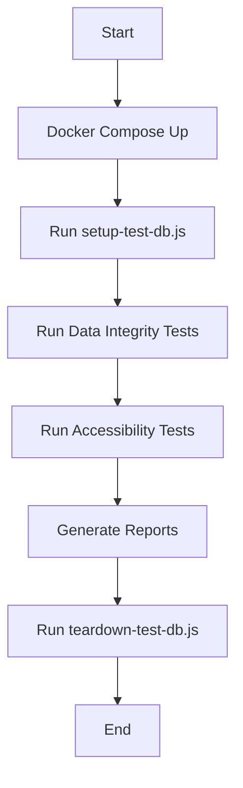

# Module 7: Data Integrity & Accessibility

This module provides a comprehensive testing framework for **data integrity** (ACID, transactional consistency, complex queries) and **accessibility** (WCAG 2.2, Axe, Lighthouse). It uses Docker to spin up ephemeral PostgreSQL databases and Jest for test execution.

## Table of Contents
- [Purpose](#purpose)
- [Prerequisites](#prerequisites)
- [Quick Setup](#quick-setup)
- [Test Structure](#test-structure)
- [Running Tests](#running-tests)
- [Accessibility Reports](#accessibility-reports)
- [Mermaid Workflow](#mermaid-workflow)
- [Troubleshooting](#troubleshooting)

## Purpose
- **Data Integrity**: Ensure your database maintains ACID properties under concurrent access.
- **Test Data Lifecycle**: Isolated, ephemeral databases for each test run.
- **Accessibility**: Automated WCAG 2.2 audits and manual keyboard navigation checks.

## Prerequisites
- **Node.js** (v18+)
- **Docker** and **Docker Compose**
- **PostgreSQL** (if not using Docker)

## Quick Setup
1. Clone this folder.
2. Install dependencies:
   ```bash
   npm install
   ```
3. Start the database:
   ```bash
   docker-compose up -d
   ```
4. Run all tests:
   ```bash
   npm test
   ```

## Test Structure
| Directory | Tests |
|-----------|-------|
| `tests/data-integrity/` | ACID, complex queries, lifecycle |
| `tests/accessibility/` | Axe scans, Lighthouse, keyboard nav |
| `tests/integration/` | End‑to‑end data + UI flows |

## Running Tests
- All tests: `npm test`
- Data integrity only: `npm run test:integrity`
- Accessibility only: `npm run test:a11y`
- Single file: `npm test -- tests/data-integrity/acid-transactions.test.js`

## Accessibility Reports
- Axe HTML report: `reports/axe-report.html`
- Lighthouse JSON report: `reports/lighthouse-report.json`
- Keyboard navigation logs: `reports/keyboard-nav.log`

## Mermaid Workflow


## Troubleshooting
- **DB Connection Error**: Ensure Docker is running and port `5432` is free.
- **Axe Violations**: Check `axe-config.js` for custom rules.
- **Lighthouse Timeout**: Increase the timeout in `lighthouse-audit.js`.

## License
MIT – freely adaptable.
