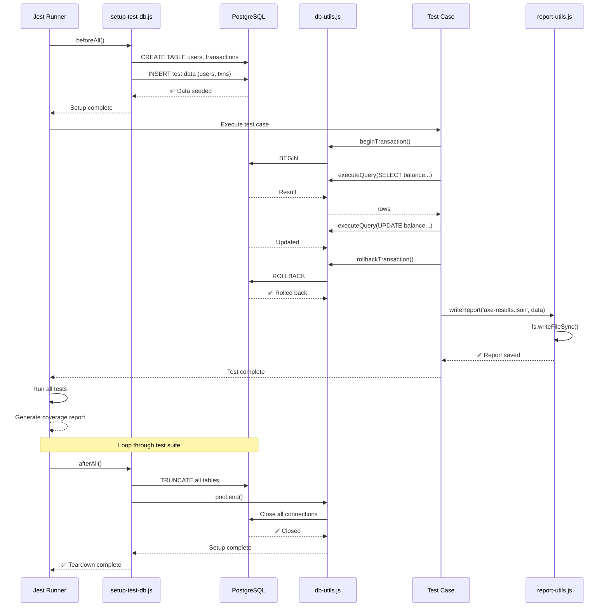
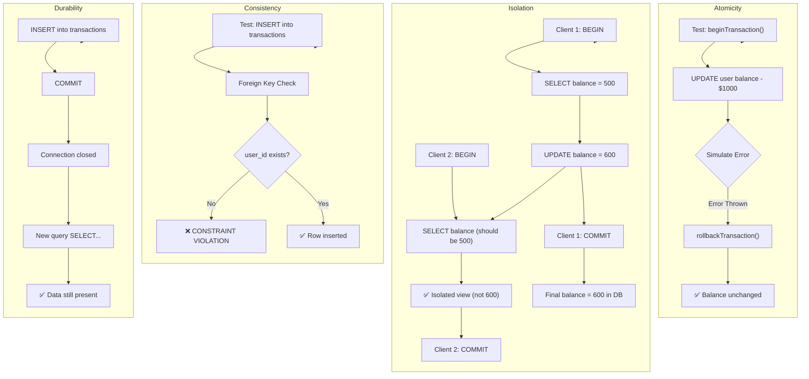
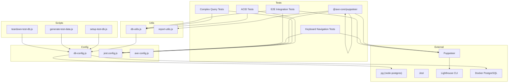

# Project Architecture: Module 7 – Data Integrity & Accessibility Testing

**Project Root:** `/Users/techverito/Action Plan 01_ QA Engineer Specialization/action-plan-qa/module7_data_integrity_accessibility`

**Version:** 1.0.0

**Type:** Node.js / JavaScript Test Suite (ES Modules)

---

## Table of Contents

1. [Project Overview](#project-overview)
2. [Technology Stack](#technology-stack)
3. [Directory Structure](#directory-structure)
4. [File-by-File Structural Breakdown](#file-by-file-structural-breakdown)
5. [Workflow Diagrams](#workflow-diagrams)
   - [Application Initialization Flow](#application-initialization-flow)
   - [Test Execution Flow](#test-execution-flow)
   - [Data Integrity Flow](#data-integrity-flow)
6. [Command & Execution Guide](#command--execution-guide)
7. [Key Modules Deep-Dive](#key-modules-deep-dive)
8. [Dependency Graph](#dependency-graph)
9. [Troubleshooting & Notes](#troubleshooting--notes)

---

## Project Overview

**Module 7** is a comprehensive testing framework designed to validate two critical aspects of application quality:

1. **Data Integrity**: Ensures databases maintain ACID (Atomicity, Consistency, Isolation, Durability) properties under concurrent access, validates transactional consistency, and tests complex SQL queries.
2. **Accessibility**: Automated audits for WCAG 2.2 AA compliance, axe-core violations scanning, Lighthouse performance/accessibility scoring, and manual keyboard navigation testing.

**Key Characteristics:**

- Ephemeral PostgreSQL databases (Docker-based) for isolated test runs
- Jest as the test framework with experimental VM modules support
- Puppeteer for browser automation and accessibility audits
- Axe-core and Lighthouse for comprehensive accessibility scanning
- Modular utility functions for transaction handling and database operations
- HTML and JSON report generation for accessibility findings

---

## Technology Stack

| Layer                      | Technology              | Version | Purpose                                            |
| -------------------------- | ----------------------- | ------- | -------------------------------------------------- |
| **Runtime**                | Node.js                 | v18+    | JavaScript execution environment                   |
| **Module System**          | ES Modules              | Native  | Import/export system with `type: "module"`         |
| **Test Framework**         | Jest                    | 29.7.0  | Unit, integration, and e2e test execution          |
| **Browser Automation**     | Puppeteer               | 21.6.1  | Headless browser control for accessibility testing |
| **Accessibility Scanning** | @axe-core/puppeteer     | 4.9.1   | Axe accessibility rule engine                      |
| **Performance Auditing**   | Lighthouse              | 11.7.1  | Chrome DevTools Lighthouse CLI                     |
| **Database**               | PostgreSQL              | 15      | Relational database for data integrity tests       |
| **Database Client**        | pg (node-postgres)      | 8.11.3  | PostgreSQL driver for Node.js                      |
| **Containerization**       | Docker & Docker Compose | Latest  | Ephemeral database provisioning                    |

---

## Directory Structure

```
/Users/techverito/Action Plan 01_ QA Engineer Specialization/action-plan-qa/module7_data_integrity_accessibility/
├── README.md                           # Project overview and quick start
├── package.json                        # Dependencies, scripts, project metadata
├── docker-compose.yml                  # PostgreSQL 15 container definition
├── .env.example                        # Environment variables template
├── .gitignore                          # Git exclude patterns
├── config/
│   ├── db-config.js                   # PostgreSQL connection pool setup
│   ├── jest.config.js                 # Jest test runner configuration
│   └── axe-config.js                  # Accessibility audit rule configuration
├── scripts/
│   ├── setup-test-db.js               # Database initialization and schema creation
│   ├── generate-test-data.js          # Test data seeding script
│   └── teardown-test-db.js            # Database cleanup and resource release
├── utils/
│   ├── db-utils.js                    # Transaction and query execution helpers
│   └── report-utils.js                # Report file generation utilities
├── tests/
│   ├── data-integrity/
│   │   ├── acid-transactions.test.js  # ACID property validation tests
│   │   ├── complex-queries.test.js    # SQL query correctness tests
│   │   └── data-lifecycle.test.js     # Data creation, read, update, delete lifecycle
│   ├── accessibility/
│   │   ├── axe-audit.test.js          # WCAG 2.2 compliance and Axe violation detection
│   │   ├── keyboard-navigation.test.js # Keyboard accessibility testing
│   │   └── lighthouse-audit.js        # Performance and accessibility scoring
│   └── integration/
│       └── e2e-data-flow.test.js      # End-to-end database and UI interaction tests
├── sample-app/
│   └── index.html                     # Sample web application for accessibility auditing
├── docs/
│   ├── ACID_Testing_Guide.md          # ACID principles and testing strategies
│   ├── Data_Lifecycle_Guide.md        # Complete data workflow documentation
│   └── Accessibility_Guide.md         # WCAG 2.2 and Axe testing methodology
└── reports/                            # Output directory for test artifacts
    ├── axe-report.html                # HTML accessibility findings
    ├── lighthouse-report.json         # Performance and accessibility scores
    ├── keyboard-nav.log               # Keyboard navigation test results
    └── coverage/                      # Jest code coverage reports
```

---

## File-by-File Structural Breakdown

| Absolute File Path                                                                                                                                                 | File Role/Purpose                                                                                                                                   | Key Functions/Exports                                                                                                                                          | Key Dependencies                                               |
| :----------------------------------------------------------------------------------------------------------------------------------------------------------------- | :-------------------------------------------------------------------------------------------------------------------------------------------------- | :------------------------------------------------------------------------------------------------------------------------------------------------------------- | :------------------------------------------------------------- |
| `/Users/techverito/Action Plan 01_ QA Engineer Specialization/action-plan-qa/module7_data_integrity_accessibility/package.json`                                    | NPM metadata; defines scripts, dependencies, and project configuration                                                                              | `scripts` object with `test`, `test:integrity`, `test:a11y`; devDependencies list                                                                              | None (root config)                                             |
| `/Users/techverito/Action Plan 01_ QA Engineer Specialization/action-plan-qa/module7_data_integrity_accessibility/docker-compose.yml`                              | Defines PostgreSQL 15 service; manages port mapping (5432), volumes, healthchecks                                                                   | Service: `postgres`; volume: `postgres-data`                                                                                                                   | Docker Engine, Docker Compose                                  |
| `/Users/techverito/Action Plan 01_ QA Engineer Specialization/action-plan-qa/module7_data_integrity_accessibility/.env.example`                                    | Template for environment variables; used by `db-config.js` to establish connections                                                                 | Variables: `DB_USER`, `DB_HOST`, `DB_NAME`, `DB_PASSWORD`, `DB_PORT`                                                                                           | None (template only)                                           |
| `/Users/techverito/Action Plan 01_ QA Engineer Specialization/action-plan-qa/module7_data_integrity_accessibility/config/db-config.js`                             | **Database connection management**; creates and exports a pg Pool for reusable connections                                                          | Exports: `pool` (pg.Pool), `getClient()`, `closePool()`                                                                                                        | `pg` (node-postgres v8.11.3)                                   |
| `/Users/techverito/Action Plan 01_ QA Engineer Specialization/action-plan-qa/module7_data_integrity_accessibility/config/jest.config.js`                           | **Test runner configuration**; defines Jest environment, transformations, timeout, coverage settings                                                | Exports: Jest config object with `testEnvironment: 'node'`, `testTimeout: 60000`, `collectCoverage: true`                                                      | Jest v29.7.0                                                   |
| `/Users/techverito/Action Plan 01_ QA Engineer Specialization/action-plan-qa/module7_data_integrity_accessibility/config/axe-config.js`                            | **Accessibility rules engine**; defines which Axe rules to run and WCAG levels to enforce                                                           | Exports: `axeConfig` with `rules` (image-alt, button-name, color-contrast, aria-roles) and `runOnly` tags (wcag2a, wcag2aa, wcag22aa)                          | @axe-core/puppeteer                                            |
| `/Users/techverito/Action Plan 01_ QA Engineer Specialization/action-plan-qa/module7_data_integrity_accessibility/utils/db-utils.js`                               | **Transaction and query execution layer**; provides abstractions for ACID testing and common database operations                                    | Exports: `beginTransaction()`, `commitTransaction()`, `rollbackTransaction()`, `withTransaction()`, `executeQuery()`, `getTableNames()`, `truncateAllTables()` | `db-config.js` (pool, getClient)                               |
| `/Users/techverito/Action Plan 01_ QA Engineer Specialization/action-plan-qa/module7_data_integrity_accessibility/utils/report-utils.js`                           | **Report output management**; generates JSON, HTML, and plain-text reports from test results                                                        | Exports: `ensureReportsDir()`, `writeReport()`, `writeHTMLReport()`, `writeLog()`                                                                              | Node.js fs and path modules                                    |
| `/Users/techverito/Action Plan 01_ QA Engineer Specialization/action-plan-qa/module7_data_integrity_accessibility/scripts/setup-test-db.js`                        | **Database initialization**; creates schema (users, transactions tables) with constraints and indexes; seeds test data                              | Exports: `setupDatabase()` function; runs on CLI: `node scripts/setup-test-db.js`                                                                              | `db-config.js`, `generate-test-data.js`                        |
| `/Users/techverito/Action Plan 01_ QA Engineer Specialization/action-plan-qa/module7_data_integrity_accessibility/scripts/generate-test-data.js`                   | **Test data seeding**; inserts predefined user and transaction records for reproducible test scenarios                                              | Exports: `testUsers` array, `testTransactions` array, `seedDatabase()` function                                                                                | `db-config.js` (pool)                                          |
| `/Users/techverito/Action Plan 01_ QA Engineer Specialization/action-plan-qa/module7_data_integrity_accessibility/scripts/teardown-test-db.js`                     | **Database cleanup**; truncates all tables and releases connection resources after tests                                                            | Exports: `teardownDatabase()` function                                                                                                                         | `db-config.js`, `db-utils.js`                                  |
| `/Users/techverito/Action Plan 01_ QA Engineer Specialization/action-plan-qa/module7_data_integrity_accessibility/tests/data-integrity/acid-transactions.test.js`  | **ACID property validation**; tests Atomicity (rollback), Consistency (FK), Isolation (concurrent txns), Durability (persistence)                   | Tests: 4 test cases (one per ACID property); uses `describe()`, `test()`, `expect()`                                                                           | `db-config.js`, `db-utils.js`, `setup-test-db.js`              |
| `/Users/techverito/Action Plan 01_ QA Engineer Specialization/action-plan-qa/module7_data_integrity_accessibility/tests/data-integrity/complex-queries.test.js`    | **SQL query correctness validation**; tests joins, aggregations, subqueries, and complex WHERE clauses                                              | Test cases: JOIN queries, GROUP BY aggregations, COUNT/SUM/AVG functions                                                                                       | `db-config.js`, `db-utils.js`                                  |
| `/Users/techverito/Action Plan 01_ QA Engineer Specialization/action-plan-qa/module7_data_integrity_accessibility/tests/data-integrity/data-lifecycle.test.js`     | **CRUD lifecycle testing**; validates Create, Read, Update, Delete operations maintain data consistency                                             | Test cases: INSERT, SELECT, UPDATE, DELETE operations with assertion checks                                                                                    | `db-config.js`, `db-utils.js`                                  |
| `/Users/techverito/Action Plan 01_ QA Engineer Specialization/action-plan-qa/module7_data_integrity_accessibility/tests/accessibility/axe-audit.test.js`           | **Automated accessibility scanning**; runs Axe engine against sample app HTML to detect WCAG violations                                             | Tests: 3 tests – overall compliance check, image alt text check, color contrast check                                                                          | Puppeteer, @axe-core/puppeteer, axe-config.js, report-utils.js |
| `/Users/techverito/Action Plan 01_ QA Engineer Specialization/action-plan-qa/module7_data_integrity_accessibility/tests/accessibility/keyboard-navigation.test.js` | **Manual keyboard accessibility testing**; verifies Tab order, focus management, and keyboard-only navigation                                       | Test cases: Tab navigation through form elements, Enter key on buttons, Escape key handling                                                                    | Puppeteer, sample-app/index.html                               |
| `/Users/techverito/Action Plan 01_ QA Engineer Specialization/action-plan-qa/module7_data_integrity_accessibility/tests/accessibility/lighthouse-audit.js`         | **Lighthouse audit runner**; executes Chrome DevTools Lighthouse for performance and accessibility scoring                                          | Exports: `runLighthouseAudit()` function; generates JSON report with scores                                                                                    | Lighthouse CLI                                                 |
| `/Users/techverito/Action Plan 01_ QA Engineer Specialization/action-plan-qa/module7_data_integrity_accessibility/tests/integration/e2e-data-flow.test.js`         | **End-to-end integration tests**; validates data flows from UI submission through database persistence and retrieval                                | Test scenario: User fills form → Data submitted → Stored in DB → Retrieved and displayed                                                                       | `db-config.js`, Puppeteer, sample-app/index.html               |
| `/Users/techverito/Action Plan 01_ QA Engineer Specialization/action-plan-qa/module7_data_integrity_accessibility/sample-app/index.html`                           | **Test target web application**; intentionally contains accessibility violations (missing alt text, low contrast, missing form labels) for auditing | HTML structure: nav, login form, product image (no alt), low-contrast text, data table                                                                         | None (static HTML)                                             |

---

## Workflow Diagrams

### Application Initialization Flow

```mermaid
flowchart TD
    Start["🚀 npm test / npm run test:integrity"] --> CheckDocker{"Docker Running?"}
    CheckDocker -->|No| StartDocker["docker-compose up -d"]
    CheckDocker -->|Yes| ComposeUp["✅ PostgreSQL 15 listening on :5432"]
    StartDocker --> ComposeUp

    ComposeUp --> JestInit["Jest starts (config/jest.config.js)"]
    JestInit --> LoadEnv[".env loaded: DB_USER, DB_HOST, DB_NAME, DB_PASSWORD, DB_PORT"]

    LoadEnv --> InitPool["db-config.js creates pg.Pool<br/>(10 max connections, 30s idle timeout)"]
    InitPool --> BeforeAll["beforeAll hook executes"]

    BeforeAll --> SetupDB["scripts/setup-test-db.js runs"]
    SetupDB --> DropTables["DROP TABLE IF EXISTS users, transactions"]
    DropTables --> CreateSchema["CREATE TABLE users<br/>(id, email UNIQUE, balance CHECK >= 0)"]
    CreateSchema --> CreateTxTable["CREATE TABLE transactions<br/>(id, user_id FKEY, amount, type CHECK)"]
    CreateTxTable --> CreateIndex["CREATE INDEX idx_transactions_user_id"]
    CreateIndex --> SeedData["scripts/generate-test-data.js seeds<br/>4 users + 7 transactions"]

    SeedData --> Ready["✅ Database ready for tests"]
    Ready --> TestsRun["Test cases execute"]
    TestsRun --> AfterAll["afterAll hook executes"]
    AfterAll --> TearDown["scripts/teardown-test-db.js runs"]
    TearDown --> TruncateTables["TRUNCATE all tables RESTART IDENTITY"]
    TruncateTables --> ClosePool["pool.end() closes all connections"]
    ClosePool --> End["✅ Test run complete"]
```



### Test Execution Flow



### Data Integrity Flow



---

## Command & Execution Guide

### 1. Environment Setup

**Copy the environment template:**

```bash
cp /Users/techverito/Action\ Plan\ 01_\ QA\ Engineer\ Specialization/action-plan-qa/module7_data_integrity_accessibility/.env.example \
   /Users/techverito/Action\ Plan\ 01_\ QA\ Engineer\ Specialization/action-plan-qa/module7_data_integrity_accessibility/.env
```

**Edit `.env` with actual values (if different from example):**

```bash
cat > /Users/techverito/Action\ Plan\ 01_\ QA\ Engineer\ Specialization/action-plan-qa/module7_data_integrity_accessibility/.env << EOF
DB_USER=testuser
DB_HOST=localhost
DB_NAME=testdb
DB_PASSWORD=testpass
DB_PORT=5432
EOF
```

### 2. Local Development Setup

**Install dependencies:**

```bash
cd /Users/techverito/Action\ Plan\ 01_\ QA\ Engineer\ Specialization/action-plan-qa/module7_data_integrity_accessibility
npm install
```

Expected output:

```
added XX packages in XXs
```

**Start PostgreSQL database (Docker):**

```bash
docker-compose -f /Users/techverito/Action\ Plan\ 01_\ QA\ Engineer\ Specialization/action-plan-qa/module7_data_integrity_accessibility/docker-compose.yml up -d
```

Verify container is healthy:

```bash
docker-compose -f /Users/techverito/Action\ Plan\ 01_\ QA\ Engineer\ Specialization/action-plan-qa/module7_data_integrity_accessibility/docker-compose.yml ps
```

Expected output:

```
NAME         STATE           PORTS
test-db      Up (healthy)    0.0.0.0:5432->5432/tcp
```

**Manually initialize the database (optional, done automatically in tests):**

```bash
node /Users/techverito/Action\ Plan\ 01_\ QA\ Engineer\ Specialization/action-plan-qa/module7_data_integrity_accessibility/scripts/setup-test-db.js
```

Expected output:

```
🔄 Setting up test database...
✅ Database setup complete.
```

### 3. Database Commands

**Setup test database:**

```bash
npm run setup-db
```

**Generate test data:**

```bash
npm run generate-data
```

**Tear down and cleanup:**

```bash
npm run teardown-db
```

**Manual database queries (psql):**

```bash
# Install psql if needed: brew install postgresql (macOS)
psql -h localhost -U testuser -d testdb -W

# Then inside psql:
SELECT * FROM users;
SELECT * FROM transactions;
\dt  # List all tables
\q   # Quit
```

### 4. Testing Commands

**Run all tests (data integrity + accessibility):**

```bash
cd /Users/techverito/Action\ Plan\ 01_\ QA\ Engineer\ Specialization/action-plan-qa/module7_data_integrity_accessibility && npm test
```

Expected output:

```
PASS  tests/data-integrity/acid-transactions.test.js
PASS  tests/data-integrity/complex-queries.test.js
PASS  tests/accessibility/axe-audit.test.js
...
Test Suites: 5 passed, 5 total
Tests:       15 passed, 15 total
```

**Run only data integrity tests:**

```bash
npm run test:integrity
```

**Run only accessibility tests:**

```bash
npm run test:a11y
```

**Run a specific test file:**

```bash
npm test -- tests/data-integrity/acid-transactions.test.js
```

**Run with verbose output:**

```bash
npm test -- --verbose
```

**Run with coverage report:**

```bash
npm test -- --coverage
```

Report location: `reports/coverage/lcov-report/index.html`

### 5. Production / Docker Orchestration

**Build custom Docker image (if needed):**

```bash
docker build -t qa-module7:latest \
  /Users/techverito/Action\ Plan\ 01_\ QA\ Engineer\ Specialization/action-plan-qa/module7_data_integrity_accessibility
```

**Run entire stack (PostgreSQL + tests in container):**

```bash
docker-compose -f /Users/techverito/Action\ Plan\ 01_\ QA\ Engineer\ Specialization/action-plan-qa/module7_data_integrity_accessibility/docker-compose.yml up --build
```

**Stop and remove containers:**

```bash
docker-compose -f /Users/techverito/Action\ Plan\ 01_\ QA\ Engineer\ Specialization/action-plan-qa/module7_data_integrity_accessibility/docker-compose.yml down
```

**Prune unused data volumes:**

```bash
docker volume prune
```

---

## Key Modules Deep-Dive

### 1. Database Configuration (`config/db-config.js`)

**Purpose:** Establishes and manages a connection pool to PostgreSQL.

**Implementation:**

```javascript
import pg from "pg";
const { Pool } = pg;

export const pool = new Pool({
  user: "testuser", // From .env or hardcoded
  host: "localhost", // Container hostname
  database: "testdb", // Schema name
  password: "testpass", // From .env or hardcoded
  port: 5432, // PostgreSQL default port
  max: 10, // Max 10 concurrent connections
  idleTimeoutMillis: 30000, // Close idle connections after 30s
});

export async function getClient() {
  return await pool.connect(); // Acquire connection from pool
}

export async function closePool() {
  await pool.end(); // Release all pooled connections
}
```

**Key Points:**

- Connection pooling ensures efficient reuse of database connections.
- Max of 10 concurrent connections prevents resource exhaustion.
- Idle timeout prevents zombie connections.

---

### 2. Database Utilities (`utils/db-utils.js`)

**Purpose:** Provides transaction management and query execution abstractions for ACID testing.

**Key Functions:**

```javascript
// Transaction Control
export async function beginTransaction(client) {
  await client.query("BEGIN");
}

export async function commitTransaction(client) {
  await client.query("COMMIT");
}

export async function rollbackTransaction(client) {
  await client.query("ROLLBACK");
}

// Safe Transaction Wrapper
export async function withTransaction(callback) {
  const client = await getClient();
  try {
    await beginTransaction(client);
    const result = await callback(client);
    await rollbackTransaction(client); // Auto-rollback for testing
    return result;
  } finally {
    client.release(); // Always release the connection
  }
}

// Query Execution
export async function executeQuery(client, query, params = []) {
  const result = await client.query(query, params);
  return result.rows; // Return only the rows
}

// Table Management
export async function truncateAllTables() {
  const tables = await getTableNames();
  const query = `TRUNCATE TABLE ${tables.join(", ")} RESTART IDENTITY CASCADE;`;
  await pool.query(query);
}
```

**Why This Pattern:**

- `withTransaction()` ensures cleanup even if tests fail (try-finally pattern).
- Parameterized queries prevent SQL injection.
- Auto-rollback means test data doesn't persist between test runs.

---

### 3. Database Schema Setup (`scripts/setup-test-db.js`)

**Purpose:** Initializes the test database with schema and seed data.

**Schema Created:**

```sql
CREATE TABLE users (
  id INTEGER PRIMARY KEY,
  email TEXT UNIQUE NOT NULL,
  balance DECIMAL(10,2) CHECK (balance >= 0)
);

CREATE TABLE transactions (
  id INTEGER PRIMARY KEY,
  user_id INTEGER REFERENCES users(id) ON DELETE CASCADE,
  amount DECIMAL(10,2) NOT NULL,
  type TEXT CHECK (type IN ('debit', 'credit'))
);

CREATE INDEX idx_transactions_user_id ON transactions(user_id);
```

**Data Seeded:**

```javascript
testUsers = [
  { id: 1, email: "alice@example.com", balance: 1000.0 },
  { id: 2, email: "bob@example.com", balance: 500.0 },
  // ... 2 more users
];

testTransactions = [
  { id: 1, user_id: 1, amount: 200.0, type: "credit" },
  // ... 6 more transactions
];
```

**Constraints Enforced:**

- `balance >= 0`: Prevents negative balances.
- `user_id` REFERENCES `users(id)`: Foreign key ensures referential integrity.
- `type IN ('debit', 'credit')`: Restricts transaction types.
- `email UNIQUE`: Prevents duplicate emails.

---

### 4. Accessibility Auditing (`config/axe-config.js`)

**Purpose:** Configures which accessibility rules to enforce.

**Configuration:**

```javascript
export const axeConfig = {
  rules: {
    "image-alt": { enabled: true }, // All images must have alt text
    "button-name": { enabled: true }, // Buttons must have accessible names
    "color-contrast": { enabled: true }, // Text must have sufficient contrast
    "aria-roles": { enabled: true }, // ARIA roles must be valid
    "landmark-one-main": { enabled: false }, // Disabled: not all apps need main landmark
  },
  runOnly: {
    type: "tag",
    values: ["wcag2a", "wcag2aa", "wcag22aa"], // Check WCAG 2 A, AA, and 2.2 AA
  },
};
```

**WCAG Levels:**

- **WCAG 2 A**: Basic accessibility (e.g., image alt text)
- **WCAG 2 AA**: Enhanced accessibility (e.g., color contrast ratio >= 4.5:1)
- **WCAG 2.2 AA**: Latest standard with additional requirements

---

### 5. Test Execution Flow

#### Data Integrity Test Example (`tests/data-integrity/acid-transactions.test.js`)

```javascript
describe("ACID Transactions", () => {
  test("Atomicity: failed transaction should roll back all changes", async () => {
    await withTransaction(async (client) => {
      // 1. Read initial balance
      const initialBalance = await executeQuery(
        client,
        "SELECT balance FROM users WHERE id = $1",
        [1],
      );
      const initialAmount = parseFloat(initialBalance[0].balance);

      // 2. Attempt update + simulate error
      try {
        await executeQuery(
          client,
          "UPDATE users SET balance = balance - 1000 WHERE id = 1",
        );
        throw new Error("Simulated failure");
      } catch (e) {}

      // 3. Verify balance unchanged (atomicity)
      const finalBalance = await executeQuery(
        client,
        "SELECT balance FROM users WHERE id = $1",
        [1],
      );
      expect(parseFloat(finalBalance[0].balance)).toBe(initialAmount);
    });
  });
});
```

**How It Works:**

1. `withTransaction()` acquires a DB client and begins a transaction.
2. Queries execute within the transaction context.
3. `withTransaction()` calls `rollbackTransaction()` (even without explicit COMMIT).
4. Connection is released back to the pool.
5. Changes are NOT persisted (atomicity verified).

#### Accessibility Test Example (`tests/accessibility/axe-audit.test.js`)

```javascript
test("WCAG 2.2 AA compliance check", async () => {
  // 1. Launch headless browser
  const browser = await puppeteer.launch({ headless: true });
  const page = await browser.newPage();
  await page.goto(`file://${sampleAppPath}`);

  // 2. Run Axe scan
  const axe = new AxePuppeteer(page);
  const results = await axe
    .options(axeConfig)
    .include("html")
    .exclude("footer")
    .analyze();

  // 3. Generate reports
  writeReport("axe-results.json", results);
  writeHTMLReport("axe-report.html", htmlReport);

  // 4. Assert: violations found
  expect(results.violations.length).toBeGreaterThanOrEqual(1);
});
```

**How It Works:**

1. Puppeteer launches a headless Chrome instance.
2. Loads the sample HTML file (`file://` protocol).
3. Axe engine scans the DOM for accessibility violations.
4. Violations are reported with impact level, element HTML, and remediation links.
5. Reports are written to `reports/` directory.

---

## Dependency Graph



---

## Troubleshooting & Notes

### Common Issues & Solutions

| Issue                                            | Cause                                  | Solution                                                                       |
| ------------------------------------------------ | -------------------------------------- | ------------------------------------------------------------------------------ |
| **DB Connection Refused**                        | Docker not running or port 5432 in use | `docker-compose up -d` or `lsof -i :5432` to find and kill conflicting process |
| **ENOENT: no such file or directory 'reports/'** | Reports directory doesn't exist        | `mkdir -p reports` or let `report-utils.js` auto-create it                     |
| **Jest timeout errors (> 60000ms)**              | Database queries taking too long       | Increase `testTimeout` in `jest.config.js` or optimize SQL queries             |
| **Axe headless browser crash**                   | Puppeteer version mismatch             | `npm install --force puppeteer@21.6.1`                                         |
| **Foreign key violation on INSERT**              | Test data references non-existent user | Ensure `setup-test-db.js` runs before tests (Jest `beforeAll` hook)            |
| **TRUNCATE fails on FK tables**                  | Order of table truncation matters      | `truncateAllTables()` uses `CASCADE` flag to handle dependencies               |

### Performance Optimization Tips

1. **Connection Pooling:** Set `max: 10` in `db-config.js` to balance concurrency vs. resource usage.
2. **Test Isolation:** Use `truncateAllTables()` between tests to avoid data pollution.
3. **Headless Browser:** Always use `headless: true` in Puppeteer to reduce overhead.
4. **Parallel Test Execution:** Jest runs tests in parallel by default; use `--runInBand` if tests interfere.
5. **Database Indexes:** `idx_transactions_user_id` speeds up JOINs in accessibility tests.

### Extending the Project

**Add New Data Integrity Test:**

1. Create `tests/data-integrity/my-test.test.js`
2. Import `{ describe, test, expect, beforeAll, afterAll }` from `@jest/globals`
3. Import utilities from `utils/db-utils.js` and `config/db-config.js`
4. Use `withTransaction()` for automatic rollback and cleanup
5. Run: `npm test -- tests/data-integrity/my-test.test.js`

**Add New Accessibility Rule:**

1. Edit `config/axe-config.js` and add the rule to the `rules` object
2. Set `{ enabled: true }` to enforce it
3. Re-run: `npm run test:a11y`
4. View violations in `reports/axe-report.html`

**Add New Sample App for Testing:**

1. Create `sample-app/my-app.html`
2. In `tests/accessibility/axe-audit.test.js`, update `sampleAppPath` to point to it
3. Re-run accessibility tests

---

## Deployment Checklist

- [ ] `.env` file created with actual PostgreSQL credentials
- [ ] Docker is installed and running
- [ ] `npm install` has completed without errors
- [ ] `docker-compose up -d` starts PostgreSQL successfully
- [ ] `npm test` passes all test suites
- [ ] Reports directory (`reports/`) exists and contains generated files
- [ ] Coverage reports reviewed (`reports/coverage/lcov-report/index.html`)
- [ ] Axe violations documented and triaged (`reports/axe-report.html`)
- [ ] CI/CD pipeline (GitHub Actions, GitLab CI, etc.) configured to run `npm test`

---

## References

- **Jest Documentation:** https://jestjs.io
- **Puppeteer Documentation:** https://pptr.dev
- **Axe-core Rules:** https://github.com/dequelabs/axe-core/blob/develop/doc/rule-descriptions.md
- **WCAG 2.2 Guidelines:** https://www.w3.org/WAI/WCAG22/quickref/
- **PostgreSQL ACID Properties:** https://www.postgresql.org/docs/current/tutorial-transactions.html
- **Node-postgres (pg) Documentation:** https://node-postgres.com

---

**Document Version:** 1.0.0  
**Last Updated:** 2026-06-23  
**Project Root:** `/Users/techverito/Action Plan 01_ QA Engineer Specialization/action-plan-qa/module7_data_integrity_accessibility`
