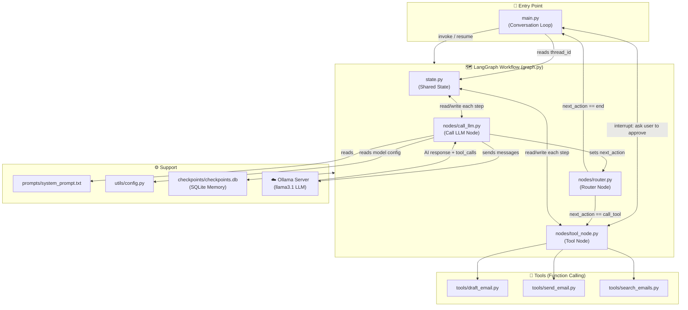
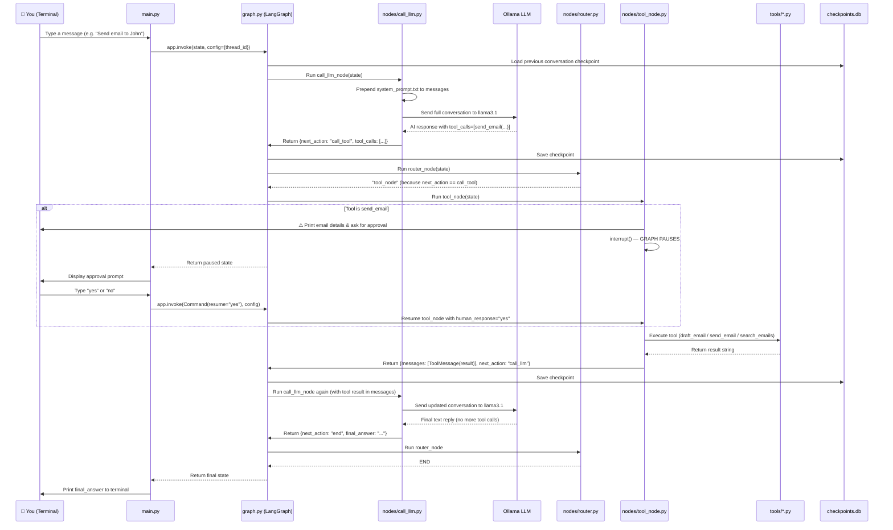
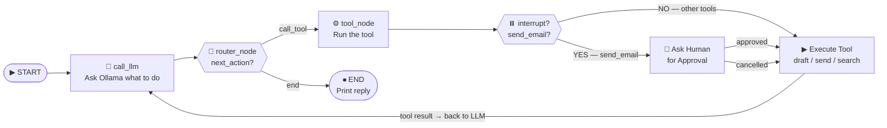

# 🤖 AI Email Assistant — Architecture & Developer Guide

> **Built with:** LangGraph · LangChain · Ollama (`llama3.1`) · Python 3.9+  
> **Purpose:** A locally-run, conversational AI assistant that can draft, send, and search emails — with a human-approval safety gate before any email is actually sent.

---

## Table of Contents

1. [High-Level Overview](#1-high-level-overview)
2. [Project Structure](#2-project-structure)
3. [File-by-File Breakdown](#3-file-by-file-breakdown)
4. [Architecture & Flow Diagrams](#4-architecture--flow-diagrams)
5. [How to Run](#5-how-to-run)
6. [Key Concepts Explained Simply](#6-key-concepts-explained-simply)

---

## 1. High-Level Overview

### What does this project do?

Imagine you have a very smart personal assistant sitting next to you. You can talk to it in plain English and say things like:

- *"Draft an email to Alice about the project deadline."*
- *"Search my inbox for emails about the budget."*
- *"Send an email to John saying Hello, just checking in."*

The AI understands your request, figures out **which action to take** (draft? search? send?), and executes it — but before sending a real email, it **pauses and asks you for permission first**. You are always in control.

### How does the AI "understand" and "act"?

This is where **Function Calling** and **LangChain/LangGraph** come in — but explained simply:

| Concept | Simple Explanation |
|---|---|
| **LLM (the AI brain)** | A locally-running AI model (`llama3.1` via Ollama) that reads your message and decides what to do. |
| **Function Calling (Tools)** | Instead of just replying with text, the AI can call specific *functions* (like `draft_email` or `search_emails`) — think of them as special buttons the AI can press. |
| **LangGraph (the workflow)** | A framework that organises the AI's decision-making as a *graph* (a flowchart). It controls the order: receive message → think → call a tool → get result → reply. |
| **Human-in-the-loop** | Before sending an email, the graph **pauses** (`interrupt`) and asks *you* to approve. This is a safety feature. |
| **Persistent Memory** | Conversation history is saved to a local SQLite database (`checkpoints/`), so the AI remembers context across sessions. |

### The Big Picture

```
You type a message
       ↓
   AI reads it & decides
       ↓
  Does it need a tool?
   ┌────────┴────────┐
  YES               NO
   ↓                 ↓
Call a tool      Reply directly
(draft/search/   to the user
  send email)
   ↓
  Is it "send email"?
   ┌────────┴────────┐
  YES               NO
   ↓                 ↓
 PAUSE &          Run tool,
 ask YOU          get result
 to approve       ↓
   ↓           AI sees result
 You say         & responds
 yes/no
```

---

## 2. Project Structure

```
emailAssistant/                         ← Root of the project
│
├── main.py                             ← Entry point; the conversation loop
├── graph.py                            ← Builds & compiles the LangGraph workflow
├── state.py                            ← Defines the shared data structure (State)
│
├── nodes/                              ← Graph "nodes" — each step in the workflow
│   ├── __init__.py                     ← Exports all three nodes for easy import
│   ├── call_llm.py                     ← Node: sends messages to the AI model
│   ├── tool_node.py                    ← Node: executes the tool the AI chose
│   └── router.py                       ← Node: decides the next step (tool or end)
│
├── tools/                              ← The "functions" the AI can call
│   ├── __init__.py                     ← Exports all tools for easy import
│   ├── draft_email.py                  ← Tool: composes an email draft (no sending)
│   ├── send_email.py                   ← Tool: sends an email (simulated)
│   └── search_emails.py                ← Tool: searches a mock email inbox
│
├── prompts/
│   └── system_prompt.txt               ← Instructions that tell the AI how to behave
│
├── utils/
│   └── config.py                       ← Reads environment variables (model name, URL)
│
├── checkpoints/
│   └── checkpoints.db                  ← SQLite database for conversation memory
│
├── thread_id.txt                       ← Stores the current conversation session ID
└── .gitignore                          ← Files excluded from version control
```

---

## 3. File-by-File Breakdown

### 🚀 Entry Point

#### `main.py`
The **starting point** of the entire application. It runs an infinite loop that reads your typed messages, sends them to the LangGraph workflow, and handles any interrupts (e.g., asking you to approve sending an email). It also manages persistent conversation sessions using a `thread_id`.

---

### 🗺️ Graph & State

#### `graph.py`
**Builds the LangGraph workflow** — it's the blueprint that connects all the nodes together with edges and rules. It also sets up the SQLite checkpointer so conversations are saved to disk automatically.

#### `state.py`
**Defines the shared "memory"** that flows through the entire graph. Think of it as a shared notepad that every node can read from and write to. It holds:
- `messages` — the full conversation history
- `next_action` — whether the AI wants to call a tool or finish
- `tool_calls` — which tool(s) the AI wants to call and with what arguments
- `final_answer` — the AI's final text reply to show the user

---

### 🧠 Nodes (Graph Steps)

#### `nodes/__init__.py`
A convenience file that **exports all three nodes** (`call_llm_node`, `tool_node`, `router_node`) so `graph.py` can import them with a single clean line.

#### `nodes/call_llm.py`
The **"thinking" node** — it loads the system prompt, prepends it to the conversation history, and sends everything to the Ollama AI model. If the AI decides to call a tool, it returns `next_action = "call_tool"`; otherwise it returns the final text answer.

#### `nodes/tool_node.py`
The **"doing" node** — it receives the list of tool calls the AI requested, looks up the right function, and runs it. Crucially, if the tool is `send_email`, it **pauses the graph with `interrupt()`** and waits for your approval before proceeding.

#### `nodes/router.py`
The **"traffic director"** — a simple function that reads `next_action` from the state and returns either `"tool_node"` (to execute a tool) or `END` (to finish and reply to the user).

---

### 🔧 Tools (Functions the AI Can Call)

#### `tools/__init__.py`
Exports all three tools so they can be imported cleanly with `from tools import draft_email, send_email, search_emails`.

#### `tools/draft_email.py`
A **safe, read-only tool** — it takes `recipient`, `subject`, and `body` as arguments and returns a formatted draft string. It does **not** send anything; it just shows you what the email would look like.

#### `tools/send_email.py`
The **send action tool** — in production, this would connect to SMTP or an email API (like Gmail). Currently it simulates sending and returns a success confirmation message. It is always guarded by the human-approval interrupt in `tool_node.py`.

#### `tools/search_emails.py`
A **search tool** that looks through a mock email database for messages matching a keyword. In production, this would connect to a real inbox via IMAP or Gmail API. Returns formatted results showing sender, subject, date, and body.

---

### 📝 Prompts & Config

#### `prompts/system_prompt.txt`
The **AI's instruction manual** — loaded once at startup. It tells the AI its role (email assistant), what tools it has access to, when to use each one, and to never send an email without explicit user instruction. This is the most important file for controlling AI behaviour.

#### `utils/config.py`
Reads **environment variables** from a `.env` file (using `python-dotenv`). Provides the Ollama model name (default: `llama3.1`) and Ollama server URL (default: `http://localhost:11434`) to the rest of the app.

---

### 💾 Data & Persistence

#### `checkpoints/checkpoints.db`
An **auto-created SQLite database** that stores the full conversation state after every graph step. This means if you quit and restart the app, the AI remembers your previous conversation.

#### `thread_id.txt`
Stores a **UUID that uniquely identifies your conversation session**. LangGraph uses this ID to load the correct checkpoint from the database. Delete this file to start a fresh conversation.

---

## 4. Architecture & Flow Diagrams

### 4.1 — Component Interaction Map

How all the files and components are connected to each other:



---

### 4.2 — Step-by-Step Execution Flow

The exact journey of a single user message through the system:



---

### 4.3 — LangGraph Node Flow (Simplified)

The graph as a visual state machine:



---

## 5. How to Run

Follow these steps **exactly** to get the assistant running on your local machine.

### Prerequisites

| Requirement | Version | Check Command |
|---|---|---|
| Python | 3.9+ | `python3 --version` |
| Ollama | Latest | `ollama --version` |
| `llama3.1` model pulled | — | `ollama list` |

### Step 1 — Install Ollama & Pull the Model

```bash
# Install Ollama (macOS)
brew install ollama

# Start the Ollama server (keep this terminal open)
ollama serve

# In a new terminal, pull the llama3.1 model
ollama pull llama3.1
```

> ⚠️ `llama3` (the old version) does **not** support function calling. You **must** use `llama3.1` or `llama3.2`.

---

### Step 2 — Install Python Dependencies

Navigate to the project folder and install dependencies:

```bash
cd "/Users/techverito/llmprojects/AI Email assistant using function calling + LangChain/emailAssistant"

pip3 install langchain-ollama langchain-core langgraph python-dotenv
```

Or if a `requirements.txt` exists:

```bash
pip3 install -r requirements.txt
```

---

### Step 3 — Configure Environment Variables (Optional)

The app works out-of-the-box with defaults, but you can customise it by creating a `.env` file in the `emailAssistant/` directory:

```bash
# emailAssistant/.env

# Which Ollama model to use (must support function calling)
OLLAMA_MODEL=llama3.1

# Where Ollama is running (default is localhost)
OLLAMA_BASE_URL=http://localhost:11434
```

> If you skip this step, the app defaults to `llama3.1` at `http://localhost:11434`.

---

### Step 4 — Run the Assistant

```bash
# Make sure you are in the emailAssistant/ directory
cd "/Users/techverito/llmprojects/AI Email assistant using function calling + LangChain/emailAssistant"

python3 main.py
```

You should see:

```
AI Email Assistant (human approval for sending) - type 'quit' to exit
Conversation ID: a1b2c3d4... (saved to disk)

You:
```

---

### Step 5 — Try It Out

Here are some example commands to test each feature:

```
# Search for emails
You: Find emails about the meeting

# Draft an email (safe — does NOT send)
You: Draft an email to alice@example.com about the project launch next week

# Send an email (will ask for your approval first)
You: Send an email to john@example.com saying "Hi John, just checking in!"

# Answer a general question
You: What tools do you have?

# Exit
You: quit
```

---

### Step 6 — Starting a Fresh Conversation

The app saves your conversation history to disk. To **start a brand new session**:

```bash
# Delete the thread ID file (a new one will be created automatically)
rm thread_id.txt

# Optionally clear the checkpoint database too
rm -rf checkpoints/
```

---

### Troubleshooting

| Error | Likely Cause | Fix |
|---|---|---|
| `Connection refused` to Ollama | Ollama server is not running | Run `ollama serve` in a separate terminal |
| `does not support tools (status code: 400)` | Wrong model (e.g. `llama3` instead of `llama3.1`) | Change `OLLAMA_MODEL=llama3.1` in `.env` |
| `ModuleNotFoundError: langchain_ollama` | Package not installed | Run `pip3 install langchain-ollama` |
| `cannot import name 'interrupt' from 'langgraph'` | LangGraph version too old | Run `pip3 install --upgrade langgraph` |
| AI always drafts but never sends | System prompt working correctly — say "send" explicitly | Type "send an email to..." instead of "write an email to..." |

---

## 6. Key Concepts Explained Simply

### What is "Function Calling"?

Normally, an AI just replies with text. With **function calling**, you give the AI a menu of *actions* it can trigger — like a TV remote with labelled buttons. When the AI recognises that you want an action done, instead of describing it in words, it "presses the button" (calls the function) with the right arguments. LangChain handles passing those arguments to your actual Python functions.

### What is LangGraph?

Think of LangGraph as a **flowchart engine**. You draw boxes (nodes) and arrows (edges) between them, and LangGraph makes sure data flows from box to box correctly. It also handles:
- **Conditional routing** (go to tool_node OR end, depending on AI's decision)
- **Cycles** (the AI can call multiple tools in a row by looping back)
- **Interrupts** (pausing the flow mid-execution to ask a human for input)
- **Checkpointing** (saving the full state to a database so conversations persist)

### What is the "State"?

The `State` object in `state.py` is like a **whiteboard** that every node can read from and write to. As the graph flows from node to node, they all share this whiteboard to communicate — the LLM writes its decision onto it, the router reads it, the tool node reads it and writes results back, and so on.

### What is Human-in-the-Loop (HITL)?

This is the safety feature where the AI **stops and asks a human** before doing something irreversible (like sending an email). In this project, when `tool_node.py` detects a `send_email` call, it calls `interrupt()` which literally freezes the graph execution. Control returns to `main.py`, which shows you the email details and waits for your "yes" or "no" before the graph resumes.

---

*Generated from actual project source code. Last updated: May 2026.*
