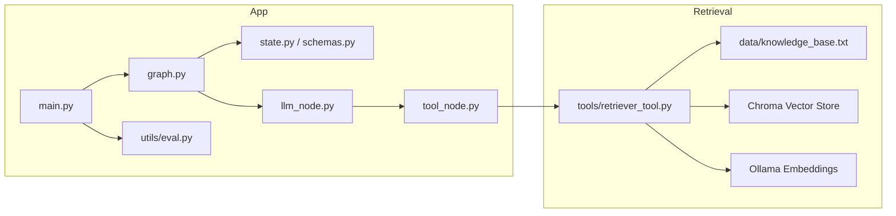
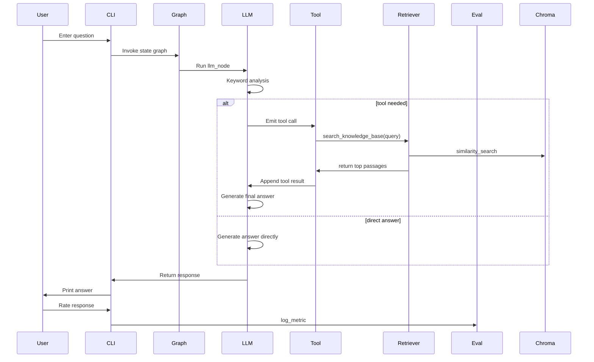

# Architecture Overview

## Overview
This project is a lightweight finance and legal question-answering assistant built as a local Python CLI application with retrieval-augmented generation (RAG). It combines a conversational agent, a vector-based knowledge retrieval tool, and evaluation logging to support domain-specific information lookup and answer synthesis.

The system is oriented around a state graph that orchestrates interactions between a language model node and a tool execution node. Input questions are either answered directly by the language model or augmented with retrieved knowledge base passages when finance/legal keywords are detected.

## Core Components

- **CLI Application (`main.py`)**
  - Launches the conversation loop and manages user interaction.
  - Maintains state across turns, handles result display, and logs user ratings.

- **Graph Workflow (`graph.py`)**
  - Defines the execution flow using `langgraph`.
  - Connects the LLM node and tool node via conditional routing.

- **LLM Node (`nodes/llm_node.py`)**
  - Interfaces with `langchain_ollama` to generate model responses.
  - Uses a keyword-based heuristic to decide when to invoke the retrieval tool.
  - Handles tool response integration and context truncation.

- **Tool Node (`nodes/tool_node.py`)**
  - Executes external tools and converts results into messages.
  - Logs retrieval success and errors to the evaluation log.

- **Retriever Tool (`tools/retriever_tool.py`)**
  - Builds and queries a Chroma vector store over `data/knowledge_base.txt`.
  - Uses Ollama embeddings for vectorization.

- **Evaluation Utilities (`utils/eval.py`)**
  - Provides metric logging to `evaluation_log.json`.
  - Includes a helper for precision@k calculations.

- **State Definitions (`state.py`, `schemas.py`)**
  - Defines the shared application state and typed message structure.
  - Includes Pydantic schema definitions for structured outputs.

## Data Flow

1. User opens the app and submits a question through the CLI.
2. `main.py` appends the user message to the state.
3. `graph.py` routes the state to `nodes/llm_node.py`.
4. `llm_node.py` inspects the latest message and:
   - If finance/legal keywords are present, creates a tool call for `search_knowledge_base`.
   - Otherwise, calls the LLM directly.
5. If a tool call is required, `nodes/tool_node.py` executes `tools/retriever_tool.search_knowledge_base`.
6. The retrieved text is returned as a tool result and appended to the conversation.
7. The graph returns to `nodes/llm_node.py`, which uses the tool result to generate the final answer.
8. `main.py` displays the answer and prompts the user for a rating.
9. `utils/eval.py` logs evaluation metrics to `evaluation_log.json`.

## Technology Stack

| Category | Tool / Library |
| --- | --- |
| Language | Python 3.13 [assumption] |
| Workflow Orchestration | `langgraph` |
| LLM Interface | `langchain_ollama` |
| Embeddings | `OllamaEmbeddings` (nomic-embed-text) |
| Vector DB | `Chroma` via `langchain-chroma` |
| Document Loading | `TextLoader` from `langchain_community` |
| Text Splitting | `langchain-text-splitters` |
| Dependency Management | `requirements.txt` |
| Logging | JSON file logging via `utils/eval.py` |

## External Dependencies

- **Ollama runtime / server**
  - Provides the `ChatOllama` model backend and embedding model.
- **Chroma**
  - Local vector database for similarity search.
- **Knowledge base file**
  - `data/knowledge_base.txt` containing domain content.

## Key Diagrams

### System Context Diagram

```mermaid
flowchart TB
  User[User] -->|asks question| CLI[CLI Application\n(main.py)]
  CLI --> Graph[Workflow Graph\n(graph.py)]
  Graph --> LLM[LLM Node\n(nodes/llm_node.py)]
  LLM -->|keyword decision| Tool[Tool Node\n(nodes/tool_node.py)]
  Tool --> Retriever[Retriever Tool\n(tools/retriever_tool.py)]
  Retriever -->|similar passages| VectorStore[Chroma Vector Store]
  Retriever -->|embeddings| Ollama[Ollama Embeddings]
  LLM -->|answer| CLI
  CLI -->|logs feedback| Eval[Evaluation Logger\n(utils/eval.py)]
```

### Component Diagram



### Sequence Diagram



## Design Decisions

- **Graph-based orchestration**
  - Using `langgraph` separates decision-making from execution and makes the workflow explicit.
  - This structure supports future extension with more tool nodes or branching logic.

- **Keyword-driven retrieval trigger**
  - A simple finance/legal keyword heuristic minimizes unnecessary retrieval calls.
  - This is appropriate for a small prototype and keeps the system lightweight.

- **Local vector retrieval**
  - Using Chroma and a text file avoids the overhead of an external database.
  - It enables fast, on-device retrieval for a domain-specific knowledge base.

## Security & Observability

- **Authentication**
  - No authentication is implemented in the current CLI-based prototype. [assumption]
  - For production, add user authentication and secure API access.

- **Data privacy**
  - The system operates on local data only.
  - No external API calls are made beyond Ollama embeddings and model access.

- **Logging & monitoring**
  - Evaluation data is logged to `evaluation_log.json`.
  - There is no centralized logging or monitoring stack in this repository.
  - Recommended improvement: add structured logs, error handling, and metrics collection.

- **Error handling**
  - Tool execution catches unknown tool errors and logs them in the tool node.
  - Additional exception handling would improve robustness if the LLM or vector store fails.
