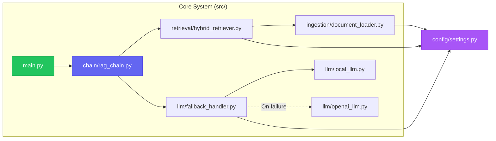
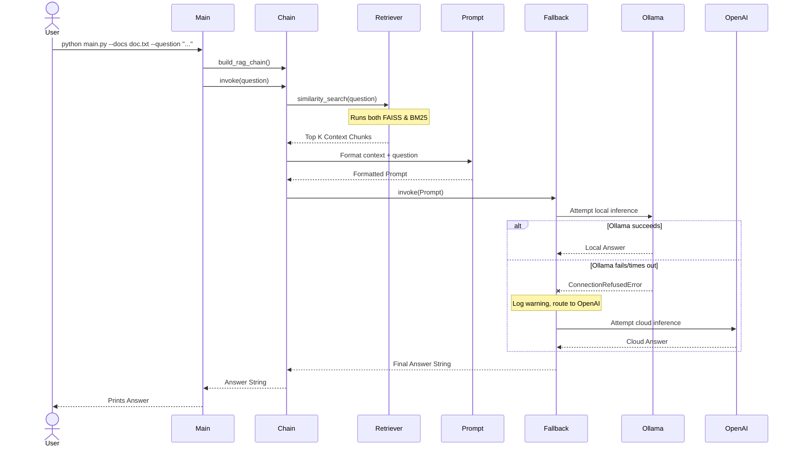

# 🧠 Hybrid Retrieval QA Framework — Architecture & Developer Guide

> **One-line summary:** A privacy-focused, hybrid retrieval-augmented generation (RAG) system that uses both dense (FAISS/HuggingFace) and sparse (BM25) search for better recall, defaulting to a local Ollama LLM with an automatic cloud-based fallback (OpenAI) if the local model fails.

---

## Table of Contents

1. [Overview](#1--overview)
2. [Core Components](#2--core-components)
3. [Data Flow](#3--data-flow)
4. [Technology Stack](#4--technology-stack)
5. [Key Diagrams](#5--key-diagrams)
6. [External Dependencies](#6--external-dependencies)
7. [Design Decisions](#7--design-decisions)
8. [Security & Observability](#8--security--observability)

---

## 1 · Overview

The **Hybrid Retrieval QA Framework** is an advanced Q&A system designed to process local documents (PDFs and text files) and answer questions based on their contents. It improves upon standard RAG implementations in two key ways:

1. **Hybrid Retrieval:** Instead of relying purely on vector embeddings (dense search), it combines vector search with traditional keyword search (BM25). This ensures it can find both semantically similar concepts *and* exact keyword matches (like serial numbers, names, or acronyms).
2. **Resilient LLM Execution:** It prioritizes privacy and cost-efficiency by running queries through a local Ollama LLM first. If the local service is down or fails to generate a response, it automatically falls back to OpenAI's API.

---

## 2 · Core Components

The system is highly modular, split across distinct sub-packages inside the `src/` directory.

| Component | Module | Role |
|-----------|--------|------|
| **Configuration** | `config/settings.py` | Uses Pydantic to manage environment variables and settings (chunk sizes, model names, API keys, retrieval weights). |
| **Document Loader** | `src/ingestion/document_loader.py` | Handles reading raw `.txt` and `.pdf` files and splitting them into manageable chunks (e.g., 500 characters, 50 character overlap) using `RecursiveCharacterTextSplitter`. |
| **Hybrid Retriever** | `src/retrieval/hybrid_retriever.py` | Builds an `EnsembleRetriever` combining FAISS (using HuggingFace BAAI embeddings) and a BM25 retriever. Merges results based on configured weights (50/50 by default). |
| **Fallback LLM Handler** | `src/llm/fallback_handler.py` | Custom wrapper that attempts to invoke the local Ollama LLM (`local_llm.py`) and seamlessly catches exceptions to route the prompt to OpenAI (`openai_llm.py`) if needed. |
| **RAG Chain** | `src/chain/rag_chain.py` | Uses LangChain Expression Language (LCEL) to orchestrate the flow: Retriever ➔ Context Formatting ➔ Prompt ➔ Fallback LLM ➔ Output Parser. |
| **Entry Point** | `src/main.py` | The CLI interface that accepts `--docs` and `--question` arguments, builds the chain, and prints the generated answer. |

---

## 3 · Data Flow

### Ingestion & Query Pipeline

1. **Ingestion (Document Loading):**
   - User provides a path to a document (`.txt` or `.pdf`).
   - `document_loader.py` loads and splits the text into ~500-character chunks.
   - The chunks are fed into both a dense vector store (FAISS) and a sparse index (BM25).

2. **Retrieval:**
   - The user asks a question.
   - The `EnsembleRetriever` queries FAISS (using local HuggingFace embeddings) for semantic matches.
   - Simultaneously, it queries BM25 for exact keyword matches.
   - The results are weighted and merged to produce the top *k* most relevant chunks.

3. **Generation:**
   - The retrieved chunks are formatted into a single context string.
   - The `PromptTemplate` combines the user's question and the formatted context.
   - The `fallback_handler` attempts to send this prompt to the local **Ollama** LLM.
   - **Happy Path:** Ollama processes the prompt and returns the answer.
   - **Fallback Path:** If Ollama crashes or is unreachable, the exception is caught, and the exact same prompt is sent to the **OpenAI** API.
   - The final output is parsed and displayed to the user.

---

## 4 · Technology Stack

| Layer | Technology | Why |
|-------|-----------|-----|
| **Language** | Python 3.10+ | Standard for AI/ML |
| **Orchestration** | LangChain (`langchain>=0.1.0`) | Provides LCEL, retrievers, and abstractions |
| **Embeddings** | HuggingFace (`BAAI/bge-base-en-v1.5`) | High-quality, fast local embeddings |
| **Dense Vector Store** | FAISS | In-memory, fast similarity search |
| **Sparse Index** | BM25 | Best-in-class for exact keyword matching |
| **Primary LLM** | Ollama (`llama2:7b`) | Free, private, local inference |
| **Fallback LLM** | OpenAI API (`gpt-3.5-turbo`) | Highly reliable, cloud-based safety net |
| **Config Mgmt** | Pydantic Settings | Type-safe environment variable parsing |

---

## 5 · Key Diagrams

### 5.1 System Context Diagram

```mermaid
graph TB
    User["👤 User (CLI)"]
    System["🧠 Hybrid RAG System"]
    Docs["📁 Local Documents<br/>(PDF, TXT)"]
    
    Ollama["🦙 Ollama Service<br/>(Localhost)"]
    OpenAI["☁️ OpenAI API<br/>(Cloud)"]
    HF_Hub["🤗 HuggingFace Hub<br/>(Model Download)"]

    User -->|Submits doc path<br/>& question| System
    System -->|Reads text| Docs
    System -->|Primary inference| Ollama
    System -.->|Fallback inference| OpenAI
    System -->|Downloads embedding model<br/>(One-time)| HF_Hub
    System -->|Returns answer| User

    style System fill:#6366f1,stroke:#4f46e5,color:#fff
    style User fill:#10b981,stroke:#059669,color:#fff
    style Ollama fill:#f59e0b,stroke:#d97706,color:#fff
    style OpenAI fill:#0ea5e9,stroke:#0284c7,color:#fff
```

### 5.2 Component Diagram



### 5.3 Sequence Diagram (Typical Request with Fallback)



---

## 6 · External Dependencies

| Dependency | Type | Requirement | Notes |
|------------|------|-------------|-------|
| **Ollama** | Local Service | Highly Recommended | Must be running locally on `localhost:11434`. Pull the model via `ollama pull llama2:7b` beforehand. |
| **OpenAI API** | Cloud Service | Optional / Fallback | Requires an active internet connection and valid `OPENAI_API_KEY` in the `.env` file. |
| **HuggingFace** | Network | Required (First Run) | Requires internet access on the first run to download the `BAAI/bge-base-en-v1.5` embeddings model. |

---

## 7 · Design Decisions

### Decision 1: Hybrid Retrieval (FAISS + BM25)
**Choice:** Combine dense vector search with sparse keyword search using LangChain's `EnsembleRetriever`.
**Why:** Vector search is excellent at understanding semantics and synonyms, but struggles heavily with exact matches (like querying for a specific ID number or a rare acronym). BM25 excels at exact keyword matching. Combining them yields a significantly higher recall rate than either method alone.

### Decision 2: The LLM Fallback Mechanism
**Choice:** Try a local LLM first, and seamlessly catch exceptions to query a cloud API if the local LLM fails.
**Why:** 
1. **Privacy & Cost:** Local LLMs ensure zero data leakage and cost nothing per token.
2. **Reliability:** Local services (like Ollama) might crash, run out of memory, or simply not be started by the user. A cloud fallback ensures the application doesn't completely break, providing a robust user experience.

### Decision 3: Pydantic Settings for Configuration
**Choice:** Use `pydantic_settings` to parse the `.env` file instead of standard `os.getenv`.
**Why:** Pydantic provides type coercion (ensuring chunk sizes are integers and weights are floats) and validation out of the box. It centralizes all configuration logic into a single, type-safe file (`settings.py`).

---

## 8 · Security & Observability

### Security
- **API Keys:** The `OPENAI_API_KEY` is loaded securely via a `.env` file and is never hardcoded. The `.gitignore` properly excludes `.env`.
- **Data Privacy:** Because the primary LLM (Ollama) and the embeddings (HuggingFace) run locally, sensitive documents can be queried without ever sending data to the cloud (provided the OpenAI API key is unset or the local LLM never fails).
- **No Auth:** `[assumption]` This is currently a local CLI tool, so there is no user authentication, RBAC, or API gateway layer.

### Observability
- **Logging:** Basic Python `logging` is configured at the `INFO` level in `main.py`. 
- **Fallback Alerts:** The `fallback_handler.py` explicitly logs a `WARNING` whenever the local LLM fails and it has to route traffic to OpenAI. This is critical for debugging local model stability.
- **Monitoring:** `[assumption]` There is no telemetry, APM, or token usage tracking currently implemented. For production, integrating LangSmith (via environment variables) is recommended to trace RAG performance and token costs.
