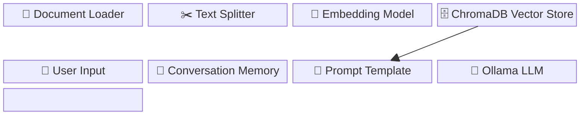
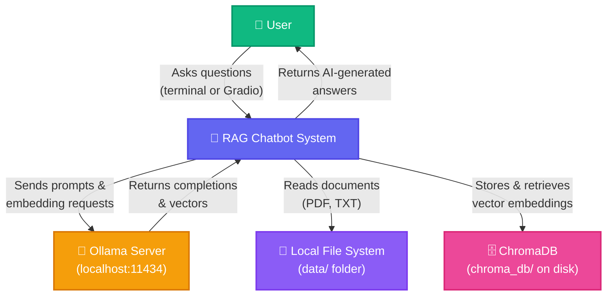
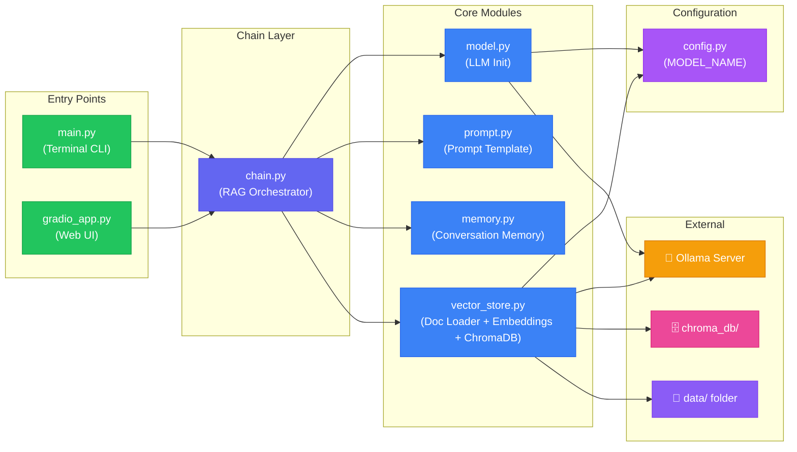
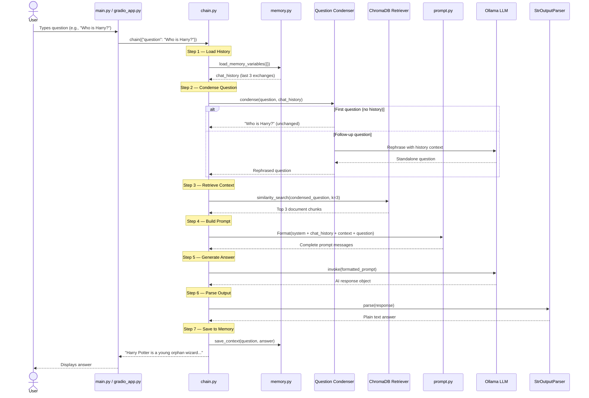
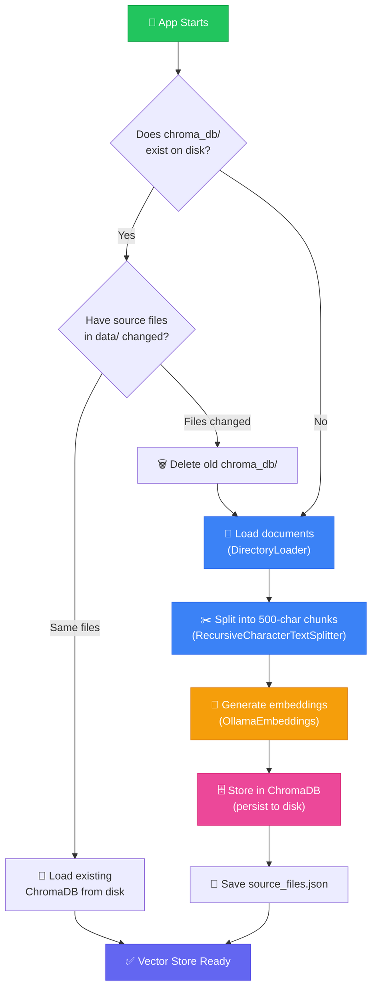

# 🧠 LangChain‑Powered RAG Chatbot — Architecture & Developer Guide

> **One-line summary:** A local, privacy-first chatbot that reads your documents (PDF, TXT),
> stores them as vectors in ChromaDB, and uses an Ollama LLM to answer questions about
> them — all orchestrated by LangChain, with conversation memory and a Gradio web UI.

---

## Table of Contents

1. [High-Level Overview](#1--high-level-overview)
2. [Project Structure](#2--project-structure)
3. [File-by-File Breakdown](#3--file-by-file-breakdown)
4. [Core Components](#4--core-components)
5. [Data Flow](#5--data-flow)
6. [Architecture & Flow Diagrams](#6--architecture--flow-diagrams)
7. [Technology Stack](#7--technology-stack)
8. [External Dependencies](#8--external-dependencies)
9. [Design Decisions](#9--design-decisions)
10. [Security & Observability](#10--security--observability)
11. [How to Run](#11--how-to-run)
12. [Troubleshooting](#12--troubleshooting)

---

## 1 · High-Level Overview

### What Does This Project Do? (Explained for Beginners)

Imagine you have a stack of documents — a Harry Potter story summary, a company policy PDF,
or research notes. Normally, to find an answer you'd have to open each file and read through
it manually. **This RAG chatbot does that work for you.**

Here's the magic in plain English:

```
📄 Your Documents  ──▶  🧩 Chopped into small pieces  ──▶  🔢 Turned into numbers (vectors)
                                                                    │
                                                                    ▼
💬 You ask a question  ──▶  🔍 Find the most relevant pieces  ──▶  🤖 AI reads them & answers
```

| Step | What Happens | Analogy |
|------|-------------|---------|
| **1. Load Documents** | The system reads your `.txt` and `.pdf` files from the `data/` folder. | Opening a textbook. |
| **2. Split into Chunks** | Long documents are cut into small overlapping paragraphs (~500 characters each). | Tearing out relevant paragraphs and pinning them to a board. |
| **3. Create Embeddings** | Each chunk is converted into a list of numbers (a "vector") that captures its meaning. | Writing a one-sentence summary of each paragraph in a secret code. |
| **4. Store in ChromaDB** | These vectors are saved on disk so the system doesn't redo this work every time. | Filing the coded summaries in a cabinet. |
| **5. User Asks a Question** | Your question is also converted into a vector. | Writing your question in the same secret code. |
| **6. Retrieve Relevant Chunks** | The system finds the 3 chunks whose codes are most similar to your question's code. | Pulling the 3 most relevant paragraphs from the filing cabinet. |
| **7. Generate an Answer** | The AI (Ollama LLM) reads those 3 chunks + your question and writes a natural-language answer. | A smart friend reads the paragraphs and tells you the answer in their own words. |
| **8. Remember the Conversation** | The last 3 exchanges are kept in memory so follow-up questions work naturally. | Your friend remembers what you just talked about. |

### What is RAG?

**RAG = Retrieval-Augmented Generation.** Instead of the AI guessing from its training data
alone, it first *retrieves* real information from your documents, then *generates* an answer
grounded in that information. This dramatically reduces hallucinations (made-up answers).

### What is LangChain?

**LangChain** is a Python framework that connects all the pieces together — the document
loaders, the vector store, the LLM, the prompt template, and the memory — into a single
runnable "chain" that you can invoke with one function call.

---

## 2 · Project Structure

```
LangChain‑powered RAG chatbot/
│
├── 📂 data/                              # ── YOUR DOCUMENTS GO HERE ──
│   ├── sample.txt                        #    Plain-text document (Harry Potter summary)
│   └── guardians_of_the_galaxy_story.pdf #    PDF document
│
├── 📂 src/                               # ── ALL APPLICATION CODE ──
│   ├── __init__.py                       #    Makes src/ a Python package (may be empty)
│   ├── config.py                         #    Central configuration (model name, etc.)
│   ├── model.py                          #    LLM initialization (Ollama / ChatOllama)
│   ├── prompt.py                         #    Prompt template with chat history placeholder
│   ├── memory.py                         #    Conversation memory (sliding window, k=3)
│   ├── vector_store.py                   #    Document loading, splitting, embedding, ChromaDB
│   ├── chain.py                          #    RAG chain assembly (retriever → prompt → LLM)
│   ├── main.py                           #    CLI entry point (terminal chatbot loop)
│   └── gradio_app.py                     #    Web UI entry point (Gradio chat interface)
│
├── 📂 chroma_db/                         # ── AUTO-GENERATED VECTOR DATABASE ──
│   ├── chroma.sqlite3                    #    SQLite metadata store for ChromaDB
│   ├── source_files.json                 #    Tracks which data files were indexed
│   └── <uuid>/                           #    Internal ChromaDB collection directory
│
├── 📂 .vscode/                           #    VS Code workspace settings
├── .gitignore                            #    Git ignore rules
├── requirements.txt                      #    Python dependencies
└── RAG_Chatbot_Guide.md                  #    Original quick-start guide
```

---

## 3 · File-by-File Breakdown

### Configuration & Setup

| File | Purpose |
|------|---------|
| [`config.py`](file:///Users/techverito/llmprojects/LangChain%E2%80%91powered%20RAG%20chatbot/src/config.py) | Defines the **model name** (`llama2` by default) and **embeddings model** as project-wide constants. Every other module imports from here — change the model in one place and it updates everywhere. |
| [`requirements.txt`](file:///Users/techverito/llmprojects/LangChain%E2%80%91powered%20RAG%20chatbot/requirements.txt) | Lists all Python package dependencies: `langchain`, `langchain_community`, `chromadb`, `pypdf`, and `sentence_transformers`. Install them with `pip install -r requirements.txt`. |
| [`.gitignore`](file:///Users/techverito/llmprojects/LangChain%E2%80%91powered%20RAG%20chatbot/.gitignore) | Prevents `__pycache__/`, virtual environments (`.venv/`, `env/`), `.env` secrets, and generated files (`chroma_db/`, `*.pkl`) from being committed to Git. |

---

### Core Pipeline

| File | Purpose |
|------|---------|
| [`model.py`](file:///Users/techverito/llmprojects/LangChain%E2%80%91powered%20RAG%20chatbot/src/model.py) | Initialises the **LLM** using `ChatOllama`. Configures `temperature=0` (deterministic answers) and `num_predict=512` (limits output length to save memory). The model name comes from `config.py`. |
| [`vector_store.py`](file:///Users/techverito/llmprojects/LangChain%E2%80%91powered%20RAG%20chatbot/src/vector_store.py) | The **heaviest module** — handles the entire document-to-vector pipeline: (1) loads `.txt` and `.pdf` files from `data/` using LangChain `DirectoryLoader`, (2) splits them into ~500-character chunks with `RecursiveCharacterTextSplitter`, (3) generates embeddings via `OllamaEmbeddings`, (4) stores/loads them in a **persistent ChromaDB** on disk. Includes smart caching — it tracks which source files were indexed and only rebuilds when files change. |
| [`prompt.py`](file:///Users/techverito/llmprojects/LangChain%E2%80%91powered%20RAG%20chatbot/src/prompt.py) | Defines the **prompt template** sent to the LLM. Uses `ChatPromptTemplate` with a system instruction ("answer using ONLY the context"), a `MessagesPlaceholder` for chat history, and a human message containing the retrieved context + the user's question. |
| [`memory.py`](file:///Users/techverito/llmprojects/LangChain%E2%80%91powered%20RAG%20chatbot/src/memory.py) | Creates a **sliding-window conversation memory** (`ConversationBufferWindowMemory`) that retains the last `k=3` question/answer exchanges. This allows the chatbot to understand follow-up questions like "Tell me more about that." |
| [`chain.py`](file:///Users/techverito/llmprojects/LangChain%E2%80%91powered%20RAG%20chatbot/src/chain.py) | **The orchestrator** — assembles all components into a single runnable RAG chain using LangChain's LCEL (LangChain Expression Language). The chain: (1) loads chat history from memory, (2) condenses the user's question using history (so follow-ups become standalone questions), (3) retrieves top-3 relevant chunks, (4) formats them into the prompt, (5) invokes the LLM, (6) parses the output, and (7) saves the exchange back to memory. |

---

### Entry Points (How You Start the App)

| File | Purpose |
|------|---------|
| [`main.py`](file:///Users/techverito/llmprojects/LangChain%E2%80%91powered%20RAG%20chatbot/src/main.py) | **Terminal chatbot.** Builds the RAG chain with memory, then enters an interactive loop: reads user input, invokes the chain, prints the answer. Type `quit` or `exit` to stop. |
| [`gradio_app.py`](file:///Users/techverito/llmprojects/LangChain%E2%80%91powered%20RAG%20chatbot/src/gradio_app.py) | **Web UI chatbot.** Wraps the same RAG chain in a [Gradio](https://gradio.app) `ChatInterface` that launches a browser-based chat window at `http://127.0.0.1:7860`. No frontend code needed — Gradio generates the UI automatically. |

---

### Data Files

| File | Purpose |
|------|---------|
| [`data/sample.txt`](file:///Users/techverito/llmprojects/LangChain%E2%80%91powered%20RAG%20chatbot/data/sample.txt) | A plain-text summary of the Harry Potter story — used as a sample document for the RAG chatbot to answer questions about. |
| `data/guardians_of_the_galaxy_story.pdf` | A PDF document containing a Guardians of the Galaxy story summary — demonstrates the chatbot's ability to ingest and query PDF files. |

---

### Auto-Generated Directories

| Directory | Purpose |
|-----------|---------|
| `chroma_db/` | Persistent vector database created automatically on first run. Contains `chroma.sqlite3` (metadata), `source_files.json` (tracks indexed files), and internal collection directories. **Delete this folder to force a full re-index.** |

---

## 4 · Core Components



| Component | Module | Role |
|-----------|--------|------|
| **Document Loader** | `vector_store.py` | Reads `.txt` and `.pdf` files from `data/` using LangChain's `DirectoryLoader`, `TextLoader`, and `PyPDFLoader`. |
| **Text Splitter** | `vector_store.py` | `RecursiveCharacterTextSplitter` breaks documents into 500-char chunks with 50-char overlap so that no meaning is lost at boundaries. |
| **Embedding Model** | `vector_store.py` | `OllamaEmbeddings` converts text chunks into dense vector representations using the locally-running Ollama model. |
| **Vector Store** | `vector_store.py` | ChromaDB stores vectors on disk with persistence. Supports smart caching — only rebuilds when source files change. |
| **Retriever** | `chain.py` | Wraps ChromaDB as a LangChain retriever (`as_retriever(k=3)`) to fetch the 3 most relevant chunks for a query. |
| **Conversation Memory** | `memory.py` | `ConversationBufferWindowMemory(k=3)` stores the last 3 exchanges as `HumanMessage`/`AIMessage` pairs. |
| **Question Condenser** | `chain.py` | A mini LLM call that rephrases follow-up questions (e.g., "Tell me more") into standalone queries using chat history. |
| **Prompt Template** | `prompt.py` | `ChatPromptTemplate` with system instruction, chat history placeholder, and context + question slots. |
| **LLM (Ollama)** | `model.py` | `ChatOllama` running locally — no API keys, no internet, fully private. Default model: `llama2`. |
| **Output Parser** | `chain.py` | `StrOutputParser` extracts the plain-text answer from the LLM's response object. |
| **RAG Chain** | `chain.py` | LCEL pipeline that connects all of the above into a single callable chain. |

---

## 5 · Data Flow

### How Data Moves Through the System

```
┌─────────────────────────────────────────────────────────────────────────────┐
│                         INGESTION PIPELINE (one-time)                      │
│                                                                             │
│   data/*.txt ──┐                                                            │
│                ├──▶ DirectoryLoader ──▶ RecursiveCharacterTextSplitter      │
│   data/*.pdf ──┘         │                       │                          │
│                          ▼                       ▼                          │
│                    Raw Documents           500-char Chunks                  │
│                                                  │                          │
│                                                  ▼                          │
│                                        OllamaEmbeddings                    │
│                                                  │                          │
│                                                  ▼                          │
│                                       ChromaDB (chroma_db/)                │
│                                       + source_files.json                  │
└─────────────────────────────────────────────────────────────────────────────┘

┌─────────────────────────────────────────────────────────────────────────────┐
│                       QUERY PIPELINE (every question)                      │
│                                                                             │
│   User Question                                                             │
│        │                                                                    │
│        ▼                                                                    │
│   Load Chat History (last 3 exchanges from memory)                         │
│        │                                                                    │
│        ▼                                                                    │
│   Condense Question (LLM rephrases with history context)                   │
│        │                                                                    │
│        ▼                                                                    │
│   Retriever (ChromaDB similarity search → top 3 chunks)                    │
│        │                                                                    │
│        ▼                                                                    │
│   Prompt Template (system + history + context + question)                   │
│        │                                                                    │
│        ▼                                                                    │
│   Ollama LLM (generates answer)                                            │
│        │                                                                    │
│        ▼                                                                    │
│   StrOutputParser (extract plain text)                                      │
│        │                                                                    │
│        ├──▶ Display to user (terminal or Gradio)                            │
│        └──▶ Save to memory (for next question)                              │
└─────────────────────────────────────────────────────────────────────────────┘
```

---

## 6 · Architecture & Flow Diagrams

### 6.1 System Context Diagram

This shows the system from the outside — who uses it and what external services it depends on.



---

### 6.2 Component Diagram

This shows how the internal source files relate to each other.



---

### 6.3 Sequence Diagram — Full Question-Answer Flow

This shows exactly what happens when a user asks a question, step by step.



---

### 6.4 Ingestion Pipeline (Document Loading & Indexing)

This shows what happens when the app starts for the first time (or when documents change).



---

### 6.5 LCEL Chain Internals

This shows the internal structure of the RAG chain built in `chain.py` using LangChain Expression Language.

```mermaid
flowchart LR
    Input["{ question }"] --> A["RunnablePassthrough.assign<br/>chat_history = load_memory()"]
    A --> B["RunnablePassthrough.assign<br/>condensed_question = condense()"]
    B --> C["RunnableParallel"]

    subgraph C["RunnableParallel"]
        C1["context = retriever → format_docs"]
        C2["question = passthrough"]
        C3["chat_history = passthrough"]
    end

    C --> D["ChatPromptTemplate"]
    D --> E["ChatOllama (LLM)"]
    E --> F["StrOutputParser"]
    F --> G["Answer string"]
    G --> H["Save to memory"]

    style Input fill:#22c55e,stroke:#16a34a,color:#fff
    style C fill:#f0f9ff,stroke:#3b82f6,color:#1e3a5f
    style D fill:#a855f7,stroke:#9333ea,color:#fff
    style E fill:#f59e0b,stroke:#d97706,color:#fff
    style G fill:#6366f1,stroke:#4f46e5,color:#fff
```



---

## 7 · Technology Stack

| Layer | Technology | Why |
|-------|-----------|-----|
| **Language** | Python 3.10+ | De-facto standard for AI/ML applications |
| **LLM Framework** | LangChain + LangChain Community | Provides document loaders, text splitters, prompt templates, LCEL chains, and memory abstractions |
| **LLM Runtime** | [Ollama](https://ollama.com) (`llama2` default) | Runs LLMs locally — fully private, no API keys, no internet needed |
| **LLM Interface** | `ChatOllama` (LangChain) | LangChain wrapper for Ollama's chat API |
| **Embeddings** | `OllamaEmbeddings` | Generates vector representations using the same local Ollama model |
| **Vector Database** | [ChromaDB](https://www.trychroma.com/) | Lightweight, file-based vector store with SQLite backend — perfect for local projects |
| **Document Loaders** | `TextLoader`, `PyPDFLoader` via `DirectoryLoader` | Reads `.txt` and `.pdf` files from the `data/` folder |
| **Text Splitting** | `RecursiveCharacterTextSplitter` | Splits on natural boundaries (paragraphs → sentences → words) with configurable chunk size and overlap |
| **Conversation Memory** | `ConversationBufferWindowMemory` | Keeps the last `k` exchanges as LangChain message objects |
| **Web UI** | [Gradio](https://gradio.app) | Auto-generates a chat interface with zero frontend code |
| **PDF Parsing** | `pypdf` | Backend for `PyPDFLoader` to extract text from PDF files |

---

## 8 · External Dependencies

| Dependency | Type | Required? | Notes |
|-----------|------|-----------|-------|
| **Ollama** | Local service | ✅ Yes | Must be installed and running (`ollama serve`). Provides both LLM inference and embedding generation. |
| **Ollama Model** (e.g., `llama2`) | Model download | ✅ Yes | Downloaded via `ollama pull llama2`. Stored locally by Ollama. |
| **ChromaDB** | Python package | ✅ Yes | Installed via `pip`. No external server needed — runs embedded with SQLite. |
| **Gradio** | Python package | 🟡 Optional | Only needed if you want the web UI. The terminal interface works without it. |
| **Internet** | Network | ❌ No | The entire system runs offline after initial setup. No API calls to external services. |

---

## 9 · Design Decisions

### Decision 1: Local-Only with Ollama (No Cloud APIs)

**Choice:** Use Ollama for both LLM inference and embeddings, instead of OpenAI/Anthropic APIs.

**Why:**
- **Privacy:** Documents never leave the user's machine — critical for sensitive data.
- **Cost:** Completely free. No per-token billing.
- **Offline:** Works without internet after initial model download.

**Trade-off:** Slower inference and potentially lower quality answers compared to GPT-4, but
acceptable for document Q&A use cases. Users can swap models via `config.py` (e.g., `mistral`,
`phi`, `llama3`).

---

### Decision 2: Persistent ChromaDB with Smart Caching

**Choice:** Save the vector store to disk (`chroma_db/`) and track which source files were
indexed via `source_files.json`.

**Why:**
- **Startup speed:** Re-embedding documents on every launch would take 30–60+ seconds. Loading
  from disk takes <1 second.
- **Change detection:** By comparing the current file list to `source_files.json`, the system
  automatically rebuilds only when documents are added, removed, or modified.

**How it works (from [`vector_store.py`](file:///Users/techverito/llmprojects/LangChain%E2%80%91powered%20RAG%20chatbot/src/vector_store.py#L87-L112)):**
```
get_or_create_vector_store():
  1. List all files in data/
  2. Read source_files.json from chroma_db/
  3. If lists match → load existing ChromaDB
  4. If lists differ → delete chroma_db/, rebuild from scratch
  5. If no chroma_db/ → create new
```

---

### Decision 3: Question Condensation for Multi-Turn Conversations

**Choice:** Before retrieval, use a separate LLM call to rephrase the user's question
incorporating chat history.

**Why:** If a user asks "Who is Harry?" then follows up with "What happened to him?", the
retriever wouldn't find relevant chunks for "him" alone. The condenser rewrites it as
"What happened to Harry Potter?" — a standalone query that retrieves the right chunks.

**Trade-off:** Adds ~1 extra LLM call per question. Justified because it makes follow-up
questions actually work.

---

## 10 · Security & Observability

### Security

| Area | Current State | Notes |
|------|--------------|-------|
| **Data Privacy** | ✅ All data stays local | No documents or queries are sent to external APIs. Ollama runs on `localhost`. |
| **Secrets Management** | ✅ `.env` is gitignored | The `.gitignore` excludes `.env` files. Currently no API keys are needed, but the pattern is in place. |
| **Input Sanitization** | ⚠️ Minimal | User input goes directly to the LLM prompt. For production, add input validation/sanitization. `[assumption]` |
| **Authentication** | ❌ None | The Gradio UI and terminal have no auth. For shared deployments, enable Gradio's built-in auth. `[assumption]` |
| **Network Exposure** | ✅ Local only | Gradio defaults to `127.0.0.1`. The commented-out `server_name="0.0.0.0"` would expose it to the network. |

### Observability

| Area | Current State | Notes |
|------|--------------|-------|
| **Logging** | ⚠️ Print statements only | `vector_store.py` prints status messages (e.g., "Loading existing vector store..."). For production, use Python's `logging` module. `[assumption]` |
| **Monitoring** | ❌ None | No metrics, health checks, or alerting. For production, consider LangSmith or custom logging. `[assumption]` |
| **Tracing** | ❌ None | No LangChain tracing enabled. Set `LANGCHAIN_TRACING_V2=true` and configure LangSmith for chain-level debugging. `[assumption]` |
| **Error Handling** | ⚠️ Basic | Ollama connection errors and missing files would produce raw Python tracebacks. Wrap in try/except for production. `[assumption]` |

---

## 11 · How to Run

### Prerequisites

| Requirement | Version | How to Check |
|------------|---------|-------------|
| Python | 3.10+ | `python3 --version` |
| pip | Latest | `pip3 --version` |
| Ollama | Latest | `ollama --version` |

### Step-by-Step Setup

#### 1. Install Ollama

Download from [ollama.com](https://ollama.com) and install. Then start the server:

```bash
# Start Ollama (runs on http://localhost:11434 by default)
ollama serve
```

#### 2. Pull a Model

```bash
# Download the default model (llama2, ~3.8 GB)
ollama pull llama2

# Or use a lighter/newer model:
# ollama pull mistral
# ollama pull phi
# ollama pull llama3
```

> **Tip:** If you choose a different model, update `MODEL_NAME` in
> [`src/config.py`](file:///Users/techverito/llmprojects/LangChain%E2%80%91powered%20RAG%20chatbot/src/config.py).

#### 3. Install Python Dependencies

```bash
cd "LangChain‑powered RAG chatbot"

# (Recommended) Create a virtual environment first
python3 -m venv venv
source venv/bin/activate    # On Windows: venv\Scripts\activate

# Install all dependencies
pip install -r requirements.txt

# If you want the Gradio web UI, also install:
pip install gradio
```

#### 4. Add Your Documents

Place any `.txt` or `.pdf` files into the `data/` folder:

```bash
ls data/
# sample.txt
# guardians_of_the_galaxy_story.pdf
# your_custom_document.pdf    ← add your own files here!
```

#### 5. Run the Chatbot

**Option A — Terminal (CLI):**

```bash
python3 -m src.main
```

```
Building RAG chain with memory (this may take a moment)...
Creating new vector store (this may take a moment)...
Ready! Ask me questions. I remember the last 3 exchanges.

You: Who is Harry Potter?
Bot: Harry Potter is a young orphan boy who discovers he is a wizard...

You: What happens to him at Hogwarts?
Bot: At Hogwarts, Harry meets his best friends Ron and Hermione...

You: quit
```

**Option B — Web UI (Gradio):**

```bash
python3 -m src.gradio_app
```

Then open the URL shown in your terminal (usually `http://127.0.0.1:7860`).

#### 6. Re-index After Adding New Documents

If you add, remove, or modify files in `data/`, simply restart the app. It will automatically
detect the change and rebuild the vector store:

```
Source documents changed, rebuilding vector store...
Creating new vector store (this may take a moment)...
```

Or manually delete the `chroma_db/` folder to force a full rebuild:

```bash
rm -rf chroma_db/
python3 -m src.main
```

---

## 12 · Troubleshooting

| Issue | Solution |
|-------|----------|
| `ModuleNotFoundError: No module named 'langchain'` | Run `pip install -r requirements.txt` (make sure your virtual environment is activated). |
| `ConnectionError` to Ollama | Ensure Ollama is running: `ollama serve` (or check if another process is using port 11434). |
| Vector store creation fails | Delete `chroma_db/` and restart the app. Also ensure `data/` contains at least one `.txt` or `.pdf` file. |
| Very slow responses | Use a smaller model (`phi` or `tinyllama`). Reduce `num_predict` in `model.py`. Ensure your machine has enough RAM (8 GB+ recommended). |
| "I don't know" for every question | The answer isn't in your documents, or the chunks didn't match. Try more specific questions, or increase `k` in `chain.py` (e.g., `search_kwargs={"k": 5}`). |
| Follow-up questions don't work | Make sure you're using `build_rag_chain_with_memory()` (not the old `build_rag_chain()`). The memory module must be imported in `chain.py`. |
| Gradio won't open in browser | Try manually navigating to `http://127.0.0.1:7860`. If port is in use, stop the other process or change the port in `gradio_app.py`. |
| `No module named 'gradio'` | Install separately: `pip install gradio`. |

---

> **Built with** 🦙 Ollama · 🦜 LangChain · 🗄️ ChromaDB · 🎨 Gradio
>
> **Architecture document generated from source code analysis — reflects the actual codebase.**
