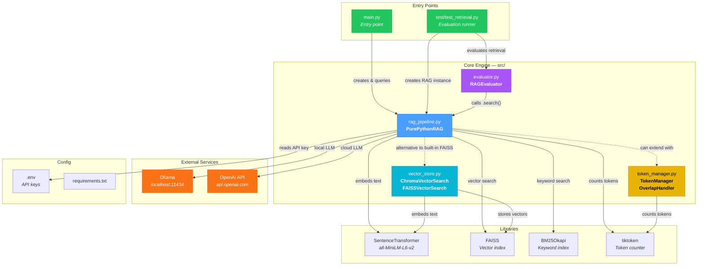
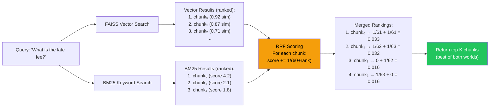
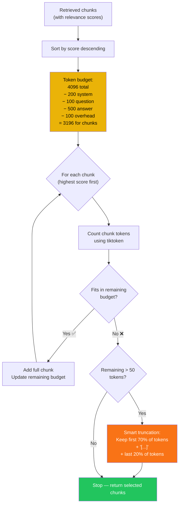
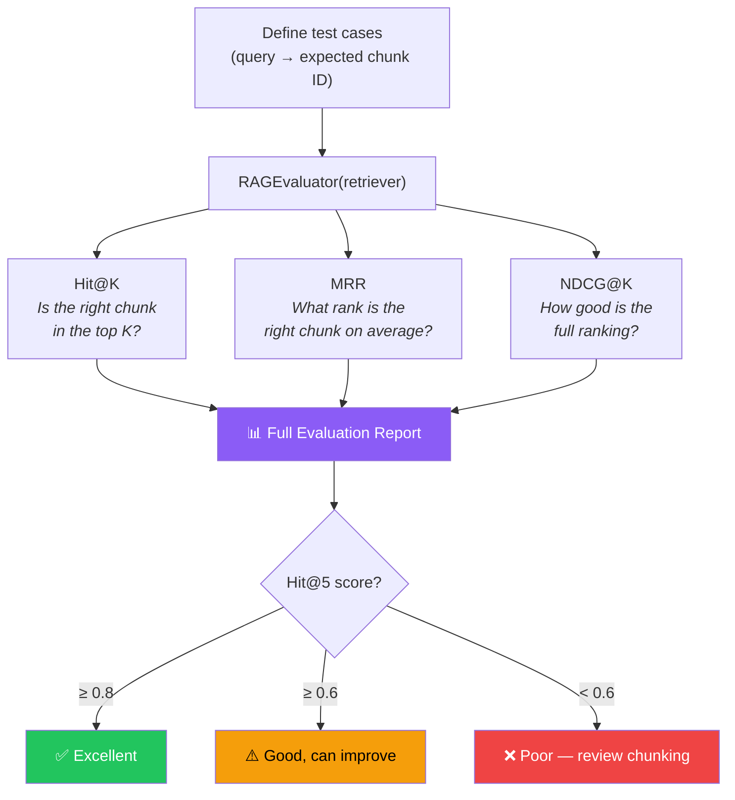

# Module3 — RAG Pipeline: Architecture & Walkthrough

> A complete, beginner-friendly guide to understanding the **Module3** project — a pure-Python **Retrieval-Augmented Generation (RAG)** system that finds the most relevant pieces of your documents and uses an LLM to answer questions about them.

---

## 1. High-Level Overview (No Jargon)

### What does this project do?

Imagine you have a pile of documents (company policies, manuals, FAQs, etc.) and you want to **ask questions** about them in plain English and get accurate, cited answers. That's exactly what this project does.

Here's the process in everyday language:

1. **You feed it your documents.** The system breaks them into small pieces called "chunks."
2. **It creates a searchable index.** Each chunk is converted into a mathematical fingerprint (an "embedding") so the system can quickly find chunks that are *meaningfully similar* to any question — even if the exact words don't match. It *also* builds a traditional keyword index as a backup.
3. **You ask a question.** The system searches both indexes, merges the results intelligently, and picks the most relevant chunks.
4. **It asks an AI to answer.** The selected chunks are stuffed into a prompt like "Here is some context — now answer this question using only this context." That prompt is sent to an LLM (either a local model via **Ollama** or the **OpenAI API**).
5. **You get a cited answer.** The AI's response comes back with source references so you can verify where the information came from.

### Key Concepts

| Concept | Plain-English Explanation |
|---|---|
| **RAG** | *Retrieval-Augmented Generation* — first **find** relevant info, then **generate** an answer from it. |
| **Embedding** | A list of numbers that captures the *meaning* of a text. Similar texts have similar numbers. |
| **Vector Search (FAISS)** | Finds chunks whose embeddings are closest to your question's embedding — great for *semantic* matches ("penalty" ↔ "fee"). |
| **Keyword Search (BM25)** | Finds chunks that share the same *words* as your question — great for exact-term matches ("USD", "email"). |
| **Hybrid Search + RRF** | Combines both search methods using *Reciprocal Rank Fusion* so you get the best of both worlds. |
| **Token Management** | LLMs have a maximum input size. The token manager ensures the prompt doesn't exceed that limit. |
| **Evaluation** | Automated metrics (Hit@K, MRR, NDCG) that tell you how good the search quality is. |

> [!TIP]
> This project does **not** use LangChain — it implements the entire RAG pipeline from scratch in pure Python, which makes it an excellent learning resource for understanding how RAG really works under the hood.

---

## 2. Project Structure

```
Module3/
├── main.py                      # 🚀 Entry point — run this to try the RAG pipeline
├── requirements.txt             # 📦 Python dependencies
├── .gitignore                   # 🙈 Files excluded from version control
├── .env                         # 🔑 (You create this) API keys & config
│
├── src/                         # 🧠 Core source code
│   ├── rag_pipeline.py          #    The main RAG engine (search + prompt + LLM)
│   ├── vector_store.py          #    Vector database implementations (Chroma & FAISS)
│   ├── token_manager.py         #    Token counting, context fitting, overlap handling
│   └── evaluator.py             #    Retrieval quality metrics (Hit@K, MRR, NDCG)
│
├── test/                        # 🧪 Tests
│   └── test_retrieval.py        #    Runs evaluation metrics on sample documents
│
├── explainationMD/              # 📖 Per-file explanation docs (markdown)
│   ├── rag_pipeline.md
│   ├── vector_store.md
│   ├── token_manager.md
│   └── evaluator.md
│
├── data/                        # 📁 (Empty) Placeholder for document files
│
├── .vscode/                     # ⚙️ VS Code settings
│   └── settings.json
│
└── venv/                        # 🐍 Python virtual environment (not committed)
```

---

## 3. File-by-File Breakdown

### Entry Point & Config

| File | Purpose |
|---|---|
| [main.py](file:///Users/techverito/llmprojects/Module3/main.py) | **The starting point.** Creates sample policy documents, initialises the RAG pipeline, and runs three example questions through it (using local Ollama by default). Run this file to see the system in action. |
| [requirements.txt](file:///Users/techverito/llmprojects/Module3/requirements.txt) | Lists all Python packages needed: `faiss-cpu`, `sentence-transformers`, `chromadb`, `rank-bm25`, `tiktoken`, `openai`, `requests`, `python-dotenv`. |
| [.gitignore](file:///Users/techverito/llmprojects/Module3/.gitignore) | Tells Git to ignore virtual environments, `.env` secrets, compiled Python files, IDE folders, and serialised index files. |
| `.env` (you create) | Stores secrets like `OPENAI_API_KEY` and optionally `OLLAMA_MODEL`. Never committed to Git. |

---

### Core Source Files (`src/`)

#### [rag_pipeline.py](file:///Users/techverito/llmprojects/Module3/src/rag_pipeline.py) — *The Brain*

The central orchestrator. Contains the `PurePythonRAG` class that wires together every stage of the RAG pipeline:

| Method | What It Does |
|---|---|
| [`__init__`](file:///Users/techverito/llmprojects/Module3/src/rag_pipeline.py#L14-L24) | Loads the embedding model (`all-MiniLM-L6-v2`), initialises FAISS index storage, sets token limits, and reads the Ollama model name from env. |
| [`add_documents`](file:///Users/techverito/llmprojects/Module3/src/rag_pipeline.py#L26-L46) | Builds **two** indexes from your text chunks — a FAISS vector index (semantic search) and a BM25 keyword index. |
| [`hybrid_search`](file:///Users/techverito/llmprojects/Module3/src/rag_pipeline.py#L48-L77) | Runs both FAISS and BM25 searches, then merges their results using **Reciprocal Rank Fusion (RRF)** to produce a single ranked list. |
| [`build_prompt`](file:///Users/techverito/llmprojects/Module3/src/rag_pipeline.py#L79-L103) | Assembles a structured prompt with numbered, cited context chunks and strict rules (answer only from context, cite sources). |
| [`optimize_context`](file:///Users/techverito/llmprojects/Module3/src/rag_pipeline.py#L105-L108) | Trims the retrieved chunks to the top-K. (Can be extended with `TokenManager` for token-aware fitting.) |
| [`call_llm`](file:///Users/techverito/llmprojects/Module3/src/rag_pipeline.py#L110-L164) | Sends the prompt to either **OpenAI's API** or a **local Ollama** instance. Includes automatic model-fallback logic if the configured Ollama model isn't found. |
| [`query`](file:///Users/techverito/llmprojects/Module3/src/rag_pipeline.py#L193-L225) | The **main method** — orchestrates the full pipeline: retrieve → optimise → prompt → LLM → return answer with sources. |

---

#### [vector_store.py](file:///Users/techverito/llmprojects/Module3/src/vector_store.py) — *The Search Engines*

Provides **two** standalone vector store implementations you can use independently:

| Class | When to Use | Key Capabilities |
|---|---|---|
| [`ChromaVectorSearch`](file:///Users/techverito/llmprojects/Module3/src/vector_store.py#L11-L53) | Learning & prototyping | Built-in persistence to disk, metadata filtering (e.g. filter by `source`), easy API. |
| [`FAISSVectorSearch`](file:///Users/techverito/llmprojects/Module3/src/vector_store.py#L58-L114) | Production & scale | Extremely fast similarity search, save/load index to disk, handles millions of vectors. |

Both use the same `all-MiniLM-L6-v2` embedding model (384 dimensions) with cosine similarity (via normalised inner product).

---

#### [token_manager.py](file:///Users/techverito/llmprojects/Module3/src/token_manager.py) — *The Budget Controller*

Ensures the prompt sent to the LLM never exceeds its token limit. Contains two classes:

| Class | What It Does |
|---|---|
| [`TokenManager`](file:///Users/techverito/llmprojects/Module3/src/token_manager.py#L5-L69) | Counts tokens using `tiktoken`, reserves space for system/question/answer overhead, selects as many high-scoring chunks as fit, and intelligently truncates the last chunk (keeping both its beginning and end) if it partially fits. Also provides a `get_usage_report()` for debugging. |
| [`OverlapHandler`](file:///Users/techverito/llmprojects/Module3/src/token_manager.py#L72-L94) | Two static utilities: (1) `chunk_with_overlap()` splits a long document into overlapping chunks so no information is lost at boundaries; (2) `merge_overlapping_results()` de-duplicates near-identical retrieved chunks using string similarity. |

---

#### [evaluator.py](file:///Users/techverito/llmprojects/Module3/src/evaluator.py) — *The Quality Checker*

Measures how well the retrieval system is working using standard information-retrieval metrics:

| Metric | Method | What It Tells You |
|---|---|---|
| **Hit@K** | [`evaluate_hit_at_k`](file:///Users/techverito/llmprojects/Module3/src/evaluator.py#L20-L36) | "Is the correct chunk anywhere in the top K results?" |
| **MRR** | [`evaluate_mrr`](file:///Users/techverito/llmprojects/Module3/src/evaluator.py#L38-L62) | "On average, how high does the correct chunk rank?" |
| **NDCG@K** | [`evaluate_ndcg_at_k`](file:///Users/techverito/llmprojects/Module3/src/evaluator.py#L64-L89) | "How good is the overall ranking, considering partial matches?" |
| **Full Report** | [`full_evaluation`](file:///Users/techverito/llmprojects/Module3/src/evaluator.py#L91-L113) | Runs all metrics and prints a summary with ✅/⚠️/❌ verdict. |

---

### Test Files

| File | Purpose |
|---|---|
| [test_retrieval.py](file:///Users/techverito/llmprojects/Module3/test/test_retrieval.py) | Loads the same sample documents as `main.py`, defines 7 test cases (query + expected chunk index), and runs the full evaluation suite to print retrieval quality scores. |

---

### Documentation Files (`explainationMD/`)

| File | Covers |
|---|---|
| [rag_pipeline.md](file:///Users/techverito/llmprojects/Module3/explainationMD/rag_pipeline.md) | Line-by-line explanation of the RAG pipeline class and methods. |
| [vector_store.md](file:///Users/techverito/llmprojects/Module3/explainationMD/vector_store.md) | Detailed breakdown of both Chroma and FAISS vector store classes. |
| [token_manager.md](file:///Users/techverito/llmprojects/Module3/explainationMD/token_manager.md) | Explanation of token budgeting, chunk fitting, truncation strategy, and overlap handling. |
| [evaluator.md](file:///Users/techverito/llmprojects/Module3/explainationMD/evaluator.md) | Deep dive into Hit@K, MRR, and NDCG metrics with formulas. |

---

## 4. Architecture & Flow Diagrams

### 4.1 Component Interaction Map

This diagram shows how every file and component connects to the others:



> [!NOTE]
> The dashed lines show **optional/extensible** connections. The `PurePythonRAG` class has its own built-in FAISS index, but `vector_store.py` provides standalone alternatives. Similarly, `token_manager.py` can be plugged in to replace the simple `optimize_context()` method.

---

### 4.2 End-to-End Execution Flow (The Happy Path)

This is the step-by-step journey from loading documents to getting an answer:

```mermaid
flowchart TD
    START(["🚀 main.py is executed"]) --> DOCS["📄 Define sample documents<br/>(5 policy text chunks)"]
    DOCS --> INIT["Create PurePythonRAG instance<br/>• Load embedding model<br/>• Init tiktoken tokenizer"]
    INIT --> ADD["add_documents()"]

    ADD --> EMB["Generate embeddings<br/>(SentenceTransformer → 384-dim vectors)"]
    EMB --> FIDX["Build FAISS index<br/>(IndexFlatIP — inner product)"]
    EMB --> BIDX["Build BM25 index<br/>(Tokenize chunks → BM25Okapi)"]

    FIDX --> READY(["✅ Indexes ready"])
    BIDX --> READY

    READY --> Q["User asks a question"]
    Q --> QUERY["query(question)"]
    QUERY --> HS["hybrid_search(question, k=10)"]

    HS --> VSEARCH["🔵 FAISS Vector Search<br/>Embed query → find top 2K<br/>semantically similar chunks"]
    HS --> KSEARCH["🟢 BM25 Keyword Search<br/>Tokenize query → score all chunks<br/>→ take top 2K by keyword match"]

    VSEARCH --> RRF["⚡ Reciprocal Rank Fusion<br/>score = Σ 1/(60 + rank)<br/>Merge & re-rank results"]
    KSEARCH --> RRF

    RRF --> OPT["optimize_context()<br/>Keep top K=5 chunks"]
    OPT --> PROMPT["build_prompt()<br/>Assemble: instructions + numbered<br/>context chunks + question"]
    PROMPT --> LLM{"Which LLM?"}

    LLM -->|"use_openai=True"| OPENAI["☁️ OpenAI API<br/>POST to gpt-3.5-turbo<br/>temperature=0, max_tokens=500"]
    LLM -->|"use_openai=False"| OLLAMA["🦙 Local Ollama<br/>POST localhost:11434/api/generate<br/>model=llama2, stream=false"]

    OLLAMA --> FALLBACK{"404 error?"}
    FALLBACK -->|"Yes"| RETRY["Fetch available models<br/>→ retry with first available"]
    FALLBACK -->|"No"| PARSE
    RETRY --> PARSE

    OPENAI --> PARSE["Parse LLM response"]
    PARSE --> RESULT["📋 Return result dict:<br/>• question<br/>• answer (with citations)<br/>• sources (chunk + metadata)<br/>• num_chunks_used"]

    RESULT --> PRINT["Print formatted output:<br/>QUESTION / ANSWER / SOURCES"]

    style START fill:#22c55e,color:#fff
    style READY fill:#22c55e,color:#fff
    style VSEARCH fill:#3b82f6,color:#fff
    style KSEARCH fill:#22c55e,color:#fff
    style RRF fill:#f59e0b,color:#000
    style OPENAI fill:#6366f1,color:#fff
    style OLLAMA fill:#f97316,color:#fff
    style RESULT fill:#8b5cf6,color:#fff
```



---

### 4.3 Hybrid Search Deep Dive — RRF Fusion



> [!IMPORTANT]
> **Why RRF?** Vector search catches semantic matches (e.g., "penalty" ≈ "fee"), while BM25 catches exact keyword matches (e.g., "USD"). RRF combines them so you get high-quality results regardless of how the user phrases their question.

---

### 4.4 Token Management Flow



---

### 4.5 Evaluation Pipeline



---

## 5. How to Run

### Prerequisites

| Requirement | Why |
|---|---|
| **Python 3.9+** | The project uses modern Python features. |
| **Ollama** (recommended) | To run an LLM locally for free. Install from [ollama.com](https://ollama.com). |
| **OpenAI API key** (optional) | Only if you want to use GPT-3.5-turbo instead of a local model. |

### Step-by-Step Setup

```bash
# 1. Navigate to the project
cd /Users/techverito/llmprojects/Module3

# 2. Create & activate a virtual environment
python3 -m venv venv
source venv/bin/activate

# 3. Install dependencies
pip install -r requirements.txt

# 4. (Optional) Create a .env file for configuration
cat > .env << 'EOF'
# Choose your local Ollama model (must be pulled first)
OLLAMA_MODEL=llama2

# Only needed if you want to use OpenAI instead of Ollama
# OPENAI_API_KEY=sk-your-key-here
EOF

# 5. Make sure Ollama is running and has a model pulled
ollama serve          # Start the Ollama server (if not already running)
ollama pull llama2    # Download the model (~3.8 GB, one-time)

# 6. Run the RAG pipeline!
python main.py
```

### Expected Output

```
Building FAISS index...
Building BM25 index...
Added 5 chunks

--- Processing: What happens if I pay late? ---
Retrieved 5 candidates
Prompt length: ~120 tokens

==================================================
QUESTION: What happens if I pay late?
ANSWER: Late payment incurs a 5% monthly fee on outstanding balance [1].
        Payments received after the 15th are considered late [2].
SOURCES: 5 chunks used
==================================================
```

### Running the Evaluation Tests

```bash
# From the Module3 directory
python test/test_retrieval.py
```

This will print a retrieval quality report with Hit@1, Hit@3, Hit@5, MRR, and NDCG@5 scores.

### Switching to OpenAI

In [main.py](file:///Users/techverito/llmprojects/Module3/main.py#L28), change:

```diff
- result = rag.query(q, verbose=True, use_openai=False)  # use Ollama
+ result = rag.query(q, verbose=True, use_openai=True)   # use OpenAI
```

Make sure your `.env` file contains a valid `OPENAI_API_KEY`.

---

### Available Ollama Models on This Machine

Based on your current setup, these models are already pulled:

| Model | Size |
|---|---|
| `llama3.1:latest` | 4.9 GB |
| `mistral:7b-instruct` | 4.4 GB |
| `llama3:latest` | 4.7 GB |
| `llama2:latest` | 3.8 GB (current default) |
| `llama3.2:1b` | 1.3 GB (fastest) |
| `codellama:7b-instruct` | 3.8 GB |
| `deepseek-coder:6.7b` | 3.8 GB |

> [!TIP]
> To use a different model, update the `OLLAMA_MODEL` in your `.env` file. For example, `OLLAMA_MODEL=llama3.1:latest` for the latest Llama 3.1 model — it will generally give better quality answers than llama2.

---

## Quick Reference: What Calls What

```
main.py
  └── PurePythonRAG()                          [rag_pipeline.py]
       ├── add_documents(chunks, metadata)
       │    ├── SentenceTransformer.encode()    [sentence-transformers]
       │    ├── faiss.IndexFlatIP.add()         [faiss-cpu]
       │    └── BM25Okapi(tokenized_chunks)     [rank-bm25]
       │
       └── query(question)
            ├── hybrid_search()
            │    ├── FAISS.search()              → vector results
            │    ├── BM25.get_scores()           → keyword results
            │    └── RRF fusion                  → merged ranking
            ├── optimize_context()               → top-K chunks
            ├── build_prompt()                   → structured prompt
            └── call_llm()
                 ├── OpenAI API                  (if use_openai=True)
                 └── Ollama localhost:11434       (if use_openai=False)
```
