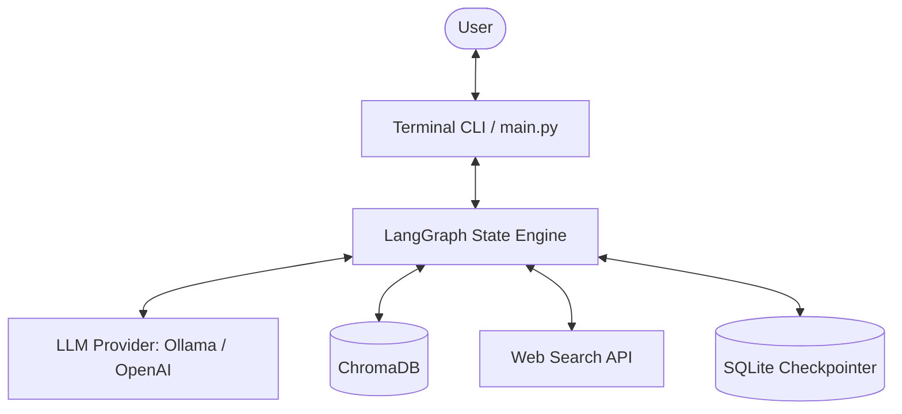
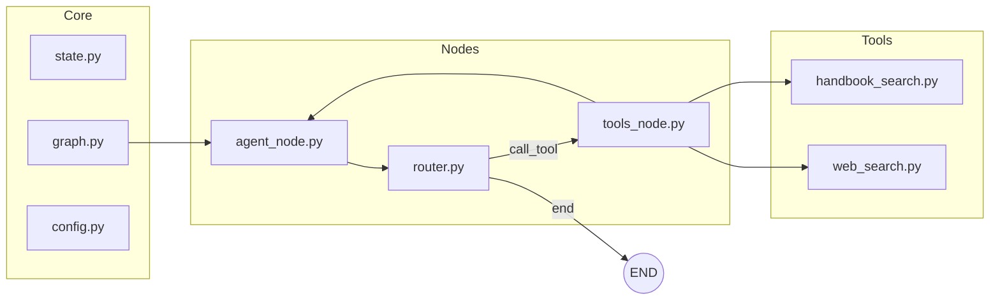
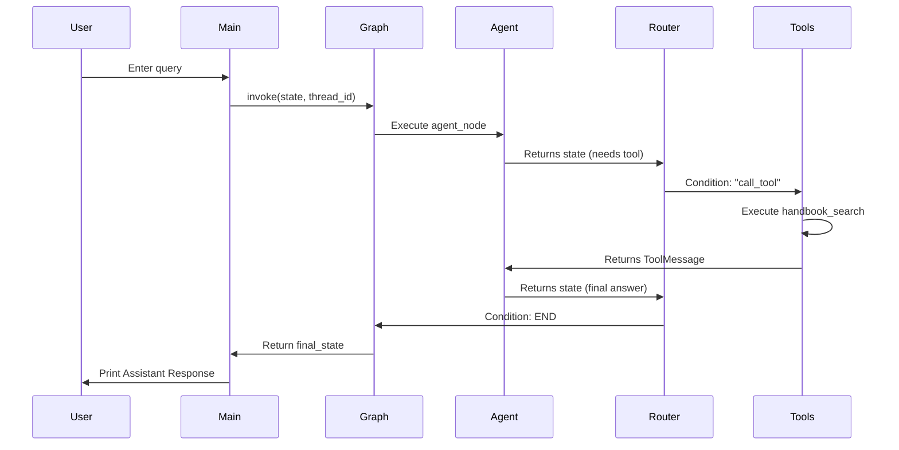

# Architecture Overview: Structured Conversational Agentic RAG System

## 1. Overview
The Structured Conversational RAG System is an advanced, agentic AI assistant capable of answering user queries by retrieving context from internal company documents (a handbook) or falling back to live web searches. Built using the **LangGraph** framework, it models the conversation as a state machine with persistent memory, enabling multi-turn, context-aware interactions. The system is highly modular, supporting both local execution (via Ollama) and cloud-based models (via OpenAI).

## 2. Core Components
- **Entry Point (`main.py`)**: Manages the interactive terminal loop, handles user input, initializes session-based persistent memory (via SQLite or in-memory), and invokes the LangGraph application.
- **State Definition (`state.py`)**: Defines the typed dictionary representing the conversational state (messages, retrieved context, next actions, tool calls). It uses `operator.add` to ensure new messages are appended to the history.
- **Workflow Engine (`graph.py`)**: Constructs the state graph, wiring together nodes and conditional edges. It is responsible for orchestrating the flow between the agent and its tools.
- **Agent Node (`nodes/agent_node.py`)**: The core decision-maker. It binds the available tools to the LLM and processes the conversational state. It dictates whether to produce a final answer or dispatch a tool call.
- **Tools Node (`nodes/tools_node.py`)**: Executes specific functions requested by the agent. It maps the requested tool name to the actual implementation and appends the result as a `ToolMessage`.
- **Router Node (`nodes/router.py`)**: Contains the conditional logic to route the flow either to the `tools_node` (if a tool was requested) or to `END` (if the agent has finalized its answer).
- **Configuration (`utils/config.py`)**: Abstract factory for initializing the LLM and Embeddings, easily toggling between OpenAI and local Ollama configurations via `.env` variables.
- **Tools (`tools/`)**:
  - `handbook_search.py`: A retriever tool powered by ChromaDB that searches chunked internal documents.
  - `web_search.py`: A fallback tool that searches the internet using Tavily (or DuckDuckGo).

## 3. Data Flow
1. **Input**: The user provides a query via the terminal interface in `main.py`.
2. **State Update**: The query is appended to the LangGraph state as a `HumanMessage`.
3. **Agent Evaluation**: The state graph triggers the `agent_node`. The LLM evaluates the conversation history.
4. **Routing**: 
   - *Scenario A (Direct Answer)*: The LLM formulates a final response. The `router_node` directs the flow to `END`.
   - *Scenario B (Tool Execution)*: The LLM decides it needs more information. It emits a tool call. The `router_node` directs the flow to `tools_node`.
5. **Tool Execution**: The `tools_node` executes either the internal handbook search (querying ChromaDB) or the web search (querying Tavily/DuckDuckGo). The result is appended to the state.
6. **Re-evaluation**: Flow returns to the `agent_node`, which synthesizes the tool results into a final response.
7. **Output**: The finalized `AIMessage` is printed to the terminal, and the updated state is persisted to the checkpointer.

## 4. Technology Stack
- **Language**: Python 3.9+
- **Frameworks**: LangChain, LangGraph
- **LLM / AI Providers**: 
  - Local: Ollama (e.g., `llama3.1`, `nomic-embed-text`)
  - Cloud: OpenAI (GPT models)
- **Vector Database**: Chroma (local vector storage)
- **Data Persistence**: SQLite (via `langgraph-checkpoint-sqlite` for conversational memory)
- **External Tools**: Tavily API, DuckDuckGo Search
- **Environment Management**: `python-dotenv`

## 5. Key Diagrams

### System Context Diagram

### Component Diagram

### Sequence Diagram

## 6. External Dependencies
- **LLM APIs**: Ollama (local daemon) or OpenAI API.
- **Search APIs**: Tavily Search API (requires `TAVILY_API_KEY`) or DuckDuckGo (fallback).
- **ChromaDB**: Used locally as an embedded vector store.
- **SQLite**: Local relational DB engine used for thread-level conversation checkpointing.

## 7. Design Decisions
1. **Agentic Workflow over Linear RAG**: By utilizing LangGraph and an agentic loop, the system is not constrained to always searching the vector database. It can intelligently decide when to search internal docs, when to search the web, and when to just answer directly based on context, resulting in a more flexible and accurate assistant.
2. **Abstracted LLM/Embedding Configuration**: The `utils/config.py` acts as a factory, easily swapping between local, private models (Ollama) and powerful cloud models (OpenAI) simply by toggling a `.env` variable. This ensures the system can be deployed in highly secure environments (fully local) or optimized for intelligence (cloud).
3. **SQLite Checkpointing for Memory**: Moving from a simple in-memory list to `langgraph-checkpoint-sqlite` provides persistent memory. If the terminal session is closed and restarted, the AI can seamlessly recall previous context from the active `thread_id`.

## 8. Security & Observability
- **Authentication**: `TAVILY_API_KEY` and `OPENAI_API_KEY` are isolated within the `.env` file and excluded from version control via `.gitignore`. 
- **Data Privacy**: Using the Ollama configuration ensures that highly sensitive corporate handbook data and conversational inputs never leave the local network. [assumption: Sensitive RAG scenarios will force `MODEL_PROVIDER=ollama`].
- **Observability**: Tool executions and router decisions naturally log state transitions within the LangGraph framework. [assumption: For production, LangSmith could be integrated with minimal effort by setting `LANGCHAIN_API_KEY` to trace token usage and tool selection latency].
