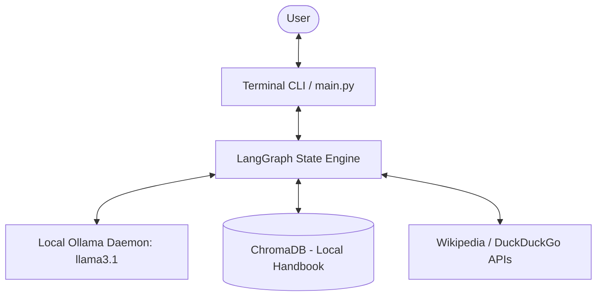
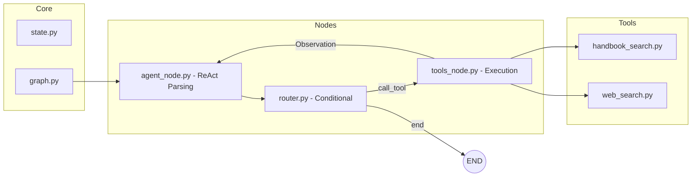
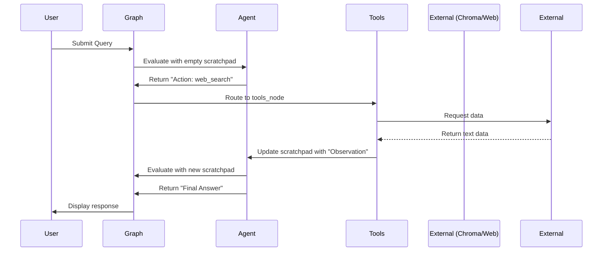

# Architecture Overview: Tool-Enabled Agentic RAG System

## 1. Overview
The **Tool-Enabled Agentic RAG System** is an intelligent conversational assistant that uses a ReAct (Reasoning and Acting) prompting framework to dynamically route user queries. Powered by **LangGraph**, it orchestrates an iterative reasoning loop where an agent decides whether to retrieve internal knowledge (company handbook), query the open web, or respond directly based on its conversational history. The system operates entirely locally using Ollama for both inference and embeddings, ensuring data privacy.

## 2. Core Components
- **Entry Point (`main.py`)**: The interactive terminal interface. It establishes a persistent session via `thread_id.txt` and manages the conversation loop, passing the growing state to the LangGraph application.
- **State Management (`state.py`)**: Defines a typed dictionary (`State`) representing the workflow's memory. Key attributes include `messages` (chat history), `tool_calls` (pending actions), and a `scratchpad` (for intermediate reasoning steps).
- **Workflow Engine (`graph.py`)**: Constructs the finite state machine using `StateGraph`. It connects the agent node to the tool execution node, incorporating conditional edges to manage the ReAct loop and utilizing `MemorySaver` for in-memory checkpointing.
- **Agent Node (`nodes/agent_node.py`)**: The core brain of the application. It uses a ReAct prompt template to evaluate the conversation and the `scratchpad`. It parses the LLM's response to extract an `Action` (tool selection) and `Action Input` (query), or a `Final Answer`.
- **Tools Executor (`nodes/tools_node.py`)**: A dedicated node that safely executes functions requested by the agent. It maps parsed tool names to actual Python functions (`handbook_search`, `web_search`), invokes them, and appends the observations to the `scratchpad`.
- **Router Node (`nodes/router.py`)**: A conditional edge function that inspects the state's `next_action` variable to route the graph either back to the tool node or to `END`.
- **Tools Package (`tools/`)**:
  - `handbook_search.py`: A local retrieval tool utilizing **ChromaDB** and `OllamaEmbeddings` to search chunked text from the internal company handbook.
  - `web_search.py`: An external retrieval tool that queries the **Wikipedia API** and falls back to **DuckDuckGo** for general knowledge.

## 3. Data Flow
1. **Input**: User submits a prompt via the CLI in `main.py`.
2. **State Injection**: The message is added to the `messages` list along with the current `thread_id`.
3. **Agent Reasoning**: `agent_node` formats a ReAct prompt containing the conversation history and the `scratchpad`. The Ollama LLM generates a response containing either a tool call or a final answer.
4. **Routing**: The `router_node` interprets the agent's intent.
   - *Path A (Tool Required)*: Routes to `tools_node`.
   - *Path B (Final Answer)*: Routes to `END`.
5. **Tool Execution**: `tools_node` extracts the target tool and query, executes the function (ChromaDB or Web API), and appends the result to the `scratchpad` as an "Observation".
6. **Iterative Loop**: The graph loops back from `tools_node` to `agent_node`, feeding the new observation back into the LLM until it determines it has enough information to formulate a `Final Answer`.
7. **Output**: The finalized string is rendered to the user.

## 4. Technology Stack
- **Language**: Python 3.9+
- **Agent Framework**: LangChain & LangGraph (v0.2.16)
- **Local Inference**: Ollama (`langchain-ollama`)
  - **LLM**: `llama3.1` (Temperature 0 for deterministic reasoning)
  - **Embeddings**: `nomic-embed-text`
- **Vector Database**: Chroma (`chromadb`)
- **State Checkpointing**: LangGraph `MemorySaver` (with SQLite dependency available).

## 5. Key Diagrams

### System Context Diagram

### Component Diagram

### Sequence Diagram

## 6. External Dependencies
- **Ollama**: Must be running locally as a daemon to serve `llama3.1` and `nomic-embed-text`.
- **Wikipedia REST API**: Used for primary web search queries.
- **DuckDuckGo API**: Used as a fallback web search mechanism.
- [assumption] The system operates completely independently of API keys (no Tavily or OpenAI dependencies are strictly required).

## 7. Design Decisions
1. **ReAct Prompting over Function Calling**: By using a manual ReAct string-parsing approach instead of native LLM tool-calling (like OpenAI's JSON mode), the system ensures compatibility with a wider range of open-source models (via Ollama) that might struggle with strict JSON schemas.
2. **Stateful Scratchpad**: Maintaining a `scratchpad` string in the state, rather than just appending raw `ToolMessages`, forces the LLM to explicitly "see" its reasoning steps (Thought -> Action -> Observation). This drastically reduces hallucinations and cyclical tool calls.
3. **In-Memory Checkpointing**: While the system generates a `thread_id`, it uses `MemorySaver` to checkpoint state. This avoids the overhead of managing SQLite databases on disk for simple local development, while still demonstrating session-aware capabilities within a single run.

## 8. Security & Observability
- **Data Privacy (Air-Gapped Potential)**: Because the core LLM and VectorDB are hosted locally via Ollama and Chroma, sensitive company handbook data is never transmitted over the internet.
- **Logging**: The system uses terminal print statements to trace the ReAct loop (Action and Action Input parsing). [assumption] In a production scenario, these would be routed to a structured logger or LangSmith.
- **Error Handling**: The `tools_node` catches unknown tool names and returns them as errors to the agent, allowing the LLM to self-correct its tool selection rather than crashing the application.
