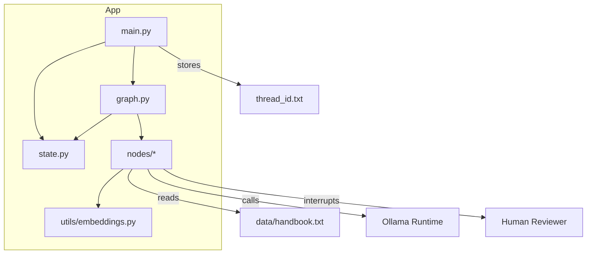
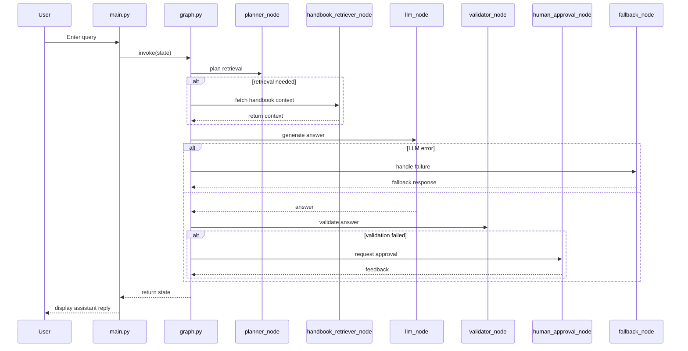

# Architecture

## Overview

This project is a Python-based multi-agent Retrieval-Augmented Generation (RAG) system built around a graph execution model. It is an interactive command-line application that accepts user input, decides whether retrieval is needed, optionally fetches context from a local handbook corpus, invokes an Ollama LLM, validates output, and can request human approval or return a fallback response.

## Core Components

- `main.py`
  - CLI entry point.
  - Initializes session metadata and thread identity.
  - Routes user input into the graph execution pipeline.
  - Handles graph interrupts for human approval.

- `graph.py`
  - Defines and compiles the LangGraph application graph.
  - Connects processing nodes to establish execution flow.
  - Orchestrates branching behavior, including retrieval, validation, human review, and fallback.

- `state.py`
  - Defines the shared typed state structure passed between nodes.
  - Provides fields for messages, retrieval contexts, validation status, error tracking, and routing hints.

- `nodes/`
  - Contains discrete functional units that perform specific tasks in the pipeline.
  - Includes:
    - `planner_node.py`
    - `handbook_retriever_node.py`
    - `web_retriever_node.py`
    - `llm_node.py`
    - `validator_node.py`
    - `human_approval_node.py`
    - `fallback_node.py`

- `utils/embeddings.py`
  - Encapsulates the embedding model used by the handbook retriever.

- `data/handbook.txt`
  - Local knowledge source used for retrieval.

## Data Flow

1. **User Input**
   - User enters a prompt in the CLI provided by `main.py`.
2. **Graph Invocation**
   - `main.py` passes the current state into `graph.app.invoke(...)`.
3. **Planning**
   - `planner_node.py` inspects the latest user message and sets `need_retrieval` based on keyword rules.
4. **Retrieval**
   - If retrieval is required, `handbook_retriever_node.py` loads `data/handbook.txt`, builds or reuses a Chroma vector store, and searches for relevant chunks.
   - `web_retriever_node.py` can provide mock web context for future extension.
5. **Context Merge**
   - Retrieved context is written into state fields such as `handbook_context` and `web_context`.
   - `context` is expected to be assembled and consumed by the LLM node.
6. **LLM Invocation**
   - `llm_node.py` formats a prompt with system instructions and available context.
   - It calls `langchain_ollama.ChatOllama` and retries failed calls.
7. **Validation**
   - `validator_node.py` checks whether the generated answer is grounded in retrieved context when retrieval happened.
   - Sets `validation_status` to `passed` or `failed`.
8. **Human Approval / Fallback**
   - If validation fails, `human_approval_node.py` interrupts the graph and requests a human judgment.
   - If repeated LLM errors occur, `fallback_node.py` appends a safe fallback message.
9. **Response**
   - The final assistant response is returned to the CLI and displayed to the user.

## Technology Stack

| Layer | Technology | Purpose |
|---|---|---|
| Language | Python 3.10+ | Primary runtime |
| Graph Orchestration | `langgraph` | Graph-based workflow execution |
| LLM Integration | `langchain-ollama` | Ollama model invocation |
| Prompt/Messages | `langchain-core` | Message and prompt templates |
| Retrieval | `langchain-chroma`, `chromadb` | Vector database, similarity search |
| Embeddings | `langchain_ollama.OllamaEmbeddings` | Local embedding model |
| Persistence | File system | `thread_id.txt` and local handbook data |
| CLI | Standard input/output | Interactive user interface |
| Retry | `tenacity` | Robust LLM call retries |
| Environment | `python-dotenv` | Optional environment variable management |

## Key Diagrams

### System Context Diagram

```mermaid
flowchart LR
    User[User]
    CLI[CLI App (`main.py`)]
    Graph[Graph Engine (`graph.py`)]
    Handbook[Local Handbook Data (`data/handbook.txt`)]
    LLM[Ollama LLM]
    Human[Human Reviewer]
    Fallback[Fallback Logic]

    User -->|prompt| CLI
    CLI -->|invoke graph| Graph
    Graph -->|retrieve| Handbook
    Graph -->|call| LLM
    Graph -->|validate| Graph
    Graph -->|request approval| Human
    Graph -->|fallback path| Fallback
    Graph -->|response| CLI
    CLI -->|output| User
```

### Component Diagram



### Sequence Diagram



## External Dependencies

- `langgraph` for graph workflow orchestration.
- `langchain-ollama` and local Ollama runtime for LLM inference.
- `langchain-chroma` and `chromadb` for vector retrieval.
- `langchain_core` for prompt/message abstractions.
- `tenacity` for retry logic.
- Local file system for state persistence and handbook corpus.

## Design Decisions

1. **Graph-based orchestration**
   - Using `langgraph` enables explicit node-level control, branching, and interrupt handling.
   - This architecture makes it easier to extend with additional nodes like new retrievers, validators, or post-processors.

2. **Local retrieval corpus**
   - Storing `handbook.txt` locally simplifies the initial proof-of-concept and avoids external indexing infrastructure.
   - It supports offline retrieval while allowing future migration to remote search services.

3. **Human approval and fallback support**
   - Separating validation and human approval improves safety for model output.
   - Fallback handling prevents the system from failing silently when the LLM is unavailable.

## Security & Observability

- **Authentication**
  - No authentication is implemented; the system is an interactive local CLI tool.
  - For production use, add an authentication layer around the interface and any exposed API.

- **Logging**
  - Minimal debug output exists in the retriever node.
  - Recommended: add structured logging around graph execution, LLM calls, validation results, and error events.

- **Monitoring**
  - No monitoring currently exists.
  - Recommended: instrument LLM latency, retrieval success/failure, validation failures, and human approval interrupts.

- **Data protection**
  - Sensitive model and prompt data remain in memory and local files only.
  - If extended to a networked service, secure the LLM endpoint and protect any persisted thread identifiers.

## Assumptions

- The system is designed as a local CLI proof-of-concept rather than a networked production service.
- The `web_retriever_node.py` is currently a mock placeholder and does not perform real external web search.
- The data pipeline is synchronous and single-threaded.
