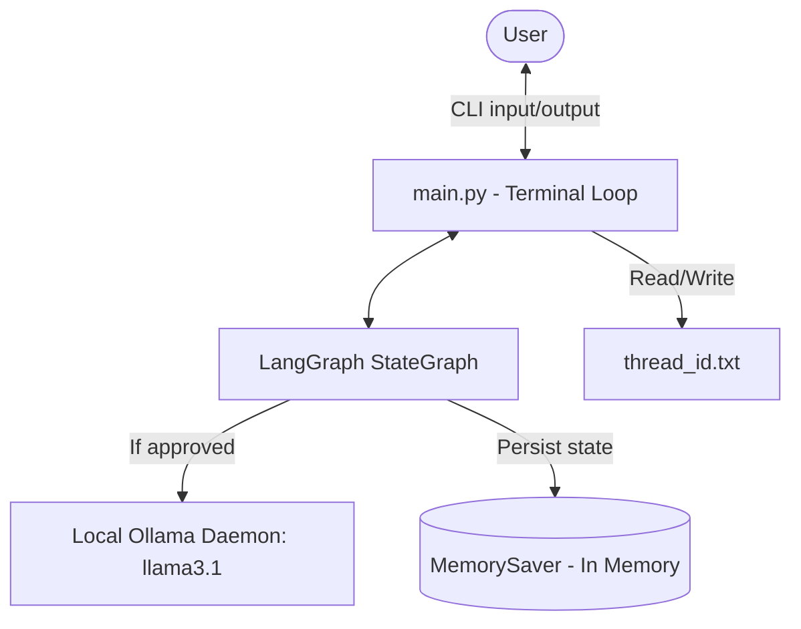
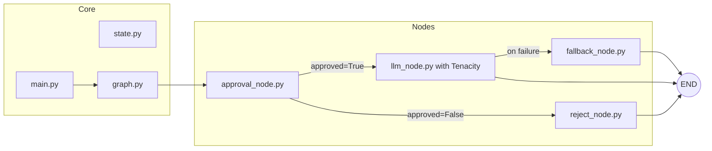
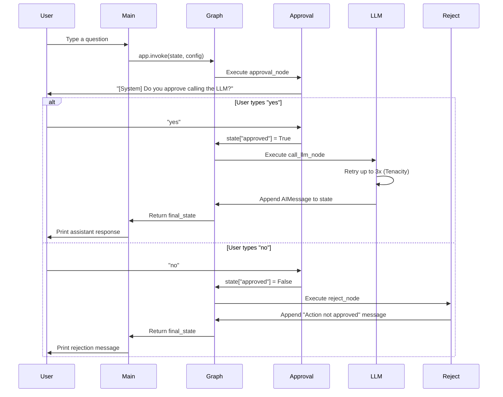

# Architecture Overview: Reliable Stateful Agent Workflow

## 1. Overview
The **Reliable Stateful Agent Workflow** is a production-focused conversational AI system built using **LangGraph**. It enforces a strict **Human-in-the-Loop (HITL)** approval gate _before_ any LLM call is made, ensuring the user explicitly consents to AI action. Built on top of Ollama (`llama3.1`) for fully local, private inference, the system demonstrates reliability patterns including:

- **Pre-execution approval**: Every conversation turn requires user consent before the LLM is invoked.
- **Rejection handling**: A dedicated node gracefully handles denial of consent.
- **Retry + Fallback**: The LLM call is wrapped with Tenacity exponential backoff; persistent failures route to a safe fallback node.
- **Persistent sessions**: A UUID-based `thread_id` with `MemorySaver` checkpointing tracks conversation context across turns.

## 2. Core Components

| File | Node Name | Role |
|---|---|---|
| `nodes/approval_node.py` | `approval` | First node in the graph. Blocks execution and asks the user for yes/no consent via `input()`. Sets the `approved` boolean in state. |
| `nodes/llm_node.py` | `call_llm` | Core LLM invocation wrapped in Tenacity `@retry`. Only reached if the user approved. Returns the AI response. |
| `nodes/reject_node.py` | `reject` | Returns a polite refusal message when the user does not approve. Terminates the turn gracefully. |
| `nodes/fallback_node.py` | `fallback` | Safety net for LLM failures (wired in for future use). Appends a hardcoded error `AIMessage` when retry limit is exhausted. |
| `graph.py` | — | Defines the `StateGraph`: START → approval → (approved? LLM : reject) → END. Uses `MemorySaver` for checkpointing. |
| `state.py` | — | Defines the `State` TypedDict: `messages`, `approved`, `error_count`, `error_message`. |
| `main.py` | — | CLI entry point. Manages the session loop, loads/creates `thread_id`, initialises state, and calls `app.invoke()`. |
| `thread_id.txt` | — | Auto-generated UUID file that persists the session identity for use with the checkpointer. |

## 3. Data Flow

1. **Input**: User submits a query via the CLI in `main.py`.
2. **State Initialisation**: The message is appended to `state["messages"]`. `approved` starts as `False`.
3. **Approval Gate** (`approval_node`):
   - The graph immediately pauses at `START → approval`.
   - The terminal prints: `[System] Do you approve calling the LLM to answer?`
   - The user types `yes` or `no`.
   - State is updated: `approved = True` (or `False`).
4. **Conditional Routing**: A lambda edge reads `state["approved"]`:
   - *`True`* → routes to `call_llm` node.
   - *`False`* → routes to `reject` node.
5. **LLM Call** (`call_llm_node`):
   - Invokes `ChatOllama(llama3.1)` with the full message history.
   - Wrapped in Tenacity: retries up to 3× with exponential backoff (2–10s).
   - On success: appends the AI response to `state["messages"]`.
   - On persistent failure: error details are captured in `error_count` / `error_message`.
6. **Rejection** (`reject_node`):
   - Appends a fixed `AIMessage`: `"Action not approved by user. Exiting."`.
7. **Output**: `main.py` reads `state["messages"][-1].content` and prints the response.
8. **Checkpointing**: `MemorySaver` persists the updated state under the active `thread_id`.

## 4. Technology Stack

| Layer | Technology |
|---|---|
| Language | Python 3.9+ |
| Agent Framework | LangGraph ≥ 0.2.0 |
| LLM | Ollama — `llama3.1` (local) via `langchain-ollama` |
| Retry Logic | Tenacity (exponential backoff, `@retry` decorator) |
| State Checkpointing | LangGraph `MemorySaver` (in-memory) |
| Persistence (session) | `thread_id.txt` (UUID, file-based) |
| Optional Persistence | `langgraph-checkpoint-sqlite` (declared in `requirements.txt`) |
| Core Messaging | `langchain-core` (`HumanMessage`, `AIMessage`) |

## 5. Key Diagrams

### System Context Diagram

### Component Diagram

### Sequence Diagram

## 6. External Dependencies

| Dependency | Purpose |
|---|---|
| **Ollama** (`llama3.1`) | Must be installed and running locally. All LLM inference runs fully on-device — no internet required. |
| **Tenacity** | Provides `@retry` with `stop_after_attempt` and `wait_exponential` for resilient LLM calls. _(Note: must be `pip3 install tenacity` separately — not in `requirements.txt`.)_ |
| **langgraph-checkpoint-sqlite** | Declared in `requirements.txt` as an optional upgrade path from `MemorySaver` to SQLite-backed cross-session persistence. Not wired in the current active graph. |

## 7. Design Decisions

1. **Approval-First Architecture**: Rather than invoking the LLM speculatively and then asking for approval, the graph places the `approval_node` _first_ (immediately after START). This is a stricter, safer design — the LLM is never called unless the user has explicitly said yes, making it suitable for sensitive or resource-intensive environments.

2. **Tenacity over Manual Retry Logic**: Using the `@retry` decorator externalises retry state and backoff configuration from the business logic of `call_llm_node`. This keeps the node function clean and makes retry behaviour easy to adjust (e.g., increasing max attempts) without touching graph wiring.

3. **Explicit `reject_node` vs. Silent Skip**: Rather than simply not calling the LLM when `approved=False`, the graph routes to a dedicated `reject_node`. This makes the user's denial explicit in the message history (appended as an `AIMessage`), provides a consistent output path, and makes future auditing or logging of denied requests straightforward.

## 8. Security & Observability

- **Data Privacy**: All inference runs locally via Ollama — no data leaves the machine. This makes the system suitable for processing sensitive or confidential queries.
- **Consent Enforcement**: The `approved` boolean is evaluated at the graph edge level via a lambda function, not inside the LLM node. This means consent cannot be bypassed by the model's output.
- **Error Transparency**: `state["error_count"]` and `state["error_message"]` provide a running audit trail of LLM failures within a session, accessible for logging or inspection at any point.
- **Debug Logging**: `router.py` includes a `[DEBUG router]` print statement tracing `next_node` values at runtime. [assumption: In production, these would be replaced with structured `logging` calls piped to a log aggregator or LangSmith.]
- **Session Isolation**: Each user session is scoped to a unique `thread_id`, preventing state bleed between conversations when the checkpointer is active.
