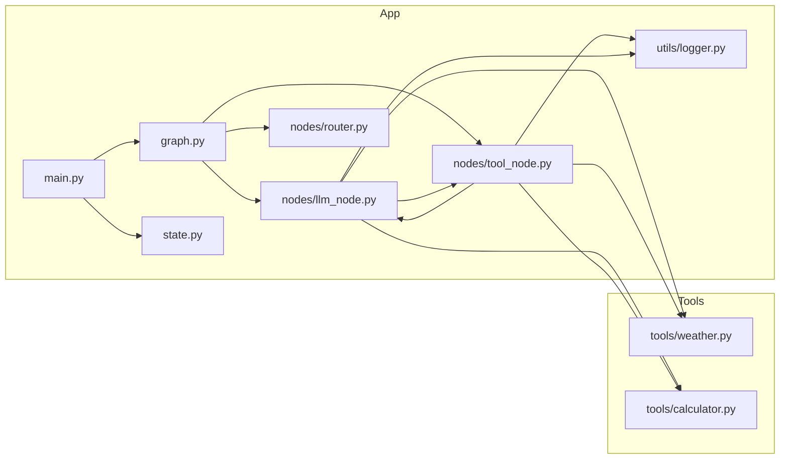
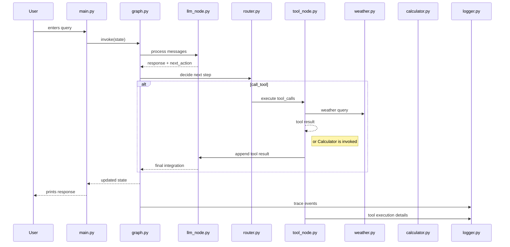

# Architecture

## Overview

This project implements a structured tool-calling conversational agent using a LangGraph state machine. The system is designed to interpret user requests, decide whether to invoke external tools, execute tool calls, and synthesize a final response. It is built as a local Python CLI application with a small set of mock tools for weather and calculation.

## Core Components

| Component | Purpose |
|---|---|
| `main.py` | Interactive CLI entry point. Accepts user input, maintains session state, and prints tool results or assistant responses. |
| `graph.py` | Assembles the LangGraph workflow. Defines nodes, edges, and the control flow between LLM reasoning and tool execution. |
| `state.py` | Defines the typed state schema passed through the graph, including messages, tool calls, tool results, action decisions, and iteration counters. |
| `nodes/llm_node.py` | LLM reasoning node. Uses `ChatOllama` to generate responses and decide whether a tool call is required. |
| `nodes/tool_node.py` | Tool execution node. Looks up tools, executes them safely, logs results, and appends tool outcomes back into state. |
| `nodes/router.py` | Routing logic for the graph. Reads `state["next_action"]` and selects either the tool path or the end path. |
| `tools/weather.py` | Mock weather tool. Returns synthetic weather output for a requested city. |
| `tools/calculator.py` | Safe calculator tool. Evaluates arithmetic expressions in a controlled namespace to prevent unsafe code execution. |
| `utils/logger.py` | Logging utility. Configures file-based debug logging for tool execution and runtime tracing. |
| `requirements.txt` | Declares project dependencies. |

## Data Flow

1. The user submits a natural language query through `main.py`.
2. The message is appended to `state["messages"]`.
3. `graph.py` runs the LangGraph workflow starting at `nodes/llm_node.py`.
4. The LLM node evaluates the conversation and may produce:
   - a direct answer (`next_action: end`)
   - a structured tool call (`next_action: call_tool` with `tool_calls` populated)
5. `nodes/router.py` routes the state to `nodes/tool_node.py` if tool execution is requested.
6. `nodes/tool_node.py` executes the requested tool(s), appends tool results as AI messages, and clears `tool_calls`.
7. The graph loops back to the LLM node so the model can integrate the tool output into a final response.
8. `main.py` prints either the last tool result or the final natural language assistant message.

## Technology Stack

- Language: Python
- Core frameworks/libraries:
  - `langgraph` for graph-based orchestration
  - `langchain-ollama` / `langchain-core` for LLM integration
  - `pydantic` for structured state and output schemas (final architecture assumes use of schemas)
- Runtime: local Python interpreter
- Logging: Python `logging` to `agent.log`
- Tools:
  - `weather.py` (mock weather tool)
  - `calculator.py` (safe math evaluator)

### Assumptions

- The LLM is served via an Ollama endpoint or local Ollama model runtime. This is inferred from `langchain-ollama` usage.
- No remote HTTP API or cloud infrastructure is required from the current project files.

## Key Diagrams

### System Context

```mermaid
flowchart TB
  User[User]
  CLI[CLI Application]
  Graph[LangGraph Workflow]
  LLM[LLM Service\n(ChatOllama)]
  Tools[Tool Executors]
  Logger[Logging\n(agent.log)]

  User -->|text query| CLI
  CLI --> Graph
  Graph --> LLM
  LLM -->|tool decision| Tools
  Tools --> Graph
  Graph -->|final response| CLI
  CLI -->|output| User
  Graph --> Logger
  Tools --> Logger
```

### Component Diagram



### Sequence Diagram



## External Dependencies

- `langgraph` for graph orchestration
- `langchain-ollama` / `langchain-core` for LLM invocation
- `pydantic` for typed schemas and output parsing
- `logging` for observability
- `[assumption]` Ollama model runtime or server availability is required at runtime

## Design Decisions

1. **Graph-based orchestration with LangGraph**
   - The state machine decouples LLM reasoning, tool execution, and routing logic.
   - This makes decision flow explicit and easier to extend with new tools.

2. **Structured tool calling rather than ad hoc prompts**
   - Tool calls are represented in state as explicit `tool_calls` objects.
   - This avoids unreliable prompt parsing and enables safer tool execution.

3. **Tool result loopback for self-correction**
   - After tool execution, the graph returns to the LLM node.
   - This allows the LLM to incorporate tool results into a natural final response instead of ending immediately after tool output.

## Security & Observability

### Security

- Tool inputs are validated before execution, especially in `tools/calculator.py`, which restricts expression characters and uses a safe evaluation namespace.
- No untrusted external API calls are present in the current implementation.
- If Ollama runs as a local service, network exposure should be limited to localhost.

### Observability

- `utils/logger.py` writes debug logs to `agent.log`.
- `nodes/tool_node.py` logs tool execution details, arguments, and errors.
- The stateful graph architecture enables tracing of decision paths through state transitions.
- `main.py` prints runtime results and can be extended to include verbosity flags or structured tracing output.
