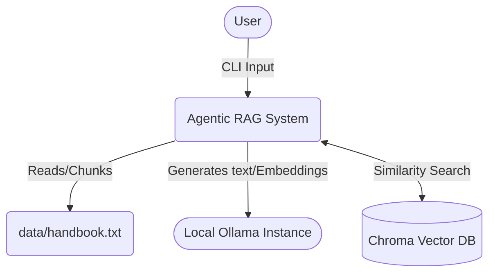
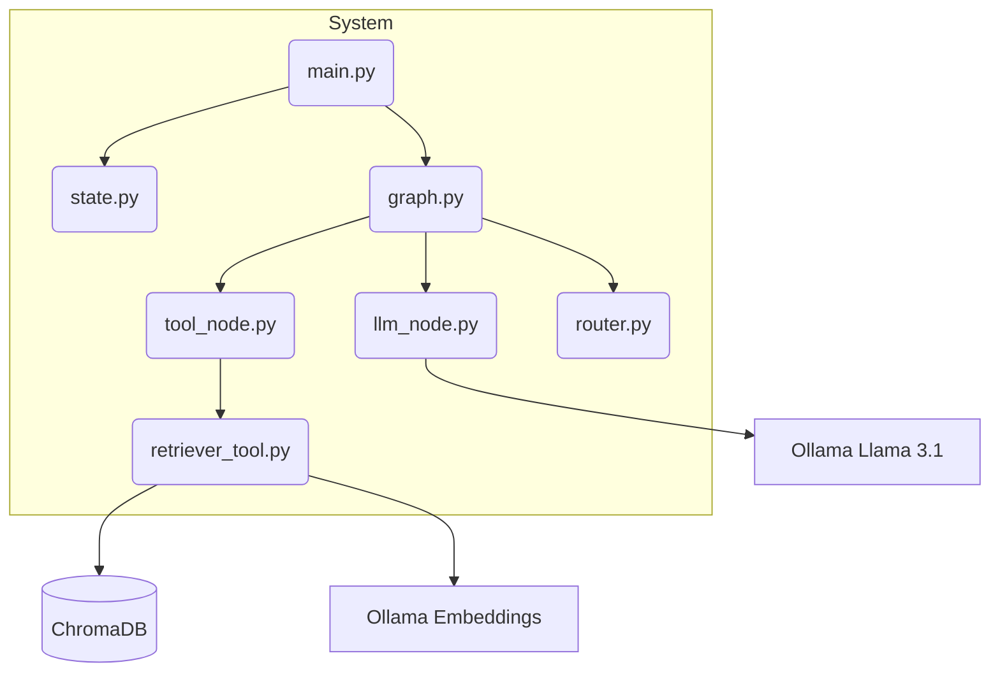
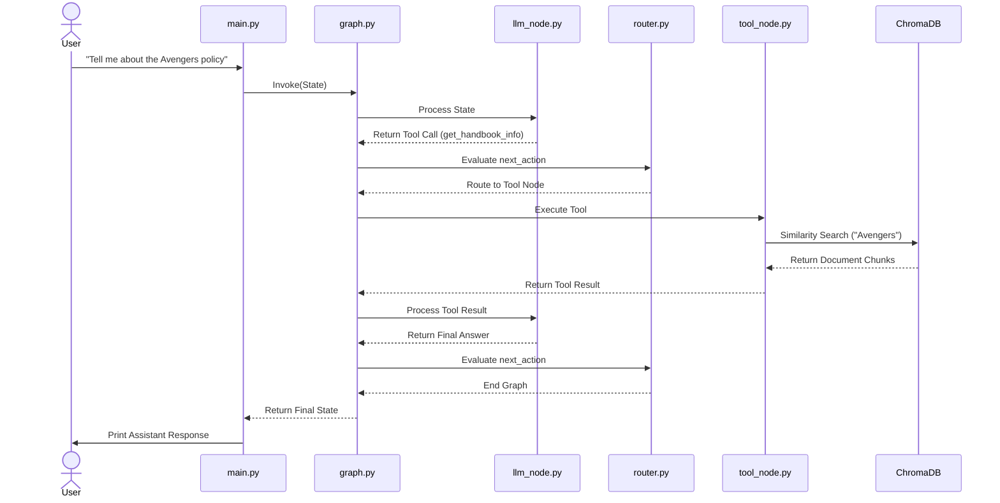

# System Architecture: Self-Correcting Agentic RAG System

## 1. Overview
The **Self-Correcting Agentic RAG System** is a local, terminal-based conversational application designed to intelligently retrieve information from a provided knowledge base (a company handbook) when necessary, or answer generally using its base knowledge. Built with LangGraph, it models the conversational flow as a state machine, allowing the agent to reason about when to trigger tools, execute them, evaluate the results, and self-correct if errors occur before returning a final response to the user.

## 2. Core Components
- **CLI Interface (`main.py`)**: The entry point that captures user input, invokes the LangGraph application, and prints the assistant's final output.
- **State Manager (`state.py`)**: Defines a `TypedDict` that acts as the shared memory for the graph. It maintains the conversation history (`messages`), pending tool executions (`tool_calls`), intermediate outcomes (`tool_results`), and routing directives (`next_action`).
- **Graph Orchestrator (`graph.py`)**: Constructs the LangGraph `StateGraph`. It binds the nodes and defines the edges (including conditional branching) that dictate the sequence of agent operations.
- **LLM Node (`nodes/llm_node.py`)**: The cognitive core of the application. It uses a local Ollama instance (`llama3.1`). It checks user queries for specific keywords to determine whether to formulate a tool call or to respond directly.
- **Tool Node (`nodes/tool_node.py`)**: The execution environment for tools. It intercepts pending tool calls, securely invokes the requested Python functions, captures their output (or exceptions), and updates the state.
- **Router Node (`nodes/router.py`)**: A conditional logic block that inspects the state's `next_action` variable to direct the graph's execution flow (e.g., looping to the Tool Node or terminating the run).
- **Retriever Tool (`tools/retriever_tool.py`)**: A specialized LangChain tool that loads a text document (`data/handbook.txt`), chunks it, embeds it using local Ollama embeddings (`nomic-embed-text`), and queries a local Chroma vector database for similarity matches.

## 3. Data Flow
1. **User Input**: The user enters a message in the CLI.
2. **State Initialization**: The message is appended to the graph's `State` and passed to the LangGraph application.
3. **Reasoning Phase (`llm_node`)**: The LLM node inspects the conversation history.
   - *Path A (Direct Answer)*: If no specific keywords are detected, the LLM generates a response, and the state's `next_action` is set to `end`.
   - *Path B (Tool Required)*: If keywords are found, the LLM sets up a tool call for `get_handbook_info`, and `next_action` is set to `call_tool`.
4. **Routing (`router`)**: Evaluates `next_action`.
5. **Tool Execution (`tool_node`)**: If routed here, the node queries ChromaDB, retrieves the relevant context, appends the result to the state, and sets `next_action` to `end`. The graph loops back to the LLM node.
6. **Synthesis Phase (`llm_node`)**: The LLM processes the tool result and generates a final, context-aware response.
7. **Output**: The finalized state is returned to the CLI, and the answer is displayed.

## 4. Technology Stack
- **Language**: Python 3.8+
- **Frameworks**: LangChain Core, LangGraph, LangChain Community
- **LLM Engine**: Ollama (running locally)
- **Models**: `llama3.1` (Text Generation), `nomic-embed-text` (Embeddings)
- **Database**: ChromaDB (Local in-memory Vector Database) `[assumption]`
- **Infrastructure**: Local machine execution

## 5. Key Diagrams

### System Context Diagram

### Component Diagram

### Sequence Diagram

## 6. External Dependencies
- **Ollama**: Requires a background daemon running locally to serve the LLM and embedding models. `[assumption]`: Running on default port 11434.
- **ChromaDB**: Required as a library dependency; runs embedded in the Python process.

## 7. Design Decisions
1. **LangGraph for Orchestration**: Chosen over standard linear chains (LCEL) because it allows for cyclical graphs. This is critical for "agentic" behavior, enabling the system to evaluate tool outputs and retry or self-correct if a tool fails or returns inadequate context.
2. **Local Execution Environment (Ollama + Chroma)**: Ensures complete data privacy and zero API costs. The system does not send company handbook data to external providers like OpenAI.
3. **Keyword-Based Tool Routing**: `[assumption]` Instead of relying purely on the LLM's intent classification to trigger tools (which can be slow or unreliable on smaller local models like Llama 3.1 8B), the system currently uses a hardcoded keyword heuristic in `llm_node.py` to guarantee tool invocation for specific topics.

## 8. Security & Observability
- **Security**: 
  - **Data Privacy**: 100% local processing. No network calls are made to external SaaS providers.
  - **Authentication**: None required. `[assumption]`: Designed as a single-user local developer tool.
- **Observability**: 
  - **Logging**: The `tool_node.py` utilizes basic `[DEBUG]` print statements to trace tool executions, arguments, and exceptions. 
  - **Tracing**: `[assumption]` The system is compatible with LangSmith. Setting `LANGCHAIN_TRACING_V2=true` in the environment would automatically capture full graph execution traces.
