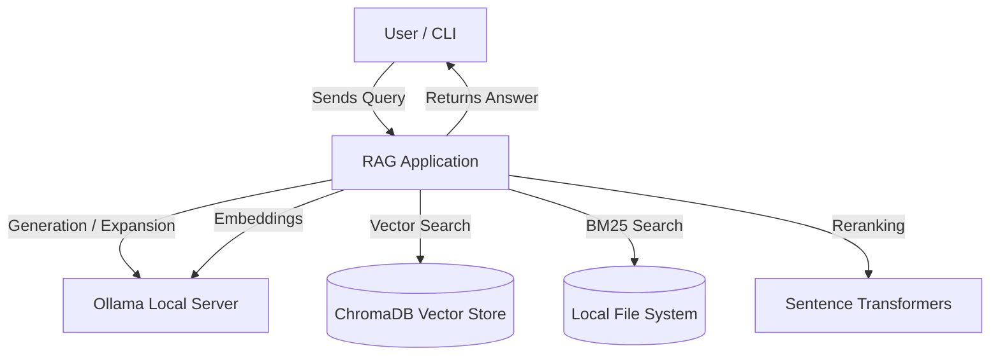
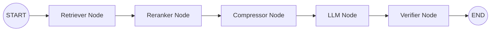
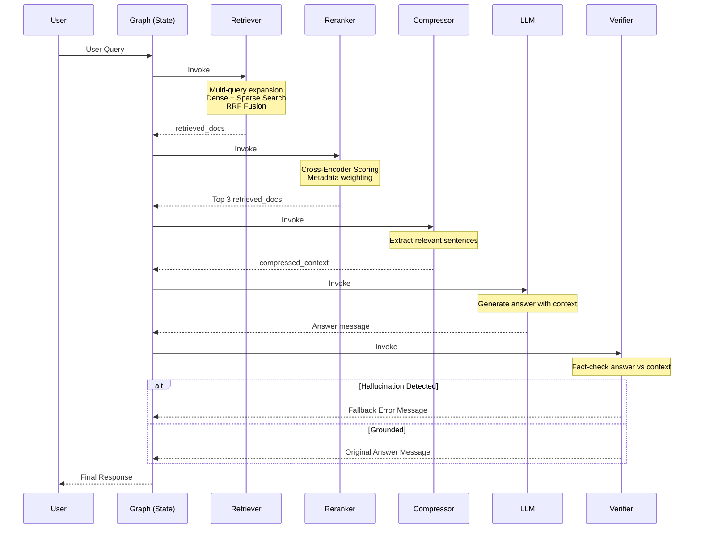

# System Architecture: Advanced & Production RAG Pipeline

## 1. Overview
This project implements an Advanced, Production-ready Retrieval-Augmented Generation (RAG) pipeline designed for enterprise use cases. Built using **LangGraph** and **LangChain**, the system orchestrates a sophisticated multi-stage workflow. It goes beyond naive RAG by implementing multi-query expansion, hybrid retrieval (dense + sparse), cross-encoder reranking, LLM-based context compression, and a final verification step to mitigate hallucinations.

## 2. Core Components

*   **`main.py`**: The application entry point. It initializes LLM caching (in-memory) for performance and manages the interactive user loop, passing inputs to the LangGraph application.
*   **`graph.py`**: The orchestration layer. It defines a `StateGraph` that explicitly wires together the different stages of the RAG pipeline into a directed execution graph.
*   **`state.py`**: Defines the shared state (`TypedDict`) passed between nodes. It tracks the conversation history (`messages`), raw `retrieved_docs`, intermediate `context`, `compressed_context`, and a `hallucination_detected` flag.
*   **Nodes (`nodes/`)**:
    *   `retriever_node.py`: Expands the user query using an LLM to generate alternatives (Multi-Query). It then performs a hybrid search using both a dense vector store (Chroma) and a sparse retriever (BM25), fusing the results using Reciprocal Rank Fusion (RRF).
    *   `reranker_node.py`: Takes the high-recall retrieved documents and re-scores them using a cross-encoder model (`ms-marco-MiniLM-L-6-v2`) combined with custom metadata extraction rules (recency, authority). Returns the top 3 documents.
    *   `compressor_node.py`: An LLM-driven step that reads the top documents and extracts *only* the specific sentences relevant to the query, reducing noise and prompt size.
    *   `llm_node.py`: Takes the compressed context and the conversation history, and invokes the primary LLM to generate the final response.
    *   `verifier_node.py`: Acts as a fact-checker. It compares the generated answer against the compressed context. If the answer is hallucinated, it overrides the response with a safe fallback message.
*   **Utils (`utils/`)**:
    *   `embeddings.py`: Configures the embedding model (`nomic-embed-text`) wrapped in a `CacheBackedEmbeddings` store (`./embedding_cache`) to avoid redundant embedding computations.

## 3. Data Flow
1.  **User Input**: User submits a query via the CLI.
2.  **Retrieval Phase**:
    *   The query is expanded into multiple semantic variations.
    *   Documents are fetched via semantic search (Chroma) and keyword search (BM25).
    *   Results are deduplicated and fused.
3.  **Reranking Phase**: A Cross-Encoder scores the retrieved documents against the query. The top 3 most relevant documents are kept.
4.  **Compression Phase**: An LLM extracts only the query-relevant sentences from the top 3 documents, filtering out fluff.
5.  **Generation Phase**: The LLM synthesizes an answer based solely on the compressed context.
6.  **Verification Phase**: A separate LLM prompt fact-checks the generated answer against the context. If it fails, a fallback error message is generated.
7.  **Output**: The final assistant message is presented to the user.

## 4. Technology Stack
*   **Language**: Python
*   **Orchestration / Framework**: LangChain, LangGraph
*   **LLM Provider**: Ollama (Local execution)
    *   *Generation Model*: `llama3.1`
    *   *Embedding Model*: `nomic-embed-text`
*   **Vector Database**: ChromaDB (Dense Retrieval)
*   **Sparse Retrieval**: `rank-bm25` (BM25 algorithm)
*   **Reranker**: `sentence-transformers` (`cross-encoder/ms-marco-MiniLM-L-6-v2`)
*   **Caching**: Local filesystem caching for embeddings; In-Memory caching for LLM calls.

## 5. Key Diagrams

### System Context Diagram

### Component Diagram (LangGraph Nodes)

### Sequence Diagram

## 6. External Dependencies
*   **Ollama**: Must be running locally to serve `llama3.1` and `nomic-embed-text`.
*   **sentence-transformers**: Downloads and runs the cross-encoder model locally via HuggingFace hub.
*   **Data Source**: Reads raw text from `data/enterprise.txt` (assumed to be the knowledge base).

## 7. Design Decisions
1.  **Stateful Orchestration with LangGraph**: Instead of a linear LangChain pipeline, LangGraph is used. This allows explicit passing of state (like `compressed_context` and `hallucination_detected`) and makes it easier to add cyclic logic (e.g., retries on hallucination) in the future.
2.  **Hybrid Retrieval (Dense + Sparse)**: Relying solely on vector search struggles with exact keyword matches (e.g., specific IDs, acronyms). Combining ChromaDB (Dense) with BM25 (Sparse) and fusing them with RRF ensures high recall for both semantic and literal queries.
3.  **Cross-Encoder Reranking over Bi-Encoders**: While bi-encoders (standard vector embeddings) are fast, they are less accurate for measuring query-document relevance. Fetching more documents and using a highly accurate (though computationally heavier) cross-encoder for the top results maximizes precision.
4.  **Context Compression**: LLMs suffer from "lost in the middle" syndrome and have context window limits. Using a secondary, cheap LLM call to extract only the relevant sentences before the final generation significantly improves the accuracy and conciseness of the final answer.

## 8. Security & Observability
*   **Authentication**: `[assumption]` This application runs locally without external network authentication. In a production deployment, an API gateway and auth middleware would be required.
*   **Observability**: 
    *   Extensive `print` statements act as debug-level logging, tracing the document counts, query variations, context length, and reranker scores at every node transition.
*   **Output Security (Trust)**: The `verifier_node` acts as a guardrail. By explicitly prompting the LLM to fact-check its own generation against the context, the system actively prevents hallucinated information from reaching the user, defaulting to a safe fallback state.
