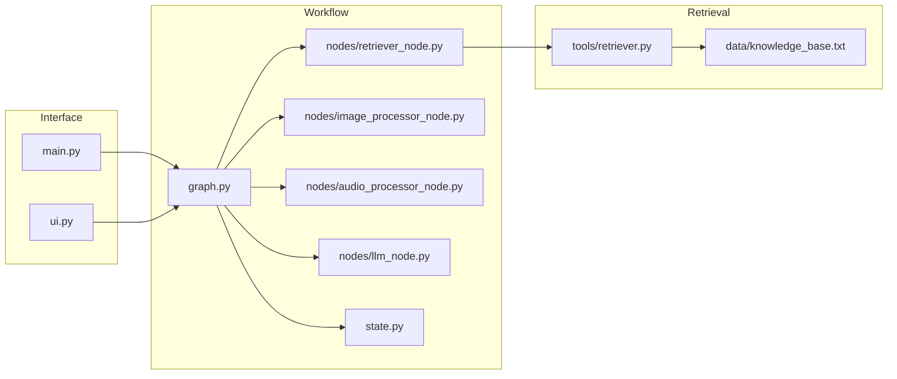
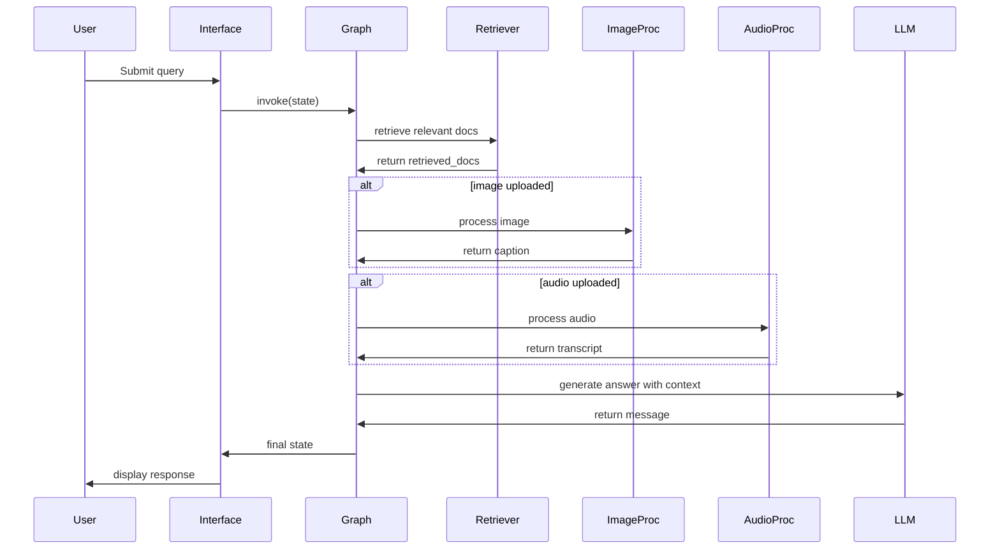

# Architecture Overview

## Overview
This project is a multi-modal retrieval-augmented generation (RAG) system that supports text, image, and audio inputs. It is implemented as a Python application with a LangGraph workflow and integrates local media processing, vector retrieval, and an LLM to answer user questions with grounded references.

The system accepts text queries and optional uploaded image/audio content, extracts context from those modalities, retrieves relevant knowledge base passages, and synthesizes a final response using a language model.

## Core Components

- **CLI / UI Layer**
  - `main.py`: A command-line interface that accepts user text queries and media commands such as `/image` and `/audio`.
  - `ui.py`: A Streamlit web interface for file uploads and chat-based interactions.

- **Workflow Graph**
  - `graph.py`: Defines the execution order using `langgraph` with nodes for retrieval, image processing, audio transcription, and LLM response generation.

- **Retriever Node**
  - `nodes/retriever_node.py`: Uses vector retrieval from the local knowledge base to fetch relevant text passages for a query.

- **Image Processor Node**
  - `nodes/image_processor_node.py`: Generates captions from uploaded images using the BLIP image captioning model.

- **Audio Processor Node**
  - `nodes/audio_processor_node.py`: Transcribes uploaded audio using OpenAI Whisper.

- **LLM Node**
  - `nodes/llm_node.py`: Combines conversation history, retrieved documents, image captions, and audio transcripts into a single prompt for the LLM.

- **Retrieval Tool**
  - `tools/retriever.py`: Builds and caches a Chroma vector store using Ollama embeddings over `data/knowledge_base.txt`.

- **Shared State**
  - `state.py`: Defines the shared state model used by graph nodes, including messages, retrieval results, media paths, captions, and transcripts.

## Data Flow

1. **User Input**
   - The user submits a text query via CLI or Streamlit UI.
   - Optionally, the user uploads an image or audio file.

2. **Workflow Orchestration**
   - `main.py` or `ui.py` forwards the state to `graph.app.invoke()`.
   - `graph.py` routes the state through the nodes: retriever → image processor → audio processor → LLM.

3. **Media Processing**
   - If an image path exists, `nodes/image_processor_node.py` produces an `image_caption`.
   - If an audio path exists, `nodes/audio_processor_node.py` produces an `audio_transcript`.

4. **Retrieval**
   - `nodes/retriever_node.py` queries the Chroma retriever using the latest user message.
   - Retrieved passages are stored in `state['retrieved_docs']`.

5. **LLM Response**
   - `nodes/llm_node.py` constructs a system prompt with retrieved text, image caption, and audio transcript.
   - The LLM generates the final answer and appends it to the conversation state.

6. **Presentation**
   - The CLI prints the assistant response and any auxiliary media output.
   - The Streamlit UI renders chat messages, captions, transcripts, and retrieved context.

## Technology Stack

| Category | Technology |
| --- | --- |
| Language | Python 3.x ([assumption]) |
| Workflow | `langgraph` |
| LLM Interface | `langchain_ollama` |
| Embeddings | Ollama embeddings (`nomic-embed-text`) |
| Vector Search | `Chroma` via `langchain-chroma` |
| Audio Transcription | `openai-whisper` |
| Image Captioning | `transformers` + `Salesforce/blip-image-captioning-base` |
| Web UI | `streamlit` |
| Data Loading | `langchain_community.document_loaders.TextLoader` |
| Text Splitting | `langchain_text_splitters.RecursiveCharacterTextSplitter` |

## Key Diagrams

### System Context Diagram

```mermaid
flowchart TB
  User[User]
  CLI[CLI / terminal interface]
  WebUI[Streamlit UI]
  Graph[LangGraph workflow]
  Retriever[Chroma retriever]
  ImageProc[Image processor (BLIP)]
  AudioProc[Audio processor (Whisper)]
  LLM[LLM via Ollama]
  KnowledgeBase[Local knowledge base file]

  User -->|text query| CLI
  User -->|text query| WebUI
  User -->|upload image/audio| WebUI
  User -->|upload image/audio| CLI
  CLI --> Graph
  WebUI --> Graph
  Graph --> Retriever
  Graph --> ImageProc
  Graph --> AudioProc
  Graph --> LLM
  Retriever --> KnowledgeBase
  ImageProc -->|caption| Graph
  AudioProc -->|transcript| Graph
  LLM -->|answer| CLI
  LLM -->|answer| WebUI
```

### Component Diagram



### Sequence Diagram



## External Dependencies

- **Ollama** for model and embedding execution via `langchain_ollama`.
- **Chroma DB** for local vector retrieval.
- **OpenAI Whisper** for audio transcription.
- **Transformers** with the BLIP model for image captioning.
- **Streamlit** for web UI.

## Design Decisions

- **Modular node-based workflow**
  - Using `langgraph` exposes a clear processing pipeline and isolates concerns for retrieval, vision, audio, and language generation.
  - This makes it easier to extend the graph with new modalities or alternate retrieval strategies.

- **Local retrieval + media grounding**
  - Storing the knowledge base as a local file and using Chroma ensures the system can work without a remote database.
  - Combining retrieved documents with image captions and audio transcripts improves answer relevance for multi-modal queries.

- **Dual interface support**
  - Providing both a CLI and Streamlit UI supports fast experimentation and user-friendly interaction.
  - The Streamlit interface enables file uploads and richer chat formatting while the CLI remains lightweight.

## Security & Observability

- **Authentication**
  - No authentication is implemented in this prototype. For production, add user access control and secure the Streamlit app.

- **Logging & debugging**
  - Debug print statements are present in `nodes/retriever_node.py` for local troubleshooting.
  - There is no centralized logging or metrics pipeline in the current implementation.

- **Monitoring**
  - The project does not include monitoring or tracing.
  - Recommended improvements: add structured logging, error handling, and a metrics exporter for production use.

- **Data considerations**
  - Media files are processed locally, and temporary uploads are cleaned up in Streamlit.
  - No external storage is used for user-uploaded files beyond temporary filesystem storage.
