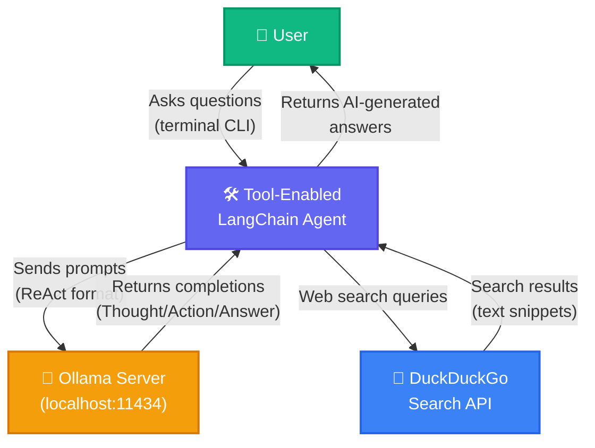
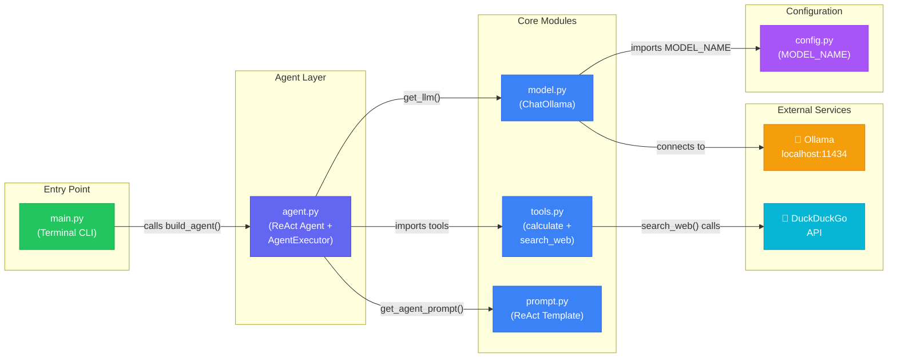
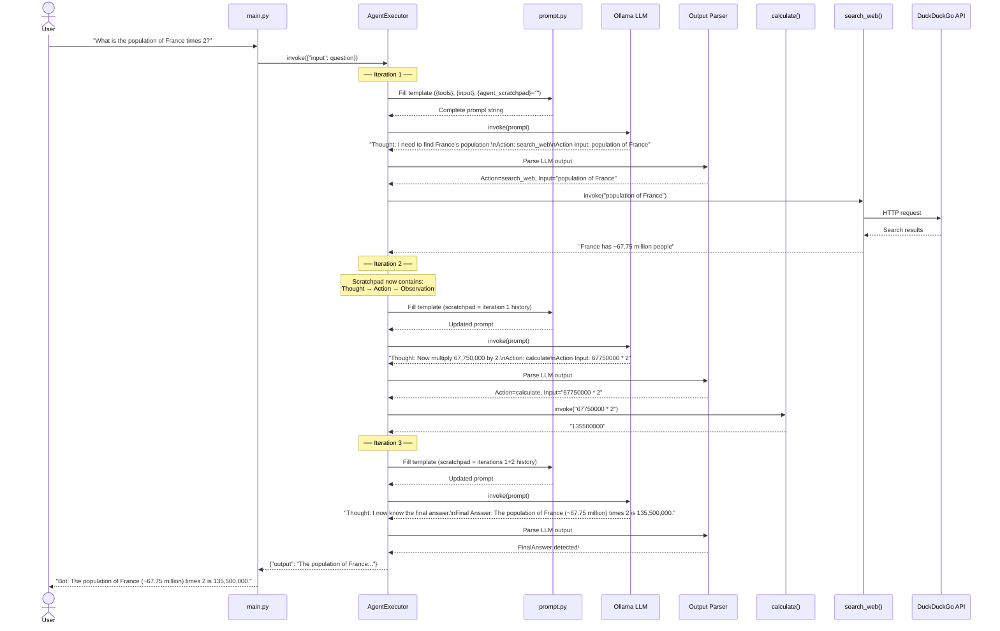
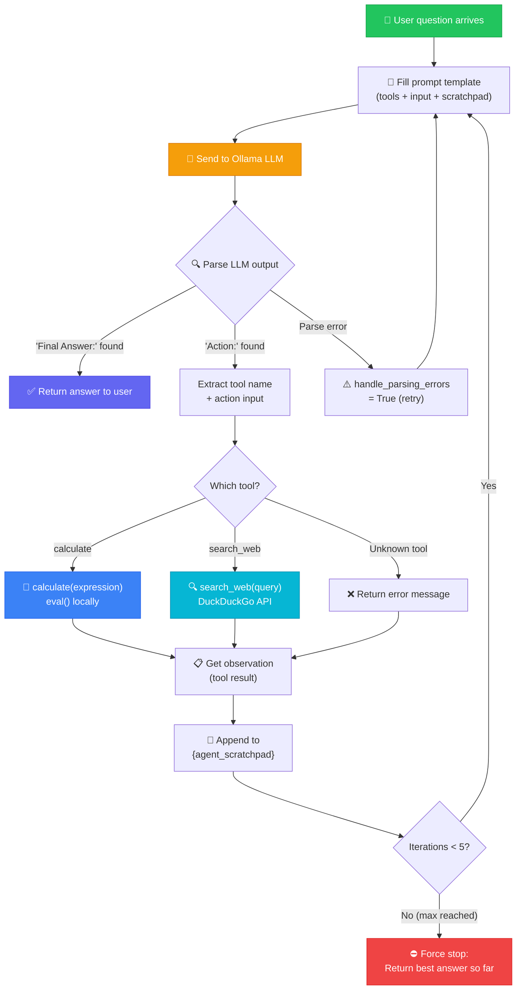
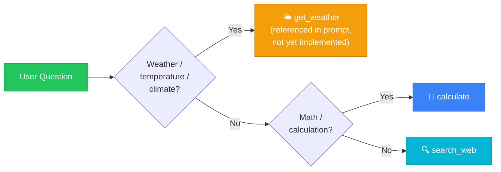

# 🛠️ Tool-Enabled LangChain Agent — Architecture & Developer Guide

> **One-line summary:** A locally-running AI agent that can **think, decide, and act** —
> it uses a ReAct (Reason + Act) loop powered by an Ollama LLM to answer questions by
> choosing between a **calculator tool** and a **DuckDuckGo web search tool**, all
> orchestrated by LangChain's `AgentExecutor`.

---

## Table of Contents

1. [Overview](#1--overview)
2. [High-Level Overview for Beginners](#2--high-level-overview-for-beginners)
3. [Project Structure](#3--project-structure)
4. [Core Components](#4--core-components)
5. [File-by-File Breakdown](#5--file-by-file-breakdown)
6. [Data Flow](#6--data-flow)
7. [Key Diagrams](#7--key-diagrams)
8. [Technology Stack](#8--technology-stack)
9. [External Dependencies](#9--external-dependencies)
10. [Design Decisions](#10--design-decisions)
11. [Security & Observability](#11--security--observability)
12. [How to Run](#12--how-to-run)
13. [Troubleshooting](#13--troubleshooting)

---

## 1 · Overview

This project implements a **Tool-enabled LangChain Agent** — an AI system that goes beyond
simple question-answering. Instead of just generating text, this agent can:

- **Reason** about what information it needs.
- **Choose a tool** (calculator or web search) to get that information.
- **Execute the tool**, read the result, and decide if it has enough to answer.
- **Repeat** the think-act cycle up to 5 times until it reaches a final answer.

This pattern is called **ReAct** (Reasoning + Acting) and is one of the most powerful
patterns in modern AI agent design. The entire system runs **locally** using Ollama — no
cloud API keys needed, fully private.

### What Makes This Different from a Simple Chatbot?

| Simple Chatbot | Tool-Enabled Agent (This Project) |
|---------------|----------------------------------|
| Only generates text from its training data | Can **call external tools** to get real information |
| Can't do math reliably | Uses a **calculator tool** for precise math |
| Knowledge is frozen at training date | Uses **DuckDuckGo search** for up-to-date facts |
| One-shot answer | **Multi-step reasoning loop** — thinks, acts, observes, thinks again |
| No decision-making | **Decides which tool to use** based on the question |

---

## 2 · High-Level Overview for Beginners

Imagine you have a really smart friend who doesn't just answer questions from memory — they
know when to grab a calculator and when to Google something. That's exactly what this agent
does.

Here's how it works in plain English:

```
💬 You ask: "What is the population of Tokyo multiplied by 3?"
                │
                ▼
        🧠 Agent THINKS:
        "I need the population of Tokyo first. Let me search the web."
                │
                ▼
        🔍 ACTION: search_web("population of Tokyo")
        📋 OBSERVATION: "Tokyo has ~13.96 million people"
                │
                ▼
        🧠 Agent THINKS:
        "Now I need to multiply 13,960,000 by 3. Let me use the calculator."
                │
                ▼
        🧮 ACTION: calculate("13960000 * 3")
        📋 OBSERVATION: "41880000"
                │
                ▼
        🧠 Agent THINKS:
        "I now have the final answer."
                │
                ▼
        ✅ FINAL ANSWER: "The population of Tokyo (~13.96 million)
           multiplied by 3 is 41,880,000."
```

### The ReAct Loop

The agent follows a strict cycle called **ReAct** (Reason + Act):

| Step | Name | What Happens |
|------|------|-------------|
| 1 | **Question** | The user's question enters the loop. |
| 2 | **Thought** | The LLM reasons about what it knows and what it needs. |
| 3 | **Action** | The LLM chooses a tool to call (e.g., `calculate` or `search_web`). |
| 4 | **Action Input** | The LLM provides the input for the tool (e.g., `"25 * 4"`). |
| 5 | **Observation** | The tool runs and returns a result (e.g., `"100"`). |
| 6 | **Repeat?** | If the LLM doesn't have enough info, it goes back to step 2. Otherwise → step 7. |
| 7 | **Final Answer** | The LLM delivers the complete answer to the user. |

This can repeat up to **5 iterations** (configurable) to prevent infinite loops.

---

## 3 · Project Structure

```
Tool-enabled LangChain agent/
│
├── 📂 src/                        # ── ALL APPLICATION CODE ──
│   ├── config.py                  #    Central configuration (model name)
│   ├── model.py                   #    LLM initialization (Ollama / ChatOllama)
│   ├── tools.py                   #    Tool definitions (calculator + web search)
│   ├── prompt.py                  #    ReAct prompt template with tool routing rules
│   ├── agent.py                   #    Agent assembly (LLM + tools + prompt → AgentExecutor)
│   ├── main.py                    #    CLI entry point (interactive terminal loop)
│   ├── memory.py                  #    Conversation memory (placeholder — not yet implemented)
│   ├── gradio_app.py              #    Web UI (placeholder — not yet implemented)
│   └── 📂 test/                   #    Test directory
│       └── test_weather.py        #    Weather tool test (placeholder)
│
├── .gitignore                     #    Git ignore rules
└── requirements.txt               #    Python dependencies
```

---

## 4 · Core Components

The system is built from five active modules that snap together like building blocks:

```
┌─────────────┐    ┌──────────────┐    ┌─────────────────┐
│  config.py  │───▶│   model.py   │───▶│                 │
│ (model name)│    │ (ChatOllama) │    │    agent.py     │
└─────────────┘    └──────────────┘    │  (assembles     │
                                       │   everything    │
┌─────────────┐                        │   into a ReAct  │──▶  main.py
│  tools.py   │───────────────────────▶│   AgentExecutor)│     (user loop)
│ (calculate, │                        │                 │
│  search_web)│                        └────────▲────────┘
└─────────────┘                                 │
                   ┌──────────────┐             │
                   │  prompt.py   │─────────────┘
                   │ (ReAct rules │
                   │  + template) │
                   └──────────────┘
```

| Component | Module | Role |
|-----------|--------|------|
| **Configuration** | `config.py` | Stores the LLM model name (`llama2`). Single source of truth — change the model once, it updates everywhere. |
| **LLM Provider** | `model.py` | Creates a `ChatOllama` instance connected to the locally-running Ollama server. Uses `temperature=0` for deterministic, focused answers. |
| **Tools** | `tools.py` | Defines two tools the agent can call: (1) `calculate` — evaluates math expressions safely, (2) `search_web` — searches DuckDuckGo for real-time information. Both are decorated with `@tool` so LangChain auto-generates their descriptions for the LLM. |
| **Prompt Template** | `prompt.py` | The ReAct prompt that teaches the LLM *how* to use tools. Contains routing rules (weather → get_weather, math → calculate, everything else → search_web), the `{tools}` and `{tool_names}` placeholders, and the `{agent_scratchpad}` where the think-act history accumulates. |
| **Agent Assembler** | `agent.py` | The central "glue" — calls `create_react_agent()` to combine the LLM, tools, and prompt into a ReAct agent, then wraps it in an `AgentExecutor` that manages the loop (max 5 iterations, error handling). |
| **Entry Point** | `main.py` | Interactive CLI loop: builds the agent once, then repeatedly reads user input, invokes the agent, and prints the result. Type `quit` to exit. |
| **Memory** | `memory.py` | Placeholder for conversation memory (not yet implemented). Would allow the agent to remember previous exchanges. |
| **Web UI** | `gradio_app.py` | Placeholder for a Gradio-based web interface (not yet implemented). Would provide a browser-based chat UI. |

---

## 5 · File-by-File Breakdown

### `src/config.py`

```python
MODEL_NAME = "llama2"   # You can change to "mistral" or "phi"
```

**Purpose:** Single constant defining which Ollama model to use. Imported by `model.py`.
Changing this one line switches the entire agent to a different LLM.

---

### `src/model.py`

```python
from langchain_ollama import ChatOllama
from .config import MODEL_NAME

def get_llm():
    return ChatOllama(model=MODEL_NAME, temperature=0)
```

**Purpose:** Factory function that creates and returns a `ChatOllama` instance.
`temperature=0` means the LLM will give the same answer every time for the same input
(deterministic) — important for reliable tool selection.

---

### `src/tools.py`

**Purpose:** Defines the two tools the agent can use.

| Tool | Function | What It Does |
|------|----------|-------------|
| `calculate` | `eval(expression)` | Safely evaluates a math expression (e.g., `"25 * 4"` → `"100"`). Uses restricted `eval()` with no builtins for safety. |
| `search_web` | `DuckDuckGoSearchRun()` | Searches DuckDuckGo and returns a text summary. Requires internet access. |

Both functions are decorated with `@tool`, which lets LangChain automatically:
- Extract the function name as the tool name.
- Use the docstring as the tool description (shown to the LLM).
- Parse the function signature for input parameters.

---

### `src/prompt.py`

**Purpose:** Returns the `PromptTemplate` that teaches the LLM the ReAct format. This is
the most critical file — it defines the agent's "personality" and decision-making rules.

**Key variables injected at runtime:**

| Placeholder | Filled By | Contains |
|------------|----------|---------|
| `{tools}` | LangChain | Description of each tool (name + docstring) |
| `{tool_names}` | LangChain | Comma-separated list of tool names (`calculate, search_web`) |
| `{input}` | User | The user's question |
| `{agent_scratchpad}` | AgentExecutor | Accumulated Thought → Action → Observation history from previous loop iterations |

**Routing rules in the prompt:**
1. Weather questions → `get_weather` tool (currently referenced but not implemented in tools).
2. Math questions → `calculate` tool.
3. Everything else → `search_web` tool.

---

### `src/agent.py`

**Purpose:** Assembles all components into a working agent.

**Assembly steps:**
1. Get the LLM from `model.py`.
2. Collect the tools from `tools.py`.
3. Get the prompt from `prompt.py`.
4. Create a ReAct agent with `create_react_agent(llm, tools, prompt)`.
5. Wrap in `AgentExecutor` with safety settings:
   - `verbose=True` — prints the LLM's thoughts and tool calls (great for learning).
   - `max_iterations=5` — prevents infinite reasoning loops.
   - `handle_parsing_errors=True` — gracefully handles malformed LLM output.

---

### `src/main.py`

**Purpose:** The CLI entry point. Builds the agent once, then enters an interactive loop:

```
You: What is 25 * 4?
Bot: 100

You: Who won the 2022 World Cup?
Bot: Argentina won the 2022 FIFA World Cup...

You: quit
```

---

### Placeholder Files

| File | Status | Intended Purpose |
|------|--------|-----------------|
| `src/memory.py` | 📝 Empty | Will hold `ConversationBufferMemory` or similar to enable multi-turn conversations. |
| `src/gradio_app.py` | 📝 Empty | Will wrap the agent in a Gradio `ChatInterface` for a browser-based UI. |
| `src/test/test_weather.py` | 📝 Empty | Will hold tests for a weather tool (not yet implemented). |

---

## 6 · Data Flow

### How Data Moves Through the System

```
┌─────────────────────────────────────────────────────────────────────────────┐
│                         AGENT EXECUTION PIPELINE                           │
│                                                                             │
│   User types question                                                       │
│        │                                                                    │
│        ▼                                                                    │
│   main.py ──▶ agent.invoke({"input": question})                            │
│        │                                                                    │
│        ▼                                                                    │
│   ┌─────────────── AgentExecutor Loop (max 5 iterations) ────────────────┐ │
│   │                                                                       │ │
│   │   1. Prompt is filled with:                                           │ │
│   │      • {tools} = "calculate: Evaluate a math expression..."           │ │
│   │      • {tool_names} = "calculate, search_web"                         │ │
│   │      • {input} = user's question                                      │ │
│   │      • {agent_scratchpad} = previous thoughts/actions (if any)        │ │
│   │                    │                                                   │ │
│   │                    ▼                                                   │ │
│   │   2. LLM (Ollama) generates:                                          │ │
│   │      • Thought: "I need to calculate..."                              │ │
│   │      • Action: calculate                                              │ │
│   │      • Action Input: "25 * 4"                                         │ │
│   │                    │                                                   │ │
│   │                    ▼                                                   │ │
│   │   3. AgentExecutor parses the output:                                 │ │
│   │      ├── "Final Answer:" found? ──▶ EXIT LOOP ──▶ Return to user     │ │
│   │      └── "Action:" found? ──▶ Execute tool ──▶ Get observation        │ │
│   │                    │                                                   │ │
│   │                    ▼                                                   │ │
│   │   4. Append to scratchpad:                                            │ │
│   │      "Observation: 100"                                               │ │
│   │                    │                                                   │ │
│   │                    ▼                                                   │ │
│   │   5. Go back to step 1 (with updated scratchpad)                      │ │
│   │                                                                       │ │
│   └───────────────────────────────────────────────────────────────────────┘ │
│        │                                                                    │
│        ▼                                                                    │
│   main.py prints: f"Bot: {result['output']}"                               │
│        │                                                                    │
│        ▼                                                                    │
│   User sees the answer                                                      │
└─────────────────────────────────────────────────────────────────────────────┘
```

### Data Flow Summary (User → Tool → Answer)

```
User Input ──▶ main.py ──▶ AgentExecutor ──▶ PromptTemplate (fill placeholders)
                                │                      │
                                │                      ▼
                                │              ChatOllama (LLM on localhost:11434)
                                │                      │
                                │                      ▼
                                │              Parsed Output (Action + Action Input)
                                │                      │
                                │         ┌────────────┴────────────┐
                                │         ▼                         ▼
                                │   calculate(expr)          search_web(query)
                                │   [local eval()]           [DuckDuckGo API]
                                │         │                         │
                                │         └────────────┬────────────┘
                                │                      ▼
                                │              Observation (tool result)
                                │                      │
                                │                      ▼
                                │              Added to {agent_scratchpad}
                                │                      │
                                │              ┌───────┴───────┐
                                │              ▼               ▼
                                │         More thinking    Final Answer
                                │         (loop back)      (exit loop)
                                │                              │
                                ◀──────────────────────────────┘
                                │
                                ▼
                          Print answer
```

---

## 7 · Key Diagrams

### 7.1 System Context Diagram

Who uses the system, and what external things does it talk to?



---

### 7.2 Component Diagram (File Relationships)

How do the internal source files depend on each other?



---

### 7.3 Sequence Diagram — Full Request/Response Flow

Step-by-step execution for a question like: **"What is the population of France times 2?"**



---

### 7.4 ReAct Loop Flowchart

The internal decision-making loop inside `AgentExecutor`.



---

### 7.5 Tool Selection Decision Tree

How the agent (guided by the prompt) decides which tool to use.



---

## 8 · Technology Stack

| Layer | Technology | Why |
|-------|-----------|-----|
| **Language** | Python 3.10+ | Standard for AI/ML development |
| **Agent Framework** | [LangChain](https://python.langchain.com/) | Provides `create_react_agent`, `AgentExecutor`, tool abstractions, and prompt management |
| **LLM Runtime** | [Ollama](https://ollama.com) (`llama2` default) | Runs LLMs locally — fully private, no API keys, no cost |
| **LLM Interface** | `ChatOllama` (`langchain_ollama`) | LangChain wrapper for Ollama's chat API |
| **Web Search** | [DuckDuckGo](https://duckduckgo.com) via `duckduckgo-search` | Free, no-API-key web search engine |
| **Search Wrapper** | `DuckDuckGoSearchRun` (`langchain_community`) | LangChain tool wrapper for DuckDuckGo |
| **Math Evaluation** | Python built-in `eval()` | Evaluates math expressions with restricted builtins for safety |
| **Prompt Pattern** | ReAct (Reason + Act) | Industry-standard pattern for tool-using agents |

---

## 9 · External Dependencies

| Dependency | Type | Required? | Network? | Notes |
|-----------|------|-----------|----------|-------|
| **Ollama** | Local service | ✅ Yes | ❌ No | Must be installed and running on `localhost:11434`. Provides LLM inference. |
| **Ollama model** (e.g., `llama2`) | Model download | ✅ Yes | 🟡 One-time | Downloaded via `ollama pull llama2`. After download, runs fully offline. |
| **DuckDuckGo** | Web API | 🟡 For `search_web` | ✅ Yes | The `search_web` tool requires internet. If offline, only `calculate` works. |
| **LangChain** | Python package | ✅ Yes | ❌ No | Installed via pip. No runtime network calls. |
| **langchain_ollama** | Python package | ✅ Yes | ❌ No | Provides `ChatOllama` class. |
| **langchain_community** | Python package | ✅ Yes | ❌ No | Provides `DuckDuckGoSearchRun`. |
| **duckduckgo-search** | Python package | ✅ Yes | ✅ At runtime | Backend for the DuckDuckGo search tool. |

---

## 10 · Design Decisions

### Decision 1: ReAct Agent Pattern (Not Function Calling)

**Choice:** Use `create_react_agent` with a text-based ReAct prompt, instead of OpenAI-style
function calling (`bind_tools`).

**Why:**
- **Model-agnostic:** ReAct works with any LLM that can follow text instructions — no need
  for models that support the `tool_calls` API format.
- **Transparency:** With `verbose=True`, every Thought → Action → Observation is printed to
  the terminal, making it **ideal for learning** how agents work.
- **Ollama compatibility:** Not all Ollama models support structured function calling. ReAct
  uses plain text, which every model can do.

**Trade-off:** ReAct is more prone to parsing errors (the LLM might not follow the exact
format). Mitigated by `handle_parsing_errors=True` in `AgentExecutor`.

---

### Decision 2: Restricted `eval()` for the Calculator

**Choice:** Use `eval(expression, {"__builtins__": {}}, {})` instead of a dedicated math
parser like `sympy`.

**Why:**
- **Simplicity:** One-line implementation that handles arithmetic, parentheses, and standard
  operators out of the box.
- **Safety:** Passing `{"__builtins__": {}}` disables access to dangerous built-in functions
  like `os`, `sys`, `exec`, etc. The expression can only use basic Python math operators.

**Trade-off:** Can't handle advanced math (integrals, symbolic algebra). For a production
system, consider `sympy` or `numexpr`. Also, a sufficiently creative input could still cause
issues — for critical systems, use `ast.literal_eval` or a proper parser.

---

### Decision 3: Local-Only LLM with Ollama

**Choice:** Use Ollama running on `localhost` instead of cloud APIs (OpenAI, Anthropic).

**Why:**
- **Privacy:** User queries never leave the machine.
- **Cost:** Zero per-token costs.
- **No API keys:** Reduces setup friction — no account creation, no billing configuration.

**Trade-off:** Smaller local models (llama2, mistral) are less capable than GPT-4 at
following complex ReAct prompts. The agent may occasionally fail to parse its own output
correctly.

---

## 11 · Security & Observability

### Security

| Area | Current State | Notes |
|------|--------------|-------|
| **Data Privacy** | ✅ All LLM inference is local | No queries are sent to cloud APIs. Only `search_web` uses the internet (DuckDuckGo). |
| **Code Injection** | ⚠️ Partially mitigated | `calculate()` uses `eval()` with `__builtins__` disabled, but is not fully sandboxed. For production, use `ast.literal_eval` or a math parser. |
| **Secrets** | ✅ No secrets needed | No API keys. `.env` is gitignored for future use. |
| **Input Validation** | ⚠️ Minimal | User input goes directly to the LLM prompt. No sanitization layer. `[assumption]` |
| **Network Exposure** | ✅ Local only | CLI runs locally. No web server exposed (Gradio is not yet implemented). |

### Observability

| Area | Current State | Notes |
|------|--------------|-------|
| **Verbose Logging** | ✅ Built-in | `AgentExecutor(verbose=True)` prints every Thought, Action, Action Input, and Observation to stdout. |
| **Error Handling** | ✅ Graceful | `handle_parsing_errors=True` catches malformed LLM output and retries. Both tools have try/except wrappers. |
| **Iteration Limit** | ✅ Protected | `max_iterations=5` prevents infinite reasoning loops. |
| **Structured Logging** | ❌ Not implemented | Only print statements. For production, use Python `logging` module. `[assumption]` |
| **Tracing** | ❌ Not implemented | No LangSmith tracing. Set `LANGCHAIN_TRACING_V2=true` for chain-level debugging. `[assumption]` |
| **Metrics** | ❌ Not implemented | No token counting, latency tracking, or tool-call frequency metrics. `[assumption]` |

---

## 12 · How to Run

### Prerequisites

| Requirement | Version | How to Check |
|------------|---------|-------------|
| Python | 3.10+ | `python3 --version` |
| pip | Latest | `pip3 --version` |
| Ollama | Latest | `ollama --version` |
| Internet | — | Required for `search_web` tool (DuckDuckGo) |

### Step-by-Step Setup

#### 1. Install Ollama

Download from [ollama.com](https://ollama.com) and start the server:

```bash
ollama serve
```

#### 2. Pull a Model

```bash
# Download the default model (~3.8 GB)
ollama pull llama2

# Or use a faster/lighter model:
# ollama pull mistral
# ollama pull phi
```

> **Tip:** If you use a different model, update `MODEL_NAME` in `src/config.py`.

#### 3. Install Python Dependencies

```bash
cd "Tool-enabled LangChain agent"

# (Recommended) Create a virtual environment
python3 -m venv venv
source venv/bin/activate    # On Windows: venv\Scripts\activate

# Install dependencies
pip install -r requirements.txt
```

#### 4. Run the Agent

```bash
# From the project root directory
python3 -m src.main
```

```
Building agent... (first run may take a moment)
Agent ready! Type your questions (or 'quit' to exit).

You: What is 125 * 8?
Bot: 1000

You: Who is the current president of the United States?
Bot: As of 2024, the current president is...

You: quit
```

#### 5. Understanding the Verbose Output

With `verbose=True`, you'll see the agent's reasoning in real-time:

```
> Entering new AgentExecutor chain...
Thought: The user wants to know 125 * 8. I should use the calculator.
Action: calculate
Action Input: 125 * 8
Observation: 1000
Thought: I now know the final answer.
Final Answer: 125 × 8 = 1000

> Finished chain.

Bot: 125 × 8 = 1000
```

---

## 13 · Troubleshooting

| Issue | Solution |
|-------|----------|
| `ModuleNotFoundError: No module named 'langchain'` | Run `pip install -r requirements.txt` (make sure your virtual environment is activated). |
| `ConnectionError` to Ollama | Ensure Ollama is running: `ollama serve` (check port 11434). |
| Agent goes in circles / doesn't reach final answer | The LLM may not follow the ReAct format well. Try a more capable model (`mistral` or `llama3`). |
| `"Math error"` from calculator | Check that the expression is valid Python math (e.g., use `*` not `×`, use `**` not `^`). |
| `"Search error"` from web search | Check your internet connection. DuckDuckGo may also rate-limit after many requests. |
| `handle_parsing_errors` triggers frequently | The model is struggling with the ReAct format. Try a larger model or simplify the prompt. |
| Agent uses wrong tool | Adjust the routing rules in `src/prompt.py` or add more examples to the prompt. |
| `max_iterations` reached without answer | Increase `max_iterations` in `agent.py`, or simplify the question so the agent needs fewer steps. |

---

> **Built with** 🦙 Ollama · 🦜 LangChain · 🦆 DuckDuckGo · 🧮 Python eval
>
> **Architecture document generated from source code analysis — reflects the actual codebase.**
